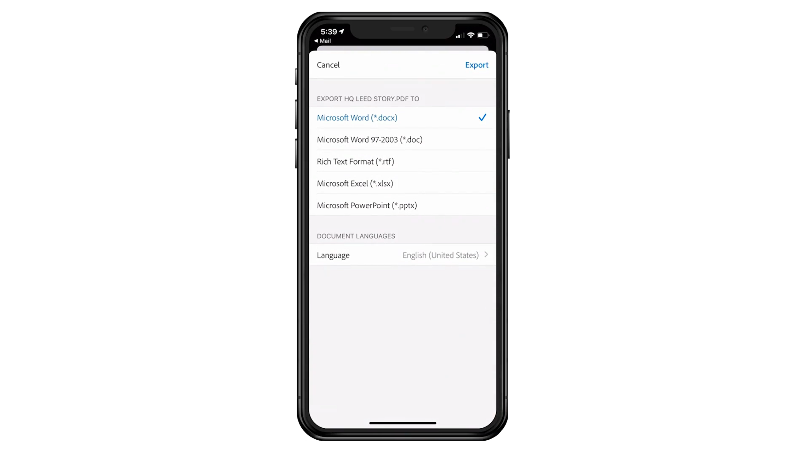

# 60 秒Acrobat總覽

60 秒Acrobat提供插點大小教學課程，協助您在一或短的時間內Acrobat學習新技巧。 這些以任務為基礎的秘訣可説明您解鎖Acrobat的一些隱藏的工具，以取得處理 PDF 檔案的新技能。 您可以觀看其中一個影片以快速解答，或是觀看五個以提升文件生產力的影片 – 還有時間享受喝咖啡的時光。

## 60 秒Acrobat教學課程

## 編輯

<table style="table-layout:fixed">
<tr>
   <td>
    
    

    <a href="edit.md"><strong>使用網頁Acrobat編輯 PDF</strong></a>
    

    瞭解如何在網頁Acrobat編輯     
  </td>
  <td>
    
    

    <a href="textrecognition.md"><strong>識別掃描的 PDF 檔案中的文字</strong></a>
    

    瞭解如何辨識掃描影像中的文字     
  </td>
  <td>
    
    

    <a href="combine-to-one-pdf.md"><strong>將多個檔案合併為一個 PDF</strong></a>
    

    瞭解如何快速地將檔案合併為單一 PDF     
  </td>
   <td>
    
    

    <a href="organize.md"><strong>快速組織頁面</strong></a>
    

    瞭解如何快速地組織 PDF 中的頁面     
  </td>
</tr>
<tr>
  <td>
    
    

    <a href="editphoto.md"><strong>在 PDF 中編輯相片</strong></a>
    

    瞭解如何在 PDF 中編輯相片
  </td>
  <td>
    
    

    <a href="editgraphic.md"><strong>在 PDF 中編輯圖形</strong></a>
    

    瞭解如何在 PDF 中編輯圖形
  </td>
  <td>
      
        

         
  </td>
  <td>
      
        

         
  </td>
</tr>
</table>

## 轉換

<table style="table-layout:fixed">
<tr>
  <td>
    
    

    <a href="convert-pdf-word.md"><strong>將 PDF 轉換為 Word</strong></a>
    

    瞭解如何將 PDF 轉換為 Word 格式
  </td>
 <td>
    
    

    <a href="convert-pdf-excel.md"><strong>將 PDF 轉換為 Excel</strong></a>
    

    瞭解如何將 PDF 轉換為 Excel 格式
  </td>
  <td>
    
    

    <a href="convert-pdf-powerpoint.md"><strong>將 PDF 轉換為 PowerPoint</strong></a>
    

    瞭解如何將 PDF 轉換為 PowerPoint 格式
  </td>
  <td>
    
    

    <a href="exportwordphone.md"><strong>從手機Export PDF至 Word</strong></a>
    

    瞭解如何從手機將 PDF 轉存為 Word
  </td>
</tr>
</table>

## 建立

<table style="table-layout:fixed">
<tr>
  <td>
    
    

    <a href="word-to-pdf.md"><strong>從 Microsoft Word 建立 PDF</strong></a>
    

    瞭解如何直接從 Word 建立 PDF
  </td>
  <td>
    
    

    <a href="create-from-acrobat.md"><strong>從Acrobat建立 PDF</strong></a>
    

    瞭解如何在Acrobat內建立 PDF
  <td>
    
    

    <a href="wordform.md"><strong>將 Word 轉換為 PDF，包括表格欄位</strong></a>
    

    將 Word 檔案轉換為 PDF 並自動產生表格欄位
  </td>
  <td>
    
    

    <a href="photo.md"><strong>立即建立相片的 PDF</strong></a>
    

    建立多張相片的 PDF
  </td>
</tr>
<tr>
  <td>
    
    

    <a href="phone.md"><strong>在手機上將PPT檔案轉換為 PDF</strong></a>
    

    在手機上將PowerPoint檔案轉換為 PDF
  </td>
  <td>
    
    

    <a href="optimize.md"><strong>快速建立更有效率的 PDF 檔案</strong></a>
    

    快速優化 PDF 檔案
  </td>
  <td>
      
        

         
  </td>
  <td>
      
        

         
  </td>
</tr>
</table>

## 簽署

<table style="table-layout:fixed">
<tr>
  <td>
    
    

    <a href="sign.md"><strong>電子簽署紙本檔</strong></a>
    

    瞭解如何以電子方式簽署紙本檔
  </td>
  <td>
      
        

         
  </td>
  <td>
      
        

         
  </td>
  <td>
      
        

         
  </td>
</tr>
</table>

## 保護

<table style="table-layout:fixed">
<tr>
  <td>
    
    

    <a href="protect.md"><strong>使用密碼保護 PDF 檔案</strong></a>
    

    瞭解如何使用密碼保護 PDF
  </td>
  <td>
    
    

    <a href="redaction.md"><strong>密文：正確方式</strong></a>
    

    瞭解如何以正確的方式在 PDF 中將敏感性資訊標記為密文
  </td>
  <td>
      
        

         
  </td>
  <td>
      
        

         
  </td>
</tr>
</table>

## 共用和審核

<table style="table-layout:fixed">
<tr>
  <td>
    
    

    <a href="share-comment.md"><strong>共用 PDF 以供註釋</strong></a>
    

    瞭解如何共用 PDF 以供他人評論
  </td>
  <td>
    
    

    <a href="share-comment-teams.md"><strong>在 Teams 中共用 PDF 檔案並加上註釋</strong></a>
    

    在 Microsoft Teams 中共用 PDF 檔案並加上註釋
  </td>
  <td>
    
    

    <a href="summarize-comments.md"><strong>使用摘要來排列 PDF 註釋</strong></a>
    

    將所有註釋摘要為單一 PDF
  </td>
   <td>
    
    

    <a href="indesign.md"><strong>將 PDF 註釋載入InDesign</strong></a>
    

    瞭解如何將所有 PDF 註釋匯入InDesign
  </td>
</tr>
</table>

## 準備

<table style="table-layout:fixed">
<tr>
  <td>
    
    

    <a href="accessible.md"><strong>讓Acrobat協助您製作具備輔助功能的 PDF</strong></a>
    

    瞭解如何使 PDF 具備通用輔助功能
  </td>
 <td>
    
    

    <a href="conform.md"><strong>將 PDF 符合標準格式</strong></a>
    

    瞭解如何將 PDF 符合特定標準
  </td>
  <td>
      
        

         
  </td>
  <td>
      
        

         
  </td>
</tr>
</table>

## 其他主題

<table style="table-layout:fixed">
<tr>
  <td>
    
    

    <a href="compare.md"><strong>使用 PDF 比較找出差異</strong></a>
    

    瞭解如何快速比較兩個 PDF 之間的差異
  </td>
 <td>
    
    

    <a href="search.md"><strong>一次Search多個 PDF 檔案</strong></a>
    

    瞭解如何搜尋多個 PDF 檔案
  </td>
  <td>
      
        

         
  </td>
  <td>
      
        

         
  </td>
</tr>
</table>