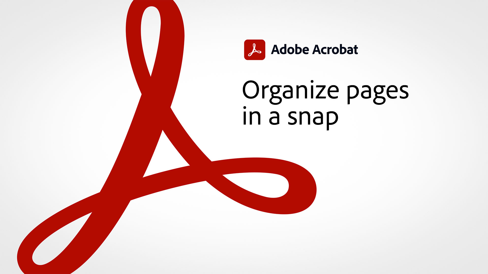

# 60 秒Acrobat總覽

60 秒Acrobat提供插點大小教學課程，協助您在一或短的時間內Acrobat學習新技巧。 這些以任務為基礎的秘訣可説明您解鎖Acrobat的一些隱藏的工具，以取得處理 PDF 檔案的新技能。 您可以觀看其中一個影片以快速解答，或是觀看五個以提升檔生產力的影片 – 還有時間享受喝咖啡的時光。

## 60 秒Acrobat教學課程

## 編輯

<table style="table-layout:fixed">
<tr>
   <td>
    
    

    <a href="edit.md"><strong>使用網頁Acrobat編輯 PDF</strong></a>
    

    <em>即使未下載 PDF，也能對文字和影像進行簡單的編輯</em>
     
  </td>
  <td>
    
    

     <a href="textrecognition.md"><strong>識別掃描的 PDF 檔案中的文字</strong></a>
    

    <em>轉換掃描的 PDF，以便在 PDF 中搜尋文字</em>
     
  </td>
  <td>
    
    

    <a href="combine-to-one-pdf.md"><strong>將多個檔案合併為一個 PDF</strong></a>
    

    <em>將數種不同類型的檔案合併為單一 PDF，快速建立新檔</em>
     
  </td>
   <td>
    
    

    <a href="organize.md"><strong>快速組織頁面</strong></a>
    

    <em>瞭解如何使用「組織頁面」工具來取得 PDF 的鳥覽檢視</em>
     
  </td>
</tr>
<tr>
  <td>
    
    

    <a href="editphoto.md"><strong>在 PDF 中編輯相片</strong></a>
    

    <em>瞭解如何使用 Photoshop 在 PDF 中進階編輯相片</em>
     
  </td>
  <td>
    
    

    <a href="editgraphic.md"><strong>在 PDF 中編輯圖形</strong></a>
    

    <em>瞭解如何使用 Illustrator 在 PDF 中對圖形進行進階編輯</em>
     
  </td>
  <td>
      
        

         
  </td>
  <td>
      
        

         
  </td>
</tr>
</table>

## 轉換

<table style="table-layout:fixed">
<tr>
  <td>
    
    

    <a href="convert-pdf-word.md"><strong>將 PDF 轉換為 Word</strong></a>
    

    <em>將 PDF 檔案轉換為可完全編輯的 Microsoft Word 檔</em>
     
  </td>
 <td>
    
    

    <a href="convert-pdf-excel.md"><strong>將 PDF 轉換為 Excel</strong></a>
    

    <em>將 PDF 檔案轉換為可完全編輯的 Microsoft Excel 檔</em>
     
  </td>
  <td>
    
    

    <a href="convert-pdf-powerpoint.md"><strong>將 PDF 轉換為 PowerPoint</strong></a>
    

    <em>將 PDF 檔案轉換為可完全編輯的 Microsoft PowerPoint 檔</em>
     
  </td>
  <td>
    
    

    <a href="exportwordphone.md"><strong>從手機Export PDF至 Word</strong></a>
    

    <em>使用 Acrobat 行動應用程式，將 PDF 檔案轉換為可完全編輯的 Microsoft Word 檔</em>
     
  </td>
</tr>
</table>

## 建立

<table style="table-layout:fixed">
<tr>
  <td>
    
    

     <a href="wordform.md"><strong>將 Word 轉換為 PDF，包括表格欄位</strong></a>
    

    <em>將 Word 檔案和表格轉換為 PDF，並自動建立表格欄位</em>
     
  </td>
  <td>
      
      

      <a href="photo.md"><strong>立即建立相片的 PDF</strong></a>
      

      <em>瞭解如何僅將一堆 JPG 拖放到Acrobat圖示上，以建立 PDF</em>
       
  </td>
  <td>
    
    

    <a href="phone.md"><strong>在手機上將 PPT 檔案轉換為 PDF</strong></a>
    

    <em>瞭解如何在手機上將 PowerPoint 附件轉換為 PDF</em>
     
  </td>
  <td>
      
      

      <a href="optimize.md"><strong>快速建立更有效率的 PDF 檔案</strong></a>
      

      <em>使用「優化 PDF」工具可大幅縮小 PDF 檔案的大小</em>
       
  </td>
</tr>
</table>

## 簽署

<table style="table-layout:fixed">
<tr>
  <td>
    
    

    <a href="sign.md"><strong>電子簽署紙本檔</strong></a>
    

    <em>瞭解如何使用Adobe Scan簽署列印表格</em>
     
  </td>
  <td>
      
        

         
  </td>
  <td>
      
        

         
  </td>
  <td>
      
        

         
  </td>
</tr>
</table>

## 保護

<table style="table-layout:fixed">
<tr>
  <td>
    
    

    <a href="protect.md"><strong>使用密碼保護 PDF 檔案</strong></a>
    

    <em>保護 PDF，以要求密碼開啟或編輯 PDF</em>
     
  </td>
  <td>
    
    

    <a href="redaction.md"><strong>密文：正確方式</strong></a>
    

    <em>瞭解移除 PDF 敏感性資訊的正確方式</em>
     
  </td>
  <td>
      
        

         
  </td>
  <td>
      
        

         
  </td>
</tr>
</table>

## 共用和審核

<table style="table-layout:fixed">
<tr>
  <td>
    
    

    <a href="share-comment.md"><strong>共用 PDF 以供注釋</strong></a>
    

    <em>瞭解如何共用 PDF，以在單一檔案中快速收集多位人員的意見回饋</em>
     
  </td>
  <td>
    
    

    <a href="share-comment-teams.md"><strong>在 Teams 中共用 PDF 檔案並加上注釋</strong></a>
    

    <em>瞭解如何在 Microsoft Teams 中即時共同處理 PDF 檔案</em>
     
  </td>
  <td>
    
    

    <a href="summarize-comments.md"><strong>使用摘要來排列 PDF 注釋</strong></a>
    

    <em>瞭解如何建立 PDF 檔案中所有注釋和標注的摘要</em>
     
  </td>
   <td>
    
    

    <a href="indesign.md"><strong>將 PDF 注釋載入InDesign</strong></a>
    

    <em>瞭解如何在共用審核Acrobat後，將 PDF 注釋加回InDesign</em>
     
  </td>
</tr>
</table>

## 準備

<table style="table-layout:fixed">
<tr>
  <td>
    
    

    <a href="accessible.md"><strong>讓Acrobat協助您製作具備協助工具的 PDF</strong></a>
    

    <em>檢查 PDF 是否可供存取</em>
     
  </td>
 <td>
    
    

    <a href="conform.md"><strong>將 PDF 符合標準格式</strong></a>
    

    <em>瞭解如何根據 PDF/X、PDF/A 或 PDF/E 等 PDF 標準驗證 PDF 內容</em>
     
  </td>
  <td>
      
        

         
  </td>
  <td>
      
        

         
  </td>
</tr>
</table>

## 其他主題

<table style="table-layout:fixed">
<tr>
  <td>
    
    

     <a href="search.md"><strong>一次Search多個 PDF 檔案</strong></a>
    

    <em>在 PDF 檔案中開始搜尋，然後開啟「進階Search」，然後搜尋整個 PDF 檔案資料夾</em>
     
  </td>
 <td>
      
        

         
  </td>
  <td>
      
        

         
  </td>
  <td>
      
        

         
  </td>
</tr>
</table>