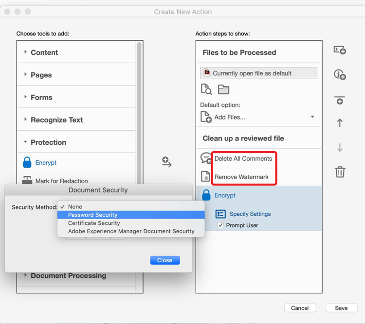

# 動作精靈

使用動作自動將一組指令套用至一或多個檔案，以節省時間和按鍵動作。

>[!NOTE]
>
>僅適用于 Acrobat Pro DC。

1. **** 從「 [!UICONTROL  工具 ] 」中心或右側窗格選取「動作精靈」。

   

   預先定義的動作會出現在「 **動作清單」** 中。

1. 在 **** 頂端選單中選取「新增動作」以建立自訂動作。

   

1. 從左側清單中選取工作，然後選取中央箭頭，將其新增至「 **[!UICONTROL 建立新動作」對話方塊中的右欄]** 。

   *每個任務的設定都在此對話方塊中預先決定，或者您可以在動作執行時提示使用者做出任何必要的決定。*

   

1. 選取 **[!UICONTROL 「儲存]** 」並命名您的動作，如此就會出現在「 **[!UICONTROL 動作清單」]** 上。

現在，您隨時可以執行自訂動作，以便在一個或多個 PDF 檔案上執行這些特定的一系列步驟。

選取 PDF 圖示以下載 *「動作精靈」* 教學課程。

 。

>[!TIP]
>
>本課程中包含 Acrobat [ DC 和 Microsoft 365 ](https://experienceleague.adobe.com/?recommended=Acrobat-U-1-2021.microsoft365) 可在 Experience League 上免費使用，讓您更聰明地工作！
