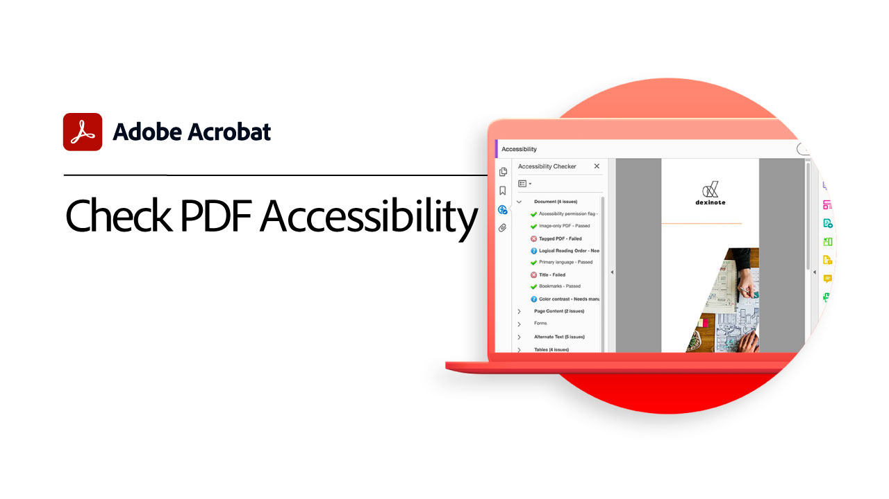

# Advanced tasks overview

Go beyond the basics with these advanced tools in Acrobat. Learn how to create an Action to repeat mundane tasks, remove sensitive information, reduce and optimize large files, quickly gather form data, and create universally Accessible PDF files.

## Acrobat tutorials

<table style="table-layout:fixed">
<tr>
  <td>
    
    

    <a href="optimizeseo.md"><strong></strong></a>
    

    <em></em> 
  </td>
  <td>
    
    

    <a href="workforms.md"><strong></strong></a>
    

    <em></em> 
  </td>
  <td>
    
    

    <a href="enhance.md"><strong></strong></a>
    

    <em></em> 
  </td>
</tr>
<tr>
  <td>
    
    

    <a href="compare.md"><strong></strong></a>
    

    <em></em> 
  </td> 
  <td>
    
    

    <a href="action.md"><strong>Action Wizard</strong></a>
    

    <em></em> 
  </td>  
  <td>
    
    

    <a href="redact.md"><strong></strong></a>
    

    <em></em> 
  </td>
</tr>
<tr>
  <td>
    
    

    <a href="reduce.md"><strong></strong></a>
    

    <em></em> 
  </td>
   <td>
    
    

    <a href="formdata.md"><strong></strong></a>
    

    <em></em> 
  </td>
   <td>
    
    

    <a href="accessibility.md"><strong></strong></a>
    

    <em></em> 
  </td>
</tr>
<tr>
  <td>
    
    

    <a href="accessibility-series.md"><strong></strong></a>
    

    <em></em> 
  </td>
  <td>
   
    

     
  </td>
  <td>
   
    

     
  </td>
</tr>
</table>
