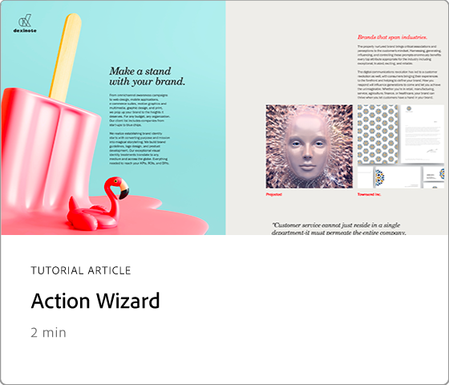
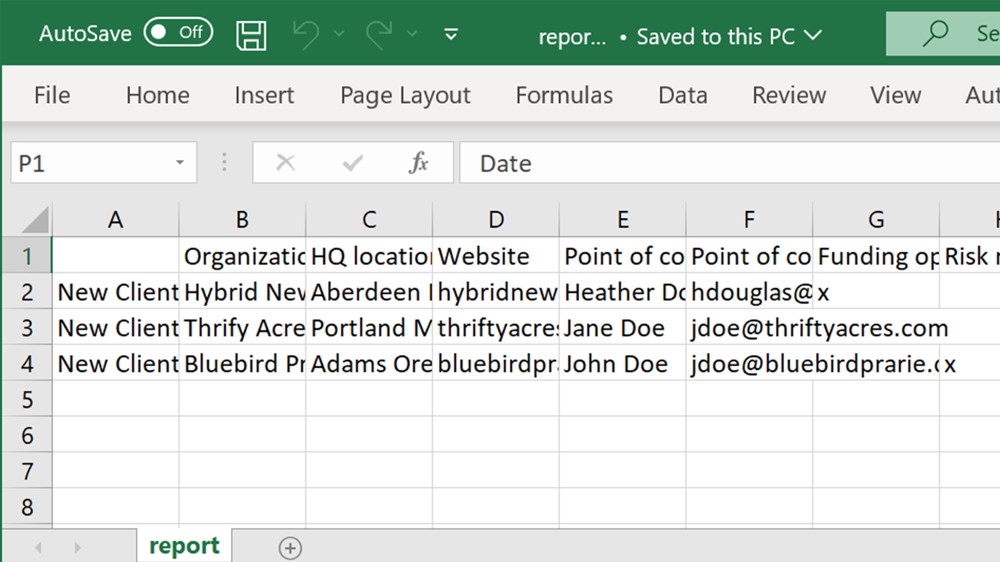

# 進階工作概觀

使用這些進階工具Acrobat超越基本知識。 瞭解如何建立動作來重複瑣事、移除敏感性資訊、縮減和優化大型檔案、快速收集表格數據，以及建立具備通用輔助功能的 PDF 檔案。

## 新增功能

* [為SEO優化 PDF （Search引擎優化）](optimizeseo.md)
瞭解如何優化 PDF 以改善可探索性和搜尋引擎在網頁上的排名

## 進階工作教學課程

<table style="table-layout:fixed">
<tr>
  <td>
    
  </td>
  <td>
    
  </td>
  <td>
    
  </td>
  <td>
    
  </td>
</tr>
<tr>
 <td>
    
  </td>
  <td>
    
  </td>
  <td>
    
  </td>
 <td>
    
  </td>
</tr>
<tr>
  <td>
    
  </td>
  <td>
    
  </td>
 <td>
    
  </td>
  <td>
    
  </td>
</tr>
<tr>
 <td>
    
  </td>
 <td>
    
  </td>
  <td>
   
    

     
  </td> 
  <td>
   
    

     
  </td>  
</tr>
</table>
