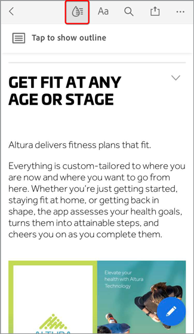

# Optimize PDFSEO（搜索引擎優化）

瞭解如何優化PDF，以改進Web上的可發現性和搜索引擎排名。

## 1.建立唯一內容

建立與網頁資訊不同的PDF內容。

+++查看有關如何建立唯一內容的詳細資訊

PDF內容應具有唯一性和結構性，如下所示：

* 使用以關鍵字開頭的單個主標題/標題
* 使用按層次結構組織的關鍵字子標題
* 使用包含關鍵字和清單的短段落
* 添加內部和外部（網站或其他網站上的內容）超連結
* 為超過25頁的文檔添加超連結目錄
* 對所有掃描的文檔運行[文本識別](https://experienceleague.adobe.com/docs/document-cloud-learn/acrobat-learning/getting-started/scan-and-ocr.html?lang=zh-Hant)
* 構建移動友好型PDF
若要檢查PDF的移動查看體驗，請在[Acrobat Reader移動應用](https://www.adobe.com/acrobat/mobile/acrobat-reader.html)中開啟檔案，然後開啟液體模式。 如有必要，請包括附加的小標題以改進導航。

  

+++

 

## 2.添加文檔屬性

PDF檔案的標題和元描述與網頁一樣。

+++查看有關如何添加文檔屬性的詳細資訊

按如下方式添加密鑰&#x200B;**[!UICONTROL 文檔屬性]**:

1. 選擇&#x200B;**[!UICONTROL 檔案>屬性]**，或在Windows上使用鍵盤快捷鍵&#x200B;*Ctrl + D*，或在Mac使用&#x200B;*Cmd + D*，然後選擇&#x200B;**[!UICONTROL 說明]**&#x200B;頁籤。
1. 在&#x200B;**[!UICONTROL 標題：]**&#x200B;欄位中輸入關鍵字優化的標題。
1. 請確保&#x200B;**[!UICONTROL 作者：]**&#x200B;欄位未標識您組織內的特定個人。
1. 在&#x200B;**[!UICONTROL 主題：]**&#x200B;欄位中輸入文檔的關鍵字優化摘要。
嘗試使用「學習」、「發現」、「瀏覽」等動作動詞開始摘要。
1. 選擇&#x200B;**[!UICONTROL 其他元資料]**&#x200B;以添加版權或公共域資訊（如果適用）。

   

+++

 

## 3.標籤PDF

在PDF中標籤內容不僅使您的檔案[對有殘疾的人可訪問](https://experienceleague.adobe.com/docs/document-cloud-learn/acrobat-learning/advanced-tasks/accessibility.html?lang=zh-Hant)，還改進了SEO。

+++查看有關如何標籤PDF的詳細資訊

按如下方式標籤PDF:

1. 在&#x200B;**[!UICONTROL 工具]**&#x200B;中心選擇&#x200B;**[!UICONTROL 輔助功能]**。
1. 在右窗格中選擇&#x200B;**[!UICONTROL 自動標籤文檔]**。
1. 在左側窗格&#x200B;**[!UICONTROL 識別報告]**&#x200B;中按照提示進行修復。
1. 如有必要，請運行&#x200B;**[!UICONTROL 設定備用文本]**。
1. 使用關鍵字在&#x200B;**[!UICONTROL 備用文本]**&#x200B;中描述影像。

   

+++

>[!NOTE]
>
>僅在Acrobat Pro、高級或Studio中提供。

 

## 4.準備Web

通過為Web查看和[減小PDF檔案大小](https://www.adobe.com/tw/acrobat/online/compress-pdf.html){target="_blank"}來優化與PDF交互的體驗。

+++查看有關如何準備WebPDF的詳細資訊

按如下方式為Web準備PDF:

要為Web準備PDF，請選擇&#x200B;**[!UICONTROL 檔案>另存為其他>縮減大小PDF]**。

此步驟可減小檔案大小，並在PDF中啟用&#x200B;**快速Web視圖**。 **快速Web視圖**&#x200B;允許在流式傳輸或下載整個檔案之前立即開啟、查看和搜索檔案，從而建立最佳最終用戶體驗。 開啟&#x200B;**[!UICONTROL 文檔屬性]**(在Windows上&#x200B;*Ctrl + D*，或在Mac上&#x200B;*Cmd + D*)以確定是否啟用&#x200B;**快速Web視圖**。

>[!TIP]
>
>如果您有Acrobat Pro（高級版或Studio），請在Action Wizard工具中運行Optimize for Web and Mobile。 此操作將顏色轉換為sRGB並嵌入字型，以便在瀏覽器和移動設備之間一致地顯示PDF。

+++

 

## 5.建立關鍵字檔案名

+++查看有關如何建立關鍵字檔案名的詳細資訊

按如下方式建立關鍵字檔案名：

在Web上發佈PDF時，檔案名將成為URL的一部分。 最好的做法是將關鍵字優化的標題與檔案名匹配。 要便於搜索 — 使用小寫、無標點或散列，並避免停止單詞（a、an、th和it、for或，但在中、my、your、our和thers等）。 如果使用單獨的單詞，請在單詞之間添加連字元或下划線。

+++

 

## 6.保護您的PDF

最後一步是[保護您的PDF](https://www.adobe.com/tw/acrobat/online/password-protect-pdf.html){target="_blank"}，以防止未經授權的更改。

+++查看有關如何保護您的PDF的詳細資訊

確保PDF，如下所示：

1. 開啟&#x200B;**[!UICONTROL 文檔屬性]**(在Windows上&#x200B;*Ctrl + D*&#x200B;或在Mac上&#x200B;*Cmd + D*)，然後選擇&#x200B;**[!UICONTROL 安全]**&#x200B;頁籤。
1. 選中&#x200B;**[!UICONTROL 打印文檔的編輯和打印。 更改這些設定需要密碼。]**
1. 在&#x200B;**[!UICONTROL 允許更改：]**&#x200B;下，選擇&#x200B;**[!UICONTROL 無]**。
1. 選中&#x200B;**[!UICONTROL 為視覺障礙的螢幕閱讀器設備啟用文本訪問。]**
1. 輸入並確認強密碼。
1. 選擇&#x200B;**[!UICONTROL 確定]**&#x200B;並保存檔案。

   

+++

現在，您的PDF已準備好發佈到Web上 — 具有最佳關鍵字排名潛力和最終用戶交互。
