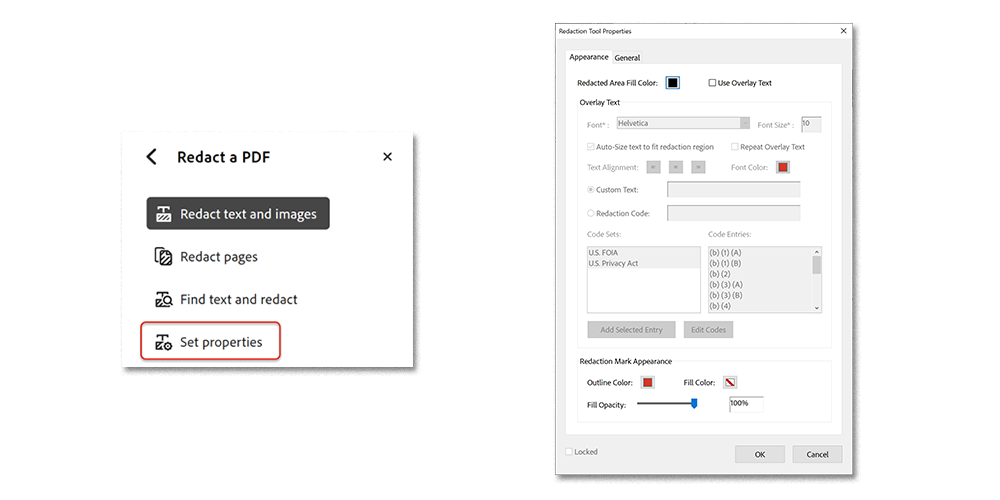
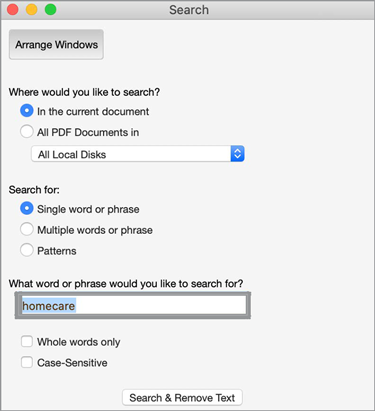
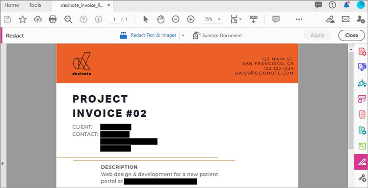

# 標記密文和淨化

瞭解如何使用「標記密文」工具，從 PDF 中永久移除私人或敏感性資訊。 使用「淨化」工具移除檔案中看不見的資訊，例如注釋、中繼資料或隱藏圖層。

>[!NOTE]
>
>僅適用于 Acrobat Pro。

[!BADGE 組織影響 ]
客戶資料保護、風險管理

## 將文字和影像標記為密文

1. 從「 **[!UICONTROL 工具 ] 」中心或右側窗格選 [!UICONTROL  取「標記]** 密文」。

   

1. 選取 **[!UICONTROL 「將文字和影]** **像標記>** **[!UICONTROL 內容]** 」來自訂密文的外觀，包括密文方塊或文字覆蓋的顏色。

   

若要將資訊標記為密文，請先標記要移除的專案，然後套用密文。 您可以將整個頁面或選取的內容標記為密文。

1. 選取「 **[!UICONTROL 將頁面]** 標記為密文」，然後選擇要標記密文的頁面或頁面範圍，然後選取「 **[!UICONTROL 確定」]** 。

   

或者，使用游標選取要標記密文的內容。 您可以將滑鼠游標停留在所選內容上，以預覽密文。

   

1. 選取「 **[!UICONTROL 將文字和影]** **像標記為密文>** **[!UICONTROL 尋找要標記]** 密文的特定內容。

使用搜尋方塊搜尋特定的字彙或片語。

1. 選取 **[!UICONTROL 「圖樣]** 」以尋找特定類型 of 資訊，然後勾選方塊，然後選取 **[!UICONTROL 「Search &amp; 移除文字」]** 。

   

1. ]**在「標記密文頂端」選單中 [!UICONTROL  選**[!UICONTROL  取「套用 ] 」，以套用標記的密文並儲存已標記密文的檔案。

   

## 淨化檔

1. 在「標記密 ] 文」頂端選單中 [!UICONTROL  選 **[!UICONTROL 取「淨化檔]** 」。

1. 選取 **[!UICONTROL 「確定」]** 以確認移除隱藏資訊。 或者，選擇「 **[!UICONTROL 按一下這裡]** 」以選擇性移除隱藏資訊。

   

>[!TIP]
>
若要加快密文程式，請查看「 [ 動作精靈」 ](../advanced-tasks/action.md) 。

>[!TIP]
>
本課程 [ 中包含 Acrobat DC 和 Microsoft 365 ](https://experienceleague.adobe.com/?recommended=Acrobat-U-1-2021.microsoft365) （可在 Experience League 上免費取得） 更聰明地工作！
