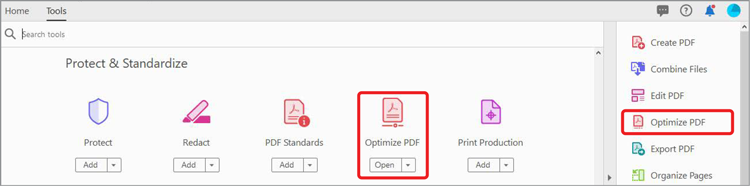

# 壓縮和優化PDF

瞭解如何壓縮和優化PDF檔案的大小。 壓縮PDF使通過電子郵件共用或上載到具有檔案大小限制的網站變得更容易。 您還可以通過優化PDF來增強觀看體驗並節省儲存成本。

## 如何在案頭上壓縮Acrobat的PDF

1. 開啟檔案，從工具欄中選擇&#x200B;**[!UICONTROL 所有工具]**，然後選擇&#x200B;**[!UICONTROL 壓縮PDF]**。

   

1. 在&#x200B;**[!UICONTROL 壓縮PDF]**&#x200B;面板中選擇&#x200B;**[!UICONTROL 單個檔案]**&#x200B;或&#x200B;**[!UICONTROL 多個檔案]**。

   

1. 選取「**[!UICONTROL 儲存]**」。

   

   在保持文檔質量的同時將檔案縮小到盡可能小的大小。

## 如何在Web上壓縮Acrobat的PDF

1. 在瀏覽器中登錄到[acrobat.adobe.com](https://acrobat.adobe.com/tw/zh/)。

1. 從頂部菜單中選擇&#x200B;**[!UICONTROL 轉換>壓縮PDF]**。

   

1. 選擇&#x200B;**[!UICONTROL 選擇檔案]**，選擇檔案，然後選擇&#x200B;**[!UICONTROL 開啟]**。

   

1. 選擇壓縮級別，然後選擇&#x200B;**[!UICONTROL 壓縮]**。

   

## 如何在台式機上優化Acrobat的PDF

>[!NOTE]
>
>優化PDF僅在台式機上的Acrobat Pro提供。

1. 開啟檔案，從工具欄中選擇&#x200B;**[!UICONTROL 所有工具]**，然後選擇&#x200B;**[!UICONTROL 壓縮PDF]**。

   

1. 從&#x200B;**[!UICONTROL 壓縮PDF]**&#x200B;面板中選擇&#x200B;**[!UICONTROL 高級優化]**。

   

1. 從&#x200B;**與**&#x200B;相容下拉清單中，選擇&#x200B;**保留現有**&#x200B;以保留當前PDF版本，或選擇Acrobat版本。 選中面板旁邊的複選框（例如，影像、字型、透明度），然後在該面板中選擇選項，然後選擇&#x200B;**[!UICONTROL 確定]**，然後保存檔案。

   

   預設情況下，在&#x200B;**設定**&#x200B;菜單中選擇了&#x200B;**標準**。 如果在「PDF優化程式」對話框中更改任何設定，則&#x200B;**設定**&#x200B;菜單將自動切換到&#x200B;**自定義**。 要防止在優化期間執行面板中的所有選項，請取消選中該面板的複選框。

1. （可選）要保存自定義設定，請選擇&#x200B;**[!UICONTROL 保存]**&#x200B;並命名設定。 要刪除已保存的設定，請在&#x200B;**設定**&#x200B;下拉清單中選擇它，然後選擇&#x200B;**[!UICONTROL 刪除]**。

   

>[!TIP]
>
>要優化多個PDF檔案，請嘗試使用[Action Wizard](../advanced-tasks/action.md)。

<table style="table-layout:fixed">
  <td>
    
    

    <a href="reduce.md"><strong>壓縮和優化PDF</strong></a>
    

    <em>減少大檔案並優化PDF，而不影響共用、發佈或存檔的質量</em>
     
  </td>
  <td>
        
        

         
      </td>
    <td>
        
        

         
    </td>
    <td>
        
        

         
    </td>
</tr>
</table>