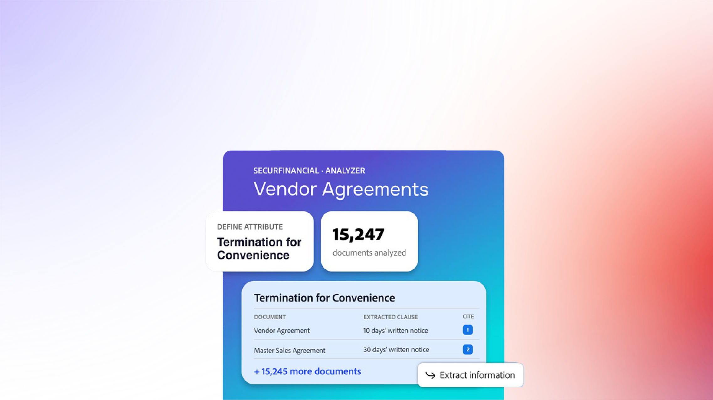
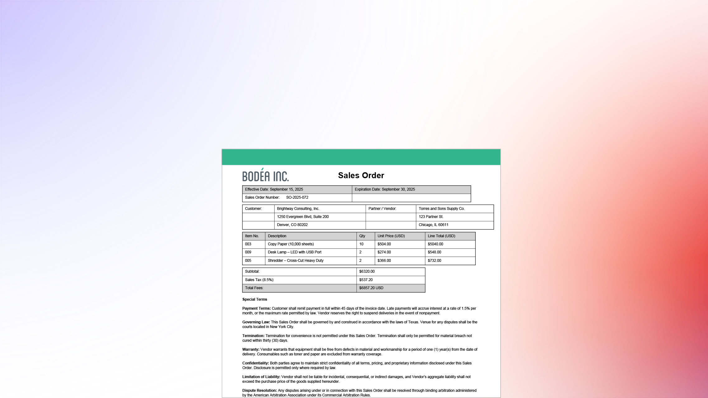
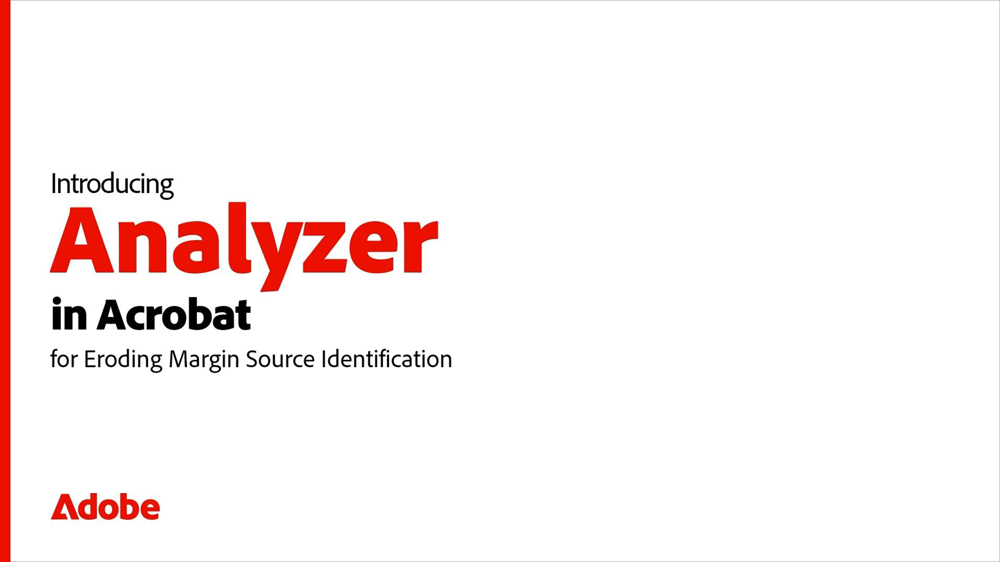

# Acrobat Studio中的Analyzer概述

Acrobat Studio中的Analyzer可協助業務使用者從數以萬計的非結構化檔案中擷取結構化、可稽核的深入分析，以自動化以檔案為中心的業務流程。

## 新增功能

>[!BEGINTABS]

>[!TAB 開始使用]

[開始使用](get-started.md)瞭解如何從大量檔案中提取結構化、被引用的資料。

>[!TAB 使用集合]

瞭解如何隨著內容成長，建立手動和連結的[集合](collections.md)、套用屬性，以及保持檔案井然有序。

>[!TAB 使用屬性]

瞭解如何使用Acrobat Studio中的Analyzer建立、測試和調整[屬性](attributes.md)。

>[!TAB 探索進階功能]

瞭解如何[匯出擷取的資料、共用集合、比較兩個檔案，以及使用AI小幫手](advanced.md)來快速解答臨機問題。

>[!TAB 動作中的使用案例]

瞭解真實的[使用案例](use-cases/use-case-overview.md)，以及不同的團隊如何運用Acrobat Studio中的Analyzer，以更聰明且更快的方式運作。

>[!ENDTABS]

## Essentials

開始使用基本知識。 瞭解如何在Acrobat Studio中使用Analyzer，以快速瞭解、摘要並與您的檔案互動。

<table style="table-layout:fixed">
<tr>
  <td>
    
    

    <a href="get-started.md"><strong>開始使用</strong></a>
    

    瞭解Acrobat Studio中的Analyzer如何協助您從大量檔案中提取結構化、被引用的資料
     
  </td>
  <td>
    
    

    <a href="collections.md"><strong>使用集合</strong></a>
    

    瞭解如何隨著內容成長，建立手動和連結的集合、套用屬性，並讓檔案維持井然有序
     
  </td>
  <td>
    
    

    <a href="attributes.md"><strong>使用屬性</strong></a>
    

    瞭解如何使用Acrobat Studio中的Analyzer建立、測試和調整屬性
     
  </td>
  <td>
    
    

    <a href="advanced.md"><strong>探索進階功能</strong></a>
    

    瞭解如何匯出擷取的資料、共用集合、比較兩個檔案以及使用AI助理來快速提出臨機問題
     
  </td>
</tr>
</table>

## 使用案例的實際行動

檢視真實世界的情境。 瞭解不同的團隊如何運用Acrobat Studio中的Analyzer，以更聰明且更快的方式工作。

<table style="table-layout:fixed">
<tr>
  <td>
    
    

    <a href="use-cases/m-and-a-post-audit.md"><strong>併購：贏取後稽核合約</strong></a>
    

    瞭解併購團隊如何分析大型合約集，以在幾分鐘內識別關鍵義務、條款及潛在風險，而非數週
     
  </td>
  <td>
    
    

    <a href="use-cases/accelerate-revenue.md"><strong>財務：檢閱收入確認與稽核的合約</strong></a>
    

    瞭解財務團隊如何更快準備稽核、支援收入確認並識別會計風險
     
  </td>
  <td>
    
    

    <a href="use-cases/data-privacy-risk.md"><strong>隱私權與資訊安全性：檢閱資料隱私權合約</strong></a>
    

    瞭解隱私權與資訊安全團隊如何找出合規差距，並透過可追蹤的結果驗證義務
     
  </td>
  <td>
    
    

    <a href="use-cases/identify-margin-erosion.md"><strong>建構：尋找轉包中的利潤風險</strong></a>
    

    瞭解建置和專案團隊如何找出未完成的變更單、過時RFI以及分包合約保護中的空白，以免影響利潤
     
  </td>
<tr>
<td>
    
    

    <a href="use-cases/vendor-risk.md"><strong>資訊安全稽核：識別廠商風險</strong></a>
    

    瞭解如何主動識別廠商合約的資訊安全性風險
     
  </td>
  <td>
    
    

     
  </td>
  <td>
    
    

     
  </td>
  <td>
    
    

     
  </td>
</tr>
</tr>
</table>