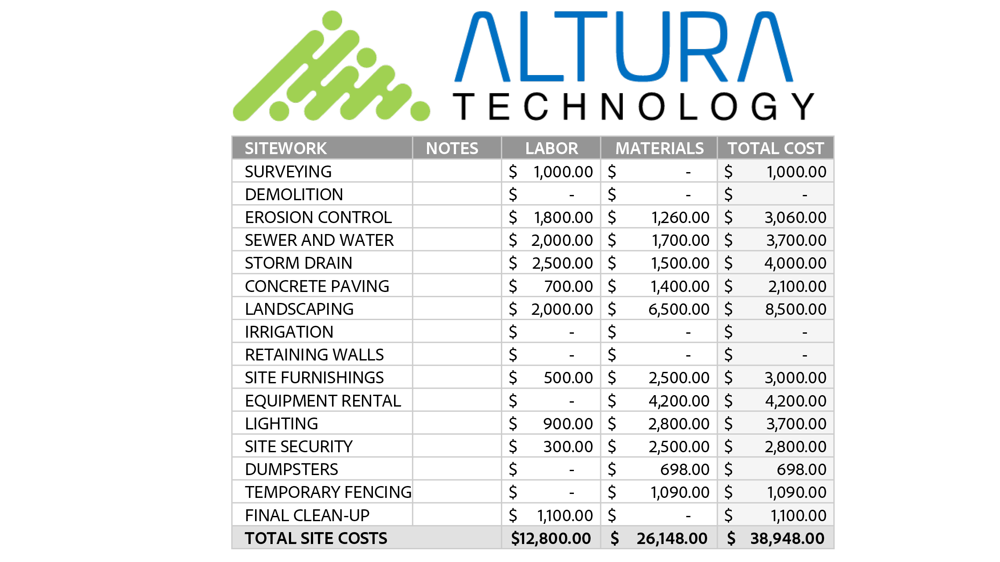

# 快速入門總覽

透過這些簡短的逐步教學課程，瞭解如何開始使用Adobe Acrobat。 從建立檔到保護或 [編輯 PDF 檔案](https://www.adobe.com/tw/acrobat/online/pdf-editor.html){target="_blank"}，此內容的設計可讓您輕鬆進入 PDF 工作流程。 查看此經專家精心策劃 [的播放清單](https://experienceleague.adobe.com/en/playlists/acrobat-get-started-business-users) ，以開始使用 Acrobat。

## 新增功能

>[!BEGINTABS]

>[!TAB 即時共同作業]

瞭解如何建立文件 [審核程序](collaborate.md) ，不僅能提高效率，還能提高內容品質。

>[!TAB 設計新頁面]

瞭解 [如何使用 Adobe Express 在 PDF 中設計新的專業頁面](add-custom-page.md) 。

>[!TAB 在 PDF 中編輯圖形]

瞭解如何在 [PDF 中建立、編輯和增強圖形](edit-graphics.md) 。

>[!TAB 新的工作區體驗]

瞭解 [Acrobat 中的新工作區](new-workspace.md) ，可協助您快速發現工具並有效率地完成 PDF 工作。

>[!ENDTABS]

## 快速入門教學課程

<!-- START CARDS HTML - DO NOT MODIFY BY HAND -->

    

        

            

                <figure class="image x-is-16by9">
                    
                </figure>
            

            

                

                    

                        <a href="https://experienceleague.adobe.com/en/docs/document-cloud-learn/acrobat-learning/getting-started/new-workspace" target="_blank" rel="referrer" title="新的工作區體驗">新的工作區體驗</a>
                    

                    
瞭解 Acrobat 中的新工作區

                

                <a href="https://experienceleague.adobe.com/en/docs/document-cloud-learn/acrobat-learning/getting-started/new-workspace" target="_blank" rel="referrer" class="spectrum-Button spectrum-Button--outline spectrum-Button--primary spectrum-Button--sizeM" style="align-self: flex-start; margin-top: 1rem;">
                    看
                </a>
            

        

    

    

        

            

                <figure class="image x-is-16by9">
                    
                </figure>
            

            

                

                    

                        <a href="https://experienceleague.adobe.com/en/docs/document-cloud-learn/acrobat-learning/getting-started/get-to-know-the-acrobat-dc-interface" target="_blank" rel="referrer" title="工作區基本介紹">Workspace基本知識</a>
                    

                    
瞭解 Acrobat 工作區的基本知識

                

                <a href="https://experienceleague.adobe.com/en/docs/document-cloud-learn/acrobat-learning/getting-started/get-to-know-the-acrobat-dc-interface" target="_blank" rel="referrer" class="spectrum-Button spectrum-Button--outline spectrum-Button--primary spectrum-Button--sizeM" style="align-self: flex-start; margin-top: 1rem;">
                    看
                </a>
            

        

    

    

        

            

                <figure class="image x-is-16by9">
                    
                </figure>
            

            

                

                    

                        <a href="https://experienceleague.adobe.com/en/docs/document-cloud-learn/acrobat-learning/getting-started/ai-assistant" target="_blank" rel="referrer" title="使用 AI Assistant 探索 PDF 見解">使用 AI Assistant 探索 PDF 見解</a>
                    

                    
使用 AI Assistant 從 PDF 檔案中獲取見解

                

                <a href="https://experienceleague.adobe.com/en/docs/document-cloud-learn/acrobat-learning/getting-started/ai-assistant" target="_blank" rel="referrer" class="spectrum-Button spectrum-Button--outline spectrum-Button--primary spectrum-Button--sizeM" style="align-self: flex-start; margin-top: 1rem;">
                    看
                </a>
            

        

    

    

        

            

                <figure class="image x-is-16by9">
                    
                </figure>
            

            

                

                    

                        <a href="https://experienceleague.adobe.com/en/docs/document-cloud-learn/acrobat-learning/getting-started/acrobatweb" target="_blank" rel="referrer" title="使用網頁Acrobat隨處工作">使用網頁Acrobat隨處工作</a>
                    

                    
瞭解如何隨處工作

                

                <a href="https://experienceleague.adobe.com/en/docs/document-cloud-learn/acrobat-learning/getting-started/acrobatweb" target="_blank" rel="referrer" class="spectrum-Button spectrum-Button--outline spectrum-Button--primary spectrum-Button--sizeM" style="align-self: flex-start; margin-top: 1rem;">
                    看
                </a>
            

        

    

    

        

            

                <figure class="image x-is-16by9">
                    
                </figure>
            

            

                

                    

                        <a href="https://experienceleague.adobe.com/en/docs/document-cloud-learn/acrobat-learning/getting-started/productivity" target="_blank" rel="referrer" title="行動生產力">行動生產力</a>
                    

                    
瞭解如何使用平板電腦或行動電話完成更多任務作

                

                <a href="https://experienceleague.adobe.com/en/docs/document-cloud-learn/acrobat-learning/getting-started/productivity" target="_blank" rel="referrer" class="spectrum-Button spectrum-Button--outline spectrum-Button--primary spectrum-Button--sizeM" style="align-self: flex-start; margin-top: 1rem;">
                    看
                </a>
            

        

    

    

        

            

                <figure class="image x-is-16by9">
                    
                </figure>
            

            

                

                    

                        <a href="https://experienceleague.adobe.com/en/docs/journey-optimizer/using/get-started/user-interface" target="_blank" rel="referrer" title="使用 Microsoft 365">使用 Microsoft 365</a>
                    

                    
直接在 Microsoft 365 中順暢地使用 PDF 檔案

                

                <a href="https://experienceleague.adobe.com/en/docs/journey-optimizer/using/get-started/user-interface" target="_blank" rel="referrer" class="spectrum-Button spectrum-Button--outline spectrum-Button--primary spectrum-Button--sizeM" style="align-self: flex-start; margin-top: 1rem;">
                    觀看教學課程
                </a>
            

        

    

<!-- END CARDS HTML - DO NOT MODIFY BY HAND -->

## 建立、合併和組織教學課程

<table style="table-layout:fixed">
  <tr>
    <td>
      
      

      <a href="create-pdf.md"><strong>建立 PDF 檔案</strong></a>
      

      從所有不同文件類型建立 PDF       
    </td>
    <td>
      
      

      <a href="combine-to-pdf.md"><strong>將檔案合併為單一 PDF</strong></a>
      

      將許多不同類型的檔案無縫合併為單一 PDF       
    </td>
    <td>
      
      

      <a href="organize.md"><strong>組織頁面</strong></a>
      

      瞭解如何按您喜歡的方式重新排列頁面       
    </td>
    <td>
      
      

      <a href="add-custom-page.md"><strong>設計新頁面</strong></a>
      

     瞭解如何在 PDF 中建立新的專業頁面       
    </td>
  </tr>
  </table>

## 編輯和導出教學課程

<table style="table-layout:fixed">
  <tr>
    <td>
      
      

      <a href="edit-pdf.md"><strong>編輯 PDF 中的文字</strong></a>
      

      在 PDF 中編輯單字、片語甚至整頁       
    </td>
    <td>
      
      

      <a href="edit-graphics.md"><strong>在 PDF 中編輯圖形</strong></a>
      

      瞭解如何在 PDF 中建立、編輯和增強圖形       
    </td>
    <td>
      
      

      <a href="stylize-this-pdf.md"><strong>將此 PDF 風格化</strong></a>
      

      瞭解如何建立具有專業外觀的 PDF       
    </td>
   <td>
      
      

      <a href="auto-adjust-layout.md"><strong>自動調整版面</strong></a>
      

      瞭解重排內容的新編輯模式       
    </td>
  </tr>
    <td>
      
      

      <a href="export-pdf.md"><strong>將 PDF 轉換為不同檔案格式</strong></a>
      

      將 PDF 檔案轉換為不同的檔案格式       
    </td>
    <td>
   
    

     
  </td>
  <td>
   
    

     
  </td>
   <td>
   
    

     
  </td>
</tr>
</table>

## 協作教學課程

<table style="table-layout:fixed">
  <tr>
    <td>
      
      

      <a href="collaborate.md"><strong>即時共同作業</strong></a>
      

      實時協作以推動項目進展
    </td>
    <td>
      
      

      <a href="comment-on-pdf-files.md"><strong>在 PDF 上加上註釋</strong></a>
      

      新增註釋，然後與他人共用 PDF       
    </td>
    <td>
    
      

       
    </td>
    <td>
    
      

       
    </td>
</tr>
</table>

## 其他教學課程

<table style="table-layout:fixed">
<tr>
  <td>
    
    

      <a href="create-fillable-forms.md"><strong>建立可填寫的表格</strong></a>
      

      將掃描的紙張轉換成可填寫的表格       
  </td>
  <td>
    
    

    <a href="fill-and-sign.md"><strong>填寫和簽署 PDF 表格</strong></a>
    

    瞭解如何快速輕鬆地填寫和簽署 PDF 表格     
  </td>
  <td>
    
    

    <a href="scan-and-ocr.md"><strong>掃描與 OCR</strong></a>
    

    將掃描或影像轉換成可搜尋、可編輯的 PDF 檔案     
  </td>
  <td>
    
    

    <a href="password-protect.md"><strong>使用密碼保護 PDF 檔案</strong></a>
    

    瞭解如何為 PDF 新增密碼     
  </td>
</tr>
<tr>
  <td>
    
    

    <a href="signatures.md"><strong>取得簽名</strong></a>
    

    瞭解如何收集具有法律效力的電子簽名     
  </td>
  <td>
    
    

    <a href="track.md"><strong>追蹤您的檔案</strong></a>
    

    追蹤和管理電子簽名檔     
  </td>
  <td>
      
      

      <a href="where-do-pdfs-come-from.md"><strong>PDF 從何而來？</strong></a>
      

      瞭解 PDF 來自何處，以及如何使用       
  </td>
  <td>
   
    

     
  </td>
</tr>
</table>
