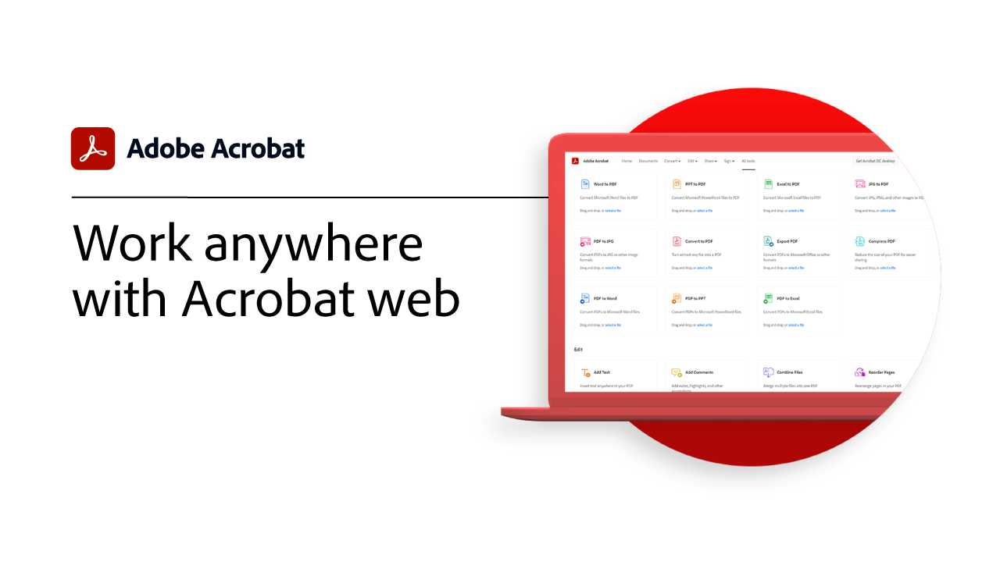

# 快速入門總覽

透過這些簡短的逐步教學課程，瞭解如何開始使用Adobe Acrobat。 從建立檔到保護 PDF 檔案，此內容的設計可讓您輕鬆進入 PDF 工作流程。

## 快速入門教學課程

<table style="table-layout:fixed">
<tr>
  <td>
    
    

    <a href="get-to-know-the-acrobat-dc-interface.md"><strong>工作區基本介紹</strong></a>
    

    <em>瞭解 Acrobat 工作區如何輕鬆地跨桌上型電腦、網頁和行動裝置存取檔案和工具</em>
     
  </td>
  <td>
    
    

    <a href="new-workspace.md"><strong>新的工作區體驗</strong></a>
    

    <em>瞭解您可以在 Acrobat 中啟用的新工作區體驗</em>
     
  </td>
  <td>
    
    

    <a href="acrobatweb.md"><strong>使用網頁Acrobat隨處工作</strong></a>
    

    <em>瞭解如何使用瀏覽器中的Acrobat網頁工具處理來自任何位置的業務檔請求</em>
     
  </td>
  <td>
    
    

     <a href="productivity.md"><strong>行動生產力</strong></a>
    

    <em>使用平板電腦或行動電話，使用 Acrobat Reader 行動應用程式完成更多工作</em>
     
  </td>
</tr>
<tr>
    <td>
      
      

      <a href="../integrate/integrate-overview.md#microsoft"><strong>使用 Microsoft 365</strong></a>
      

      <em>透過 Acrobat 和 [!DNL Microsoft 365]</em>
       
    </td>
    <td>
      
      

      <a href="../integrate/integrate-overview.md#microsoft"><strong>使用 Microsoft 365</strong></a>
      

      <em>透過 Acrobat 和 [!DNL Microsoft 365]</em>
       
    </td>
    <td>
      
      

      <a href="where-do-pdfs-come-from.md"><strong>PDF 從何而來？</strong></a>
      

      <em>瞭解 PDF 來自何處及其用途</em>
       
    </td>
    <td>
    
      

       
    </td>
  </tr>
  </table>

## 建立、合併和組織教學課程

<table style="table-layout:fixed">
  <tr>
    <td>
      
      

      <a href="create-pdf.md"><strong>建立 PDF</strong></a>
      

      <em>從所有不同檔案類型建立 PDF</em>
       
    </td>
    <td>
      
      

      <a href="combine-to-pdf.md"><strong>將檔案合併為 PDF</strong></a>
      

      <em>將許多不同類型的檔案合併成單一 PDF</em>
       
    </td>
    <td>
      
      

      <a href="organize.md"><strong>組織頁面</strong></a>
      

      <em>在 PDF 中新增、取代、擷取、旋轉、刪除和移動頁面</em>
       
    </td>
    <td>
    
      

       
    </td>
  </tr>
  </table>

## 編輯和匯出教學課程

<table style="table-layout:fixed">
  <tr>
    <td>
      
      

      <a href="edit-pdf.md"><strong>編輯 PDF</strong></a>
      

      <em>在 PDF 檔案中編輯文字和影像</em>
       
    </td>
    <td>
      
      

      <a href="auto-adjust-layout.md"><strong>自動調整版面</strong></a>
      

      <em>瞭解自動調整內容的新編輯模式</em>
       
    </td>
    <td>
      
      

      <a href="export-pdf.md"><strong>將 PDF 轉存為可編輯的格式</strong></a>
      

      <em>瞭解如何將 PDF 檔案轉存為可編輯的格式</em>
       
    </td>
    <td>
    
      

       
    </td>
  </tr>
  </table>

## 協作教學課程

<table style="table-layout:fixed">
  <tr>
    <td>
      
      

      <a href="collaborate.md"><strong>即時共同作業</strong></a>
      

      <em>隨時隨地即時收集注釋、協作回應，以及追蹤檔進度，讓您的專案向前邁進</em>
       
    </td>
    <td>
      
      

      <a href="comment-on-pdf-files.md"><strong>在 PDF 上加上注釋</strong></a>
      

      <em>新增注釋至 PDF 檔案，然後與其他人共用</em>
       
    </td>
    <td>
    
      

       
    </td>
    <td>
    
      

       
    </td>
</tr>
</table>

## 其他教學課程

<table style="table-layout:fixed">
<tr>
  <td>
    
    

    <a href="create-fillable-forms.md"><strong>建立可填寫的表格</strong></a>
    

    <em>將在其他應用程式中建立的檔轉換為可填寫的 PDF 表格</em>
     
  </td>
  <td>
    
    

    <a href="fill-and-sign.md"><strong>填寫和簽署PDF forms</strong></a>
    

    <em>快速填寫和簽署 PDF 表格</em>
     
  </td>
  <td>
    
    

    <a href="scan-and-ocr.md"><strong>掃描與 OCR</strong></a>
    

    <em>在不影響共用、張貼或封存品質的情況下，縮減大型檔案並優化 PDF</em>
     
  </td>
  <td>
    
    

    <a href="password-protect.md"><strong>使用密碼保護 PDF 檔案</strong></a>
    

    <em>為 PDF 新增密碼以保護其他人開啟或編輯檔案</em>
     
  </td>
</tr>
<tr>
  <td>
    
    

    <a href="signatures.md"><strong>取得簽名</strong></a>
    

    <em>隨時隨地收集其他人具有法律效力的電子簽名，以持續推動業務發展</em>
     
  </td>
  <td>
    
    

    <a href="track.md"><strong>追蹤您的檔</strong></a>
    

    <em>隨時瞭解哪些檔案正在等待簽名，以及哪些檔案已簽署</em>
     
  </td>
  <td>
   
    

     
  </td>
  <td>
   
    

     
  </td>
</tr>
</table>
