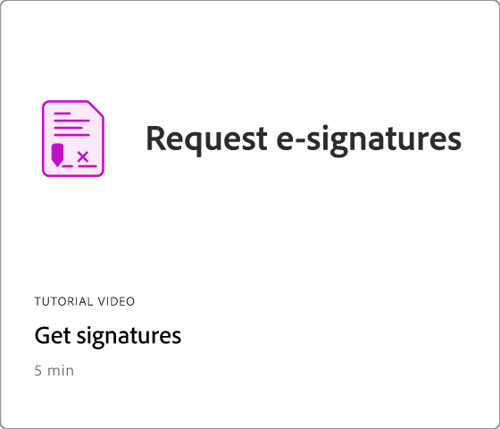

# 快速入門總覽

透過這些簡短的逐步教學課程，瞭解如何開始使用Adobe Acrobat。 從建立檔到保護或 [編輯 PDF 檔案](https://www.adobe.com/tw/acrobat/online/pdf-editor.html){target="_blank"}，此內容的設計可讓您輕鬆進入 PDF 工作流程。

## 新增功能

* [在 PDF](edit-graphics.md) 中編輯圖形
瞭解如何在 PDF 中建立、編輯和增強圖形
* [新的工作區體驗](new-workspace.md)
瞭解 Acrobat 中的新工作區，可協助您快速發現工具並有效率地完成 PDF 工作
* [使用 AI Assistant](ai-assistant.md) 探索 PDF 見解
瞭解如何使用 AI Assistant 從 PDF 檔案中獲取見解

## 快速入門教學課程

<table style="table-layout:fixed">
<tr>
  <td>
    
  </td>
  <td>
    
  </td>
  <td>
    
  </td>
  <td>
    
  </td>
</tr>
<tr>
  <td>
    <a href="productivity.md">
      
  </td>
    <td>
      <a href="../integrate/integrate-overview.md#microsoft">
        
    </td>
    <td>
      
    </td>
    <td>
    
      

       
    </td>
  </tr>
  </table>

## 建立、合併和組織教學課程

<table style="table-layout:fixed">
  <tr>
    <td>
      
    </td>
    <td>
      <a href="combine-to-pdf.md">
        
    </td>
    <td>
      
    </td>
    <td>
      
    </td>
  </tr>
  </table>

## 編輯和導出教學課程

<table style="table-layout:fixed">
  <tr>
    <td>
      
    </td>
    <td>
      
    </td>
    <td>
      
    </td>
   <td>
      
    </td>
  </tr>
    <td>
      
    </td>
    <td>
   
    

     
  </td>
  <td>
   
    

     
  </td>
   <td>
   
    

     
  </td>
</tr>
</table>

## 協作教學課程

<table style="table-layout:fixed">
  <tr>
    <td>
      
    </td>
    <td>
      
    </td>
    <td>
    
      

       
    </td>
    <td>
    
      

       
    </td>
</tr>
</table>

## 其他教學課程

<table style="table-layout:fixed">
<tr>
  <td>
    
  </td>
  <td>
    
  </td>
  <td>
    
  </td>
  <td>
    
  </td>
</tr>
<tr>
  <td>
    
  </td>
  <td>
    
  </td>
  <td>
   
    

     
  </td>
  <td>
   
    

     
  </td>
</tr>
</table>
