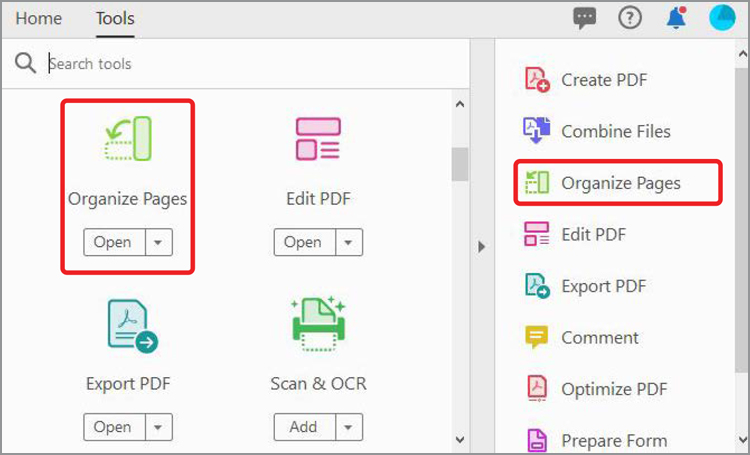
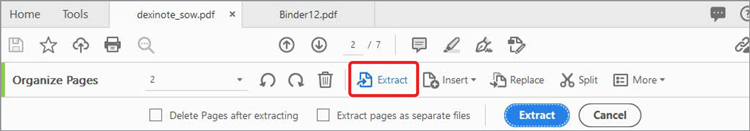

# 組織頁面

使用 **[!UICONTROL Acrobat DC 中的「組織頁面]** 」，在 PDF 中新增、取代、擷取、旋轉、刪除和移動頁面。

1. **[!UICONTROL 從「工具」中心選取「組織頁面]**  」。

   

1. 將滑鼠游標停留在頁面上，可順時針或逆時針旋轉頁面或刪除頁面。

   若要移動頁面，請按一下該頁面並拖曳至新位置。

   

1. 單 **[!UICONTROL 擊]** 工具列中的「擷取」，從一或多個頁面建立新的 PDF。

1. 選取頁面，然後按一下「 **[!UICONTROL 擷取」]** 按鈕。

   您也可以 **[!UICONTROL 插入]** 或 **[!UICONTROL 取代]** 頁面，並按一下「更多」查看其他選項 **** 。

   

1. 選 **[!UICONTROL 取「分割]** 」，將一個或多個 PDF 拆成多個較小的 PDF。

   分割 PDF 時，您可以因頁數、檔案大小或最上層書簽而分隔。

   

按一下以下載 *「組織」頁面* 教學課程的 PDF。

[! [下載組織頁面教學課程](../assets/acrobat_PDF_96.png）](../assets/AcrobatDCOrganize.pdf)
