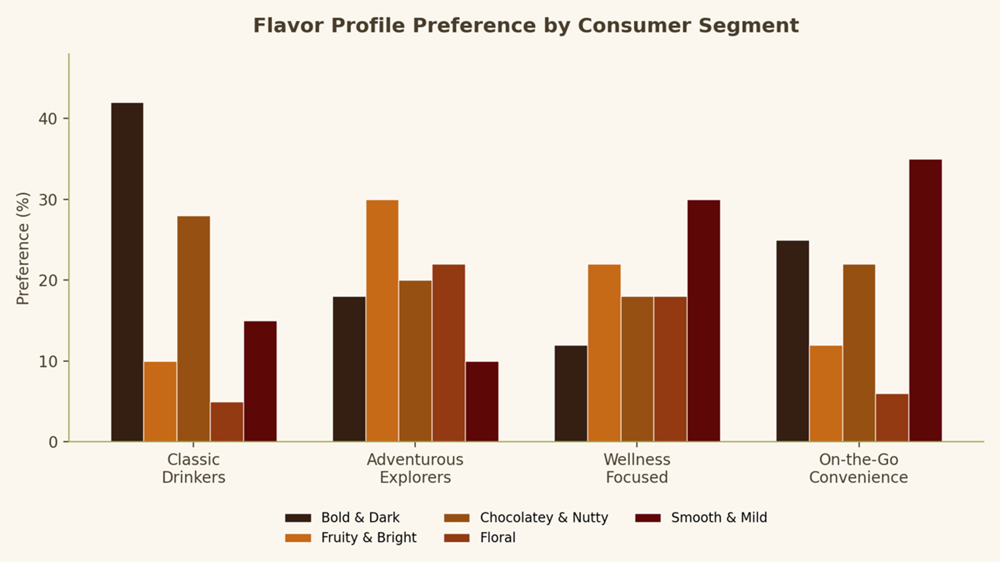

# 建立播客

瞭解如何使用Acrobat Studio從您的檔案和研究資料中建立AI產生的播客。 探索播客如何協助摘要關鍵資訊、強調重要深入分析，並讓內容更易於隨身使用。 您也會瞭解如何自訂對象的播客輸出，以及在專案中新增資訊時更新播客。

>[!VIDEO](https://video.tv.adobe.com/v/3503840?enablevpops&quality=12&learn=on&hidetitle=true)

<table style="table-layout:fixed">
<tr>
  <td>
    
    

    <a href="podcast.md"><strong>建立播客</strong></a>
    

    瞭解如何從您的檔案和研究資料建立AI產生的播客
     
  </td>
  <td>
    
    

     
  </td>
  <td>
    
    

     
  </td>
  <td>
    
    

     
  </td>
</tr>
</table>