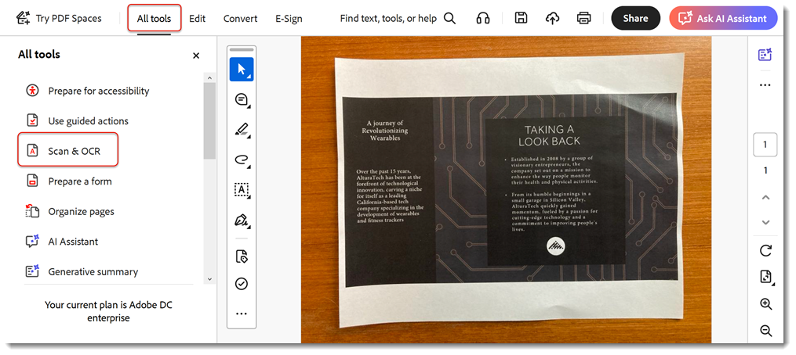

# 掃描與 OCR

將檔掃描或影像轉換為可搜尋、可編輯的 PDF 檔案 ](https://www.adobe.com/acrobat/online/pdf-editor.html) {target="_blank"} ， [ 持續推動業務發展。

>[!TIP]
>
>若要 OCR 處理多個 PDF 檔案，請嘗試使用「 [ 動作精靈」 ](../advanced-tasks/action.md) 。

1. 從「 **[!UICONTROL 工具 ] 」中心或右側窗格選 [!UICONTROL  取「掃描與 OCR]** 」。

   

1. 選取檔案.

   此檔案可能是檔的相片，或是使用掃描器或 Adobe Scan 行動應用程式建立的已掃描檔案。 或者，您可以掃描檔，使用連接的掃描器建立新檔案。

   

1. 選擇 **[!UICONTROL 「掃描的檔]** 」或 **[!UICONTROL 「相機影像]** 」來增強檔。

1. 選取 **[!UICONTROL 「增強]** 」以清理影像。

   

   Acrobat自動辨識掃描檔中的文字。

1. 選取 **[!UICONTROL 「識別文字]** 」以手動辨識影像檔案中的文字。

   

該檔案現在是可搜尋和編輯的 PDF 檔案。

>[!TIP]
>
>本課程 [ 中包含 Acrobat DC 和 Microsoft 365 ](https://experienceleague.adobe.com/?recommended=Acrobat-U-1-2021.microsoft365) （可在 Experience League 上免費取得） 更聰明地工作！
