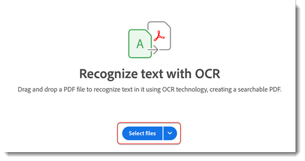

# 紙到PDF

瞭解如何掃描（或拍攝圖片）紙面文檔，並將其轉換為可搜索的[可編輯的PDF檔案](https://www.adobe.com/tw/acrobat/online/pdf-editor.html){target="_blank"}。 將紙張轉換為PDF可提高您快速查找資訊並讓殘疾人能夠訪問資訊的能力。

## 如何在案頭上將紙張變成Acrobat的PDF

1. 開啟文檔的照片或掃描影像。 或者，使用連接的掃描程式建立新檔案，或使用免費[Adobe Scan移動應用](https://adobescan.app.link/GpBqG8Bkoeb)。

1. 從工具欄中選擇&#x200B;**[!UICONTROL 所有工具]**，然後在左窗格中選擇&#x200B;**[!UICONTROL 掃描和OCR]**。

   

1. 根據檔案類型選擇&#x200B;**[!UICONTROL 增強掃描的影像]**&#x200B;或&#x200B;**[!UICONTROL 增強相機影像]**。

   

1. 拖動手柄以調整頁面邊框並選擇&#x200B;**[!UICONTROL 增強]**。

   

   Acrobat會自動清理和校直影像。

1. 選擇&#x200B;**[!UICONTROL 在此檔案]**&#x200B;中，然後選擇&#x200B;**[!UICONTROL 識別文本]**，使文本可搜索且可編輯。

   

該檔案現在是可搜索的可編輯的PDF檔案。

## 如何在Acrobat網上將紙面化成PDF

1. 在瀏覽器中登錄到[acrobat.adobe.com](https://acrobat.adobe.com/tw/zh/)。

1. 從頂部菜單中選擇「轉換」>「識別帶OCR的文本」**[!UICONTROL 。]**

   

1. 選擇&#x200B;**[!UICONTROL 選擇檔案]**，選擇檔案，然後選擇&#x200B;**[!UICONTROL 開啟]**。

   

1. 選擇&#x200B;**[!UICONTROL 識別文本]**。

   

   檔案中的文本現在可搜索和編輯。

1. 要刪除背景，請選擇影像，然後選擇&#x200B;**[!UICONTROL 編輯影像]**。

   

1. 從Adobe Express編輯器中選擇&#x200B;**[!UICONTROL 刪除背景]**。

   

1. 拖動手柄以調整頁面邊框並選擇&#x200B;**[!UICONTROL 應用]**。

   

>[!TIP]
>
>若要OCR多個PDF檔案，請嘗試在案頭上使用Acrobat Pro的[Action Wizard](../advanced-tasks/action.md)。

<table style="table-layout:fixed">
<tr>
  <td>
    
    

    <a href="scan-and-ocr.md"><strong>紙張到PDF</strong></a>
    

    <em>瞭解如何將紙面文檔轉換為智慧、可搜索、可編輯的PDF檔案功能</em>
     
  </td>
  <td>
      
      

       
  </td>
  <td>
      
      

       
  </td>
  <td>
      
      

       
  </td>
</tr>
</table>