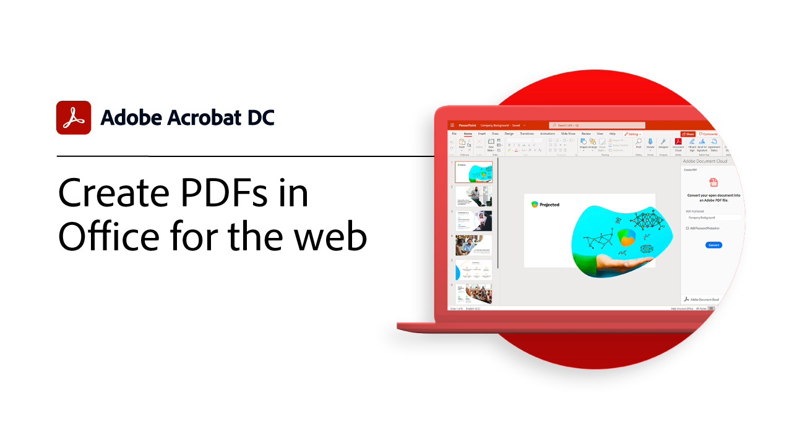

# 整合概觀

將Acrobat與 [!DNL Box] 、 [!DNL Dropbox] 、 [!DNL Google Drive] 、 [!DNL OneDrive] 和 [!DNL Microsoft] 應用程式整合。

## Microsoft

瞭解您團隊中的每個人都可以如何直接在 [ Microsoft 365 ](https://www.adobe.com/documentcloud/integrations/microsoft-office-365.html) 中順暢地使用 PDF 檔案。

<table style="table-layout:fixed">
<tr>
  <td>
    
    

    <a href="createfromword.md"><strong>從中建立 PDF 檔案 [!DNL Microsoft Word]</strong></a>
    

    <em>使用超連結的內容表格和交互參照、書簽，甚至附件，直接從中建立功能豐富的 PDF 檔案 [!DNL Microsoft Word]</em>
     
  </td>
  <td>
    
    

    <a href="createofficeweb.md"><strong>在網頁版中 [!DNL Office] 建立 PDF</strong></a>
    

    <em>瞭解如何在不離開網頁 [!DNL Microsoft Office] 應用程式的情況下建立 PDF 檔案</em>
     
  </td> 
  <td>
    
    

    <a href="acrobatandsp.md"><strong>處理您的 [!DNL SharePoint] 檔案</strong></a>
    

    <em>透過和Acrobat簡化檔工作流程 [!DNL SharePoint]</em>
     
  </td>
  <td>
    
    

    <a href="acrobatandteams.md"><strong>PDF 共同作業 [!DNL Microsoft Teams]</strong></a>
    

    <em>無需離開即可透過檢視、批註和審核 PDF 與同事協作及協作 [!DNL Microsoft Teams]</em>
     
  </td>
</tr>
<tr>
  <td>
    
    

    <a href="outlook.md"><strong>將電子郵件訊息和附件轉換為 PDF [!DNL Outlook]</strong></a>
    

    <em>瞭解如何在 [!DNL Outlook]</em>
     
  </td>
  <td>
    
    

    <a href="edge.md"><strong>使用 [!DNL Microsoft Edge]</strong></a>
    

    <em>瞭解如何使用 Adobe Acrobat 副檔名即時將網頁封存為 PDF [!DNL Microsoft Edge]</em>
     
  </td>
  <td>
   
    

     
  </td>
  <td>
   
    

     
  </td>
</tr>
</table>

## Google 雲端硬碟

瞭解如何使用必要的 PDF 和電子簽名工具，在更短的時間內 [!DNL Google Drive] 完成更多工作。

<table style="table-layout:fixed">
<tr>
  <td>
    
    

    <a href="acrobatandgoogle.md"><strong>Adobe Acrobat [!DNL Google Drive]</strong></a>
    

    <em>直接在應用程式內 [!DNL Google Drive] 存取省時的 PDF 工具和電子簽名工作流程</em>
     
  </td>
  <td>
   
    

     
  </td>
  <td>
   
    

     
  </td>
  <td>
   
    

     
  </td>
</tr>
</table>

## Dropbox

瞭解存取和使用儲存在 [!DNL Dropbox] 其中的檔案有多簡單。

<table style="table-layout:fixed">
<tr>
  <td>
    
    

    <a href="acrobat-dropbox.md"><strong>使用來自 [!DNL Dropbox]</strong></a>
    

    <em>瞭解如何從檔案內開啟、建立、編輯、簽署和儲存對檔案所做的變更 [!DNL Dropbox] Acrobat</em>
     
  </td>
  <td>
   
    

     
  </td>
  <td>
   
    

     
  </td>
  <td>
   
    

     
  </td>
</tr>
</table>

## Box

瞭解 Acrobat 和 [ Box ](https://www.adobe.com/documentcloud/integrations/box.html) {target=「_blank」} 如何讓組織中的每個人更輕鬆地持續推動業務發展。
