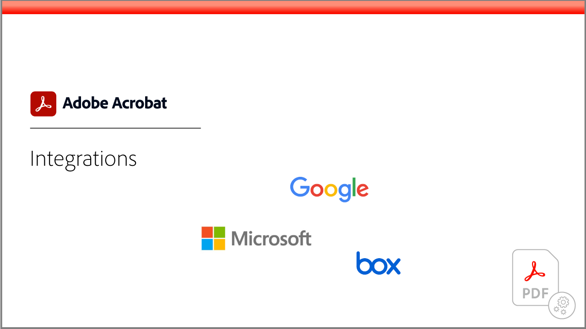

# Acrobat教學課程

Adobe Acrobat （Adobe Document Cloud解決方案） 可轉換、編輯、共用和簽署 PDF，協助您持續推展業務。 在這裡，您會找到各式各樣的學習體驗，其設計是讓初學者和進階使用者快速上手Adobe Acrobat。

## 學習路徑

<table style="table-layout:fixed">
<tr>
  <td>
    
  </td>
  <td>
    
  </td>
  <td>
    
  </td>
  <td>
    
  </td>
</tr>
<tr>
  <td>
    
  </td>  
  <td>
    
  </td>
  <td>
  
  </td>
  <td>
    
  </td>
</tr>
</table>
