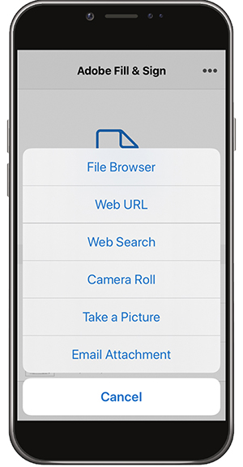
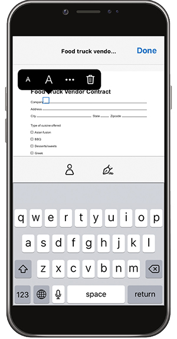

# 在桌上型電腦或行動裝置上填寫和簽署任何表單

從案頭、瀏覽器或行動應用程式快速填寫、簽署及傳送表單。 Adobe AI可辨識並儲存常用資料，以便用於PDF表單。 透過繪圖、匯入掃描或輸入您的名稱來建立簽名，然後將其安全地套用至檔案。

在本練習中，您將使用行動裝置匯入、填寫、簽署及傳送來自。

以下是此練習的[示範檔案](assets/03_FillSignScan.zip)。

**步驟1：**&#x200B;從[!DNL Apple App]市集或[!DNL Google Play]下載[!DNL Adobe Fill & Sign]應用程式。

**步驟2：**&#x200B;開啟應用程式，點選&#x200B;**[!UICONTROL 選取要填寫的表單]**。

**步驟3：**&#x200B;選擇其中一個匯入選項。 在本練習中，我們將「拍照」。

**步驟4：**&#x200B;使用白色按鈕來拍照，然後點選&#x200B;**[!UICONTROL 使用像片]**。 點選右上角的&#x200B;**[!UICONTROL 完成]**。

**步驟5：**&#x200B;在應用程式底部，點選「**[!UICONTROL 裁切]**」工具，並使用參考線[裁切影像](https://www.adobe.com/tw/acrobat/online/crop-pdf.html)。 完成時點選&#x200B;**[!UICONTROL 完成]**。

**步驟6：**&#x200B;如有必要，請使用魔術棒工具來清除影像。 完成時點選&#x200B;**[!UICONTROL 完成]**。

**步驟7：**&#x200B;點選頁面上的任何位置以建立欄位，並將必要資訊新增至您的檔案。 選取橢圓以檢視更多選項。

**步驟8：**&#x200B;點選應用程式底部的&#x200B;**[!UICONTROL 簽章]**&#x200B;按鈕以新增您的簽章。

**步驟9：**&#x200B;使用手寫筆或手指登入簽名欄位。 移動並放置簽名欄位。

**步驟10：**&#x200B;點選應用程式底部的&#x200B;**[!UICONTROL 設定檔]**&#x200B;按鈕，以取得預先填入的值，例如您的名稱和日期。 您只需填寫此資訊一次，隨後您便可以用在您使用Fill &amp; Sign應用程式完成的所有未來表單上。

**步驟11：**&#x200B;表單完成後，點選右下角的「共用」按鈕以傳送電子郵件。

## 重述：

* 從電子郵件開啟檔案，或使用裝置相機拍照紙張。

* 點選以在表單欄位中輸入文字或核取標籤。 若要加快速度，請使用自訂自動填色專案。

* 使用手指或手寫筆建立您的簽名。 然後，將其套用至表單，或視需要新增您的縮寫。
