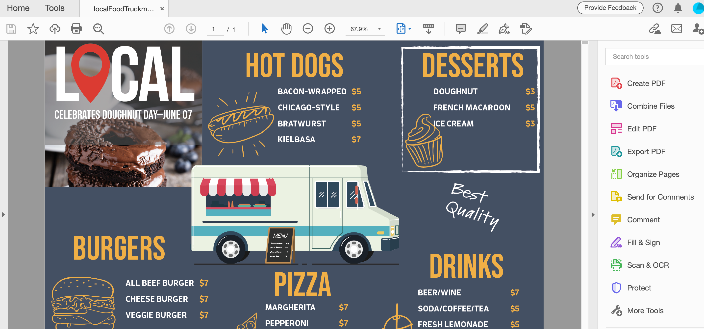
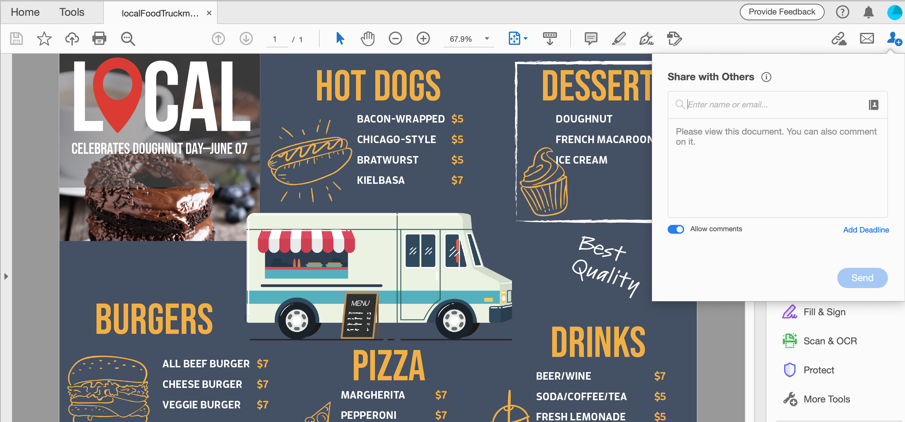
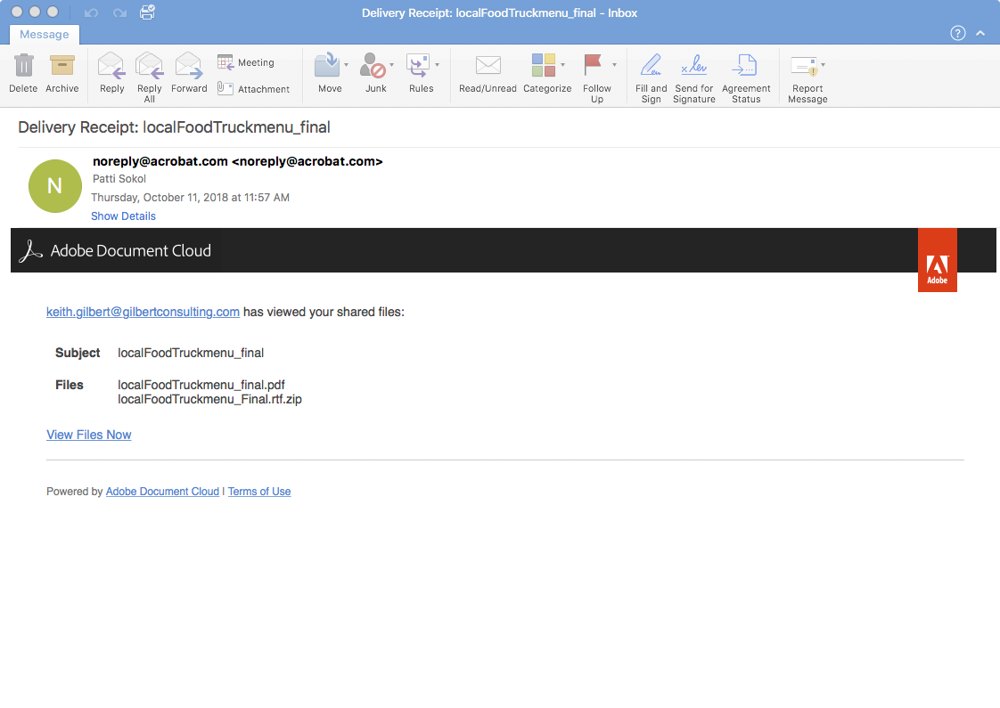
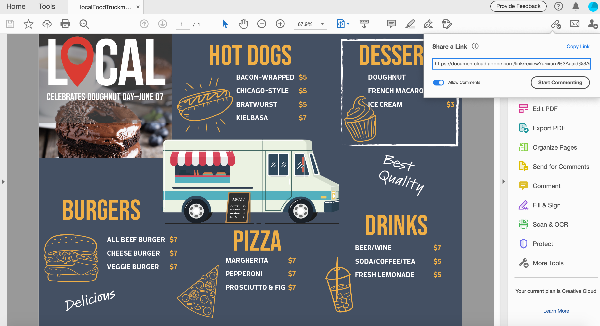
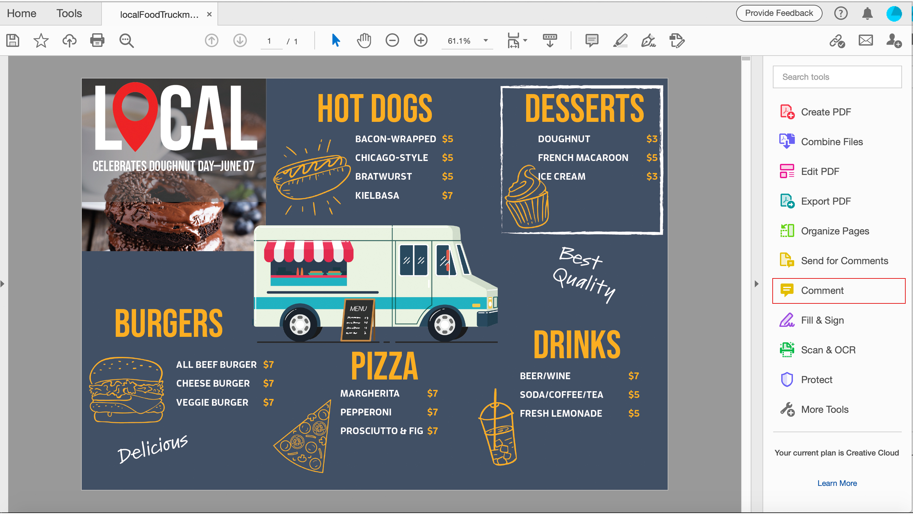
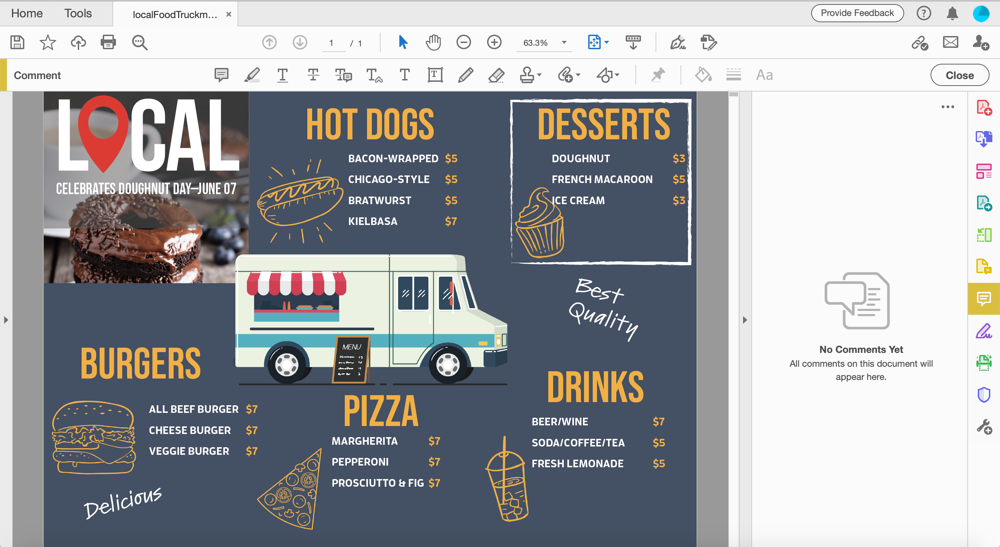

# 共用PDF檔案並線上檢閱

使用Adobe Document Cloud檢閱服務可輕鬆共用PDF檔案，以便從Acrobat案頭應用程式、Document Cloud Web或Acrobat Reader行動應用程式檢閱。 當稽核者從他們的電腦按一下電子郵件邀請中的URL時，他們可以在瀏覽器中輕鬆提供意見回饋，而無需登入或安裝任何其他軟體。

在本練習中，我們將回顧如何

* 傳送個人化邀請以發表評論
* 以電子郵件傳送匿名或公開連結

以下是此練習的[示範檔案](assets/01_Review.zip)。

## 傳送個人化邀請以發表評論

**步驟1：**&#x200B;在Adobe Acrobat中開啟`localFoodTruckmenu_start.pdf`檔案。

**步驟2：**&#x200B;按一下右側面板中的&#x200B;**[!UICONTROL 傳送註解]**，或右上角的&#x200B;**[!UICONTROL 與其他人共用此檔案]** 圖示。

**步驟3：**&#x200B;輸入收件者的電子郵件地址。 您可以輸入訊息給收件者，或新增稽核的截止日期。

收件者檢視您的檔案後，您將會收到電子郵件通知。

## 檢閱者體驗

審核者會收到電子郵件邀請，其中含有審核 PDF 的連結。 當使用者按一下邀請中的連結或&#x200B;**[!UICONTROL 檢閱]**&#x200B;按鈕時，PDF會在網頁瀏覽器中開啟。 他們可以使用注釋工具在 PDF 新增注釋。 他們也可以使用Acrobat Reader或Acrobat案頭應用程式來新增註解。

## 以電子郵件傳送匿名或公開連結

**步驟1：**&#x200B;在Adobe Acrobat中開啟`localFoodTruckmenu_start.pdf`檔案。

**步驟2：**&#x200B;按一下&#x200B;**[!UICONTROL 共用連結]** 。 系統會立即產生共用連結，因此您不必等候檔案上傳至雲端。 依預設，[!UICONTROL 允許註解]開關是開啟的。

**步驟3：**&#x200B;按一下&#x200B;**[!UICONTROL 複製連結]**&#x200B;並與收件者共用連結。

## 發表評論

**步驟1：**&#x200B;按一下右側面板上的&#x200B;**[!UICONTROL 註解]**。

**步驟2：**&#x200B;使用頂端功能區工具來標示檔案和/或輸入註解。

您的註解會自動儲存並可供其他人檢視。

## 將PDF註解匯入InDesign

InDesign CC 2019可讓您直接從PDF檔案匯入註解。 只需按一下即可匯入、接受及套用變更。 在新的「PDF註解」面板中選取註解，會在InDesign檔案中找出並反白該註解。

**步驟1：**&#x200B;下載包含註解的PDF檔案。

**步驟2：**&#x200B;開啟您的InDesign檔案。

**步驟3：**&#x200B;從上方功能表按一下&#x200B;**[!UICONTROL 檔案]**。

在Indd中有

**步驟4：**&#x200B;從下拉式清單中按一下&#x200B;**[!UICONTROL 匯入PDF註解]**。

**步驟5：**&#x200B;開啟包含註解的PDF。

在Indd中有

註解會顯示在UI中。

## 重述：

與Acrobat檢閱和共用設計版本。 Acrobat可讓您，

* 傳送指向PDF的連結以供其他人檢閱。
* 隨處檢閱：案頭、瀏覽器、行動裝置。
* 在單一檔案中收集。
* 在一個有組織的地方管理意見反應。
* 您只需要使用瀏覽器即可。

評論的傳送和追蹤都可以在同一處輕鬆進行。 收件者即使沒有Acrobat，也可以檢視！ 您可以透過瀏覽器邀請某人發表評論。 省時省力。
