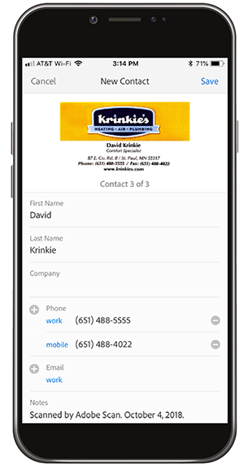

# 使用Adobe Scan進行數位化

整理、整理或共用！ 不需要在辦公桌上棧放紙張，也不需要在錢包裡放入收據。 Adobe Scan行動應用程式會直接將書面檔案掃描成PDF，並自動辨識文字。

在本練習中，您會將名片中的內容直接上傳到連絡人中。 掃描並儲存回條。

收集名片、收據或您要使用的其他紙張。

## 掃描名片

**步驟1：**&#x200B;從Apple App Store或Google Play下載Adobe Scan App。

**步驟2：**&#x200B;開啟Adobe Scan App。

**步驟3：**&#x200B;從應用程式中，拍攝包含您要儲存至手機之連絡人資訊的名片照片。

**步驟4：**&#x200B;掃描完成後，請進行調整以確保卡片在邊界方框內。

**步驟5：**&#x200B;點選右上角的&#x200B;**[!UICONTROL 儲存PDF]**。 然後，點選&#x200B;**[!UICONTROL 儲存連絡人]**。

**步驟6：**&#x200B;在儲存到您的電話之前，對連絡人資訊進行任何需要的編輯或新增。 再次點選[儲存]以完成儲存至連絡人。

## 掃描並儲存回條

Adobe Scan應用程式也可用於掃描和儲存您稍後需要的回條（例如費用報表或其他補助金）。

**步驟1：**&#x200B;開啟Adobe Scan應用程式後，為您要儲存的收據拍照。

**步驟2：** Observe as the app自動偵測您的回條，並擷取其內容。

**步驟3：**&#x200B;在右上角點選「**[!UICONTROL 儲存PDF]**」，將收據儲存在手機中。

## 重述：

* 將紙本檔案和表單掃描至PDF。
* 將JPG影像轉換為PDF。
* 直接在您的裝置上編輯。
* 將名片資訊直接新增至連絡人。

扔掉報紙！
