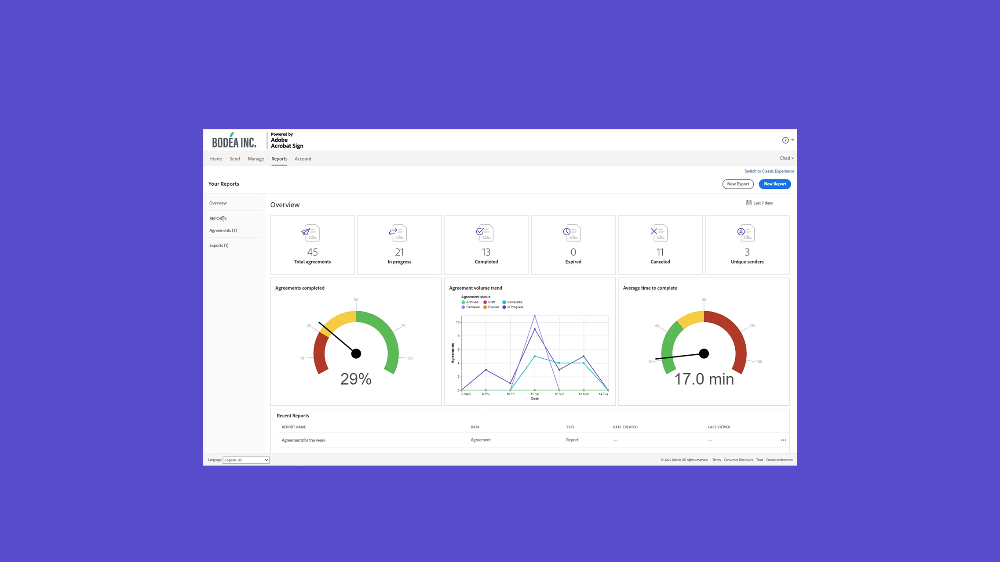
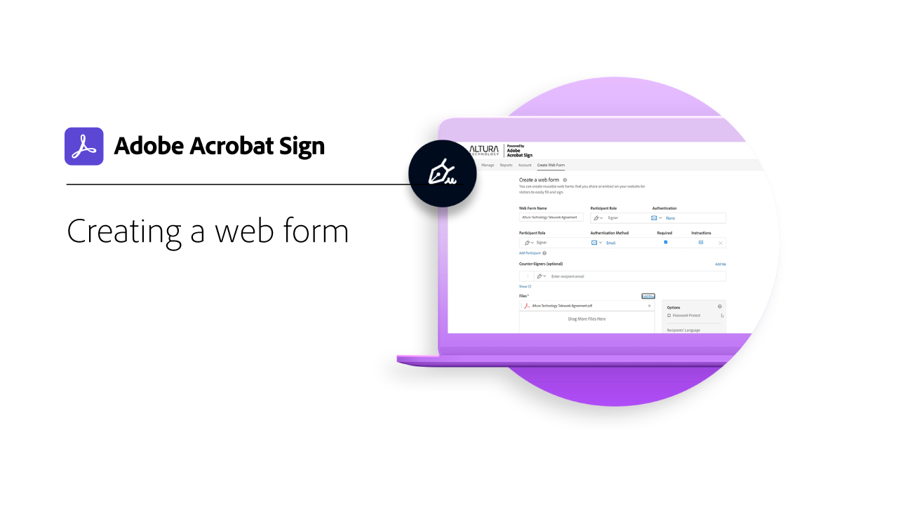
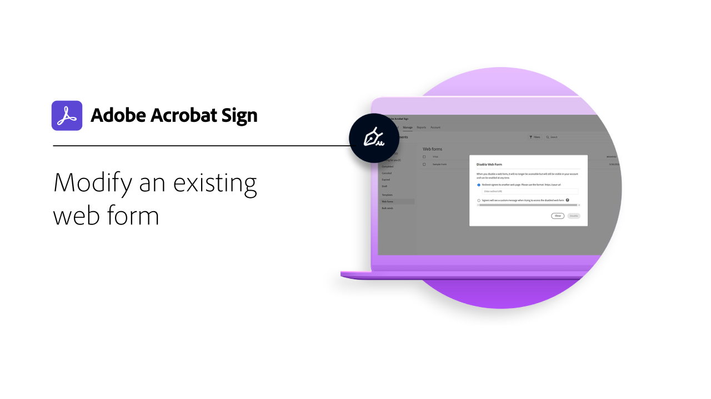
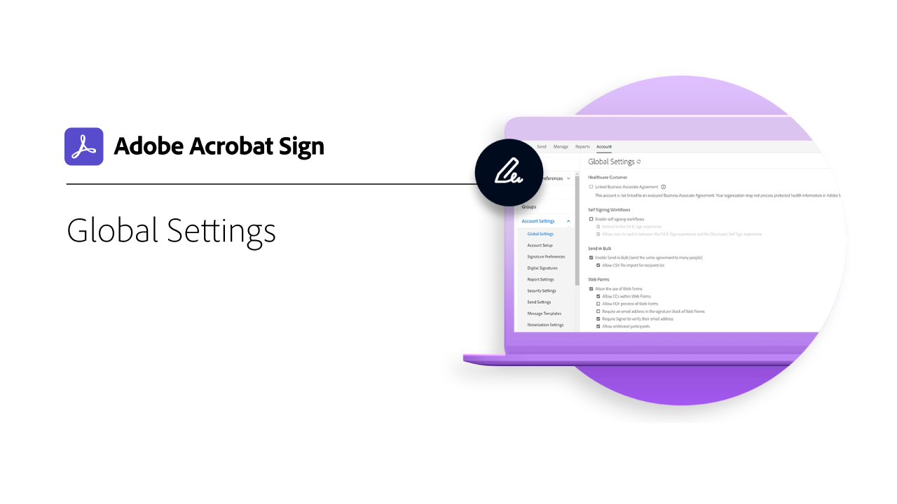
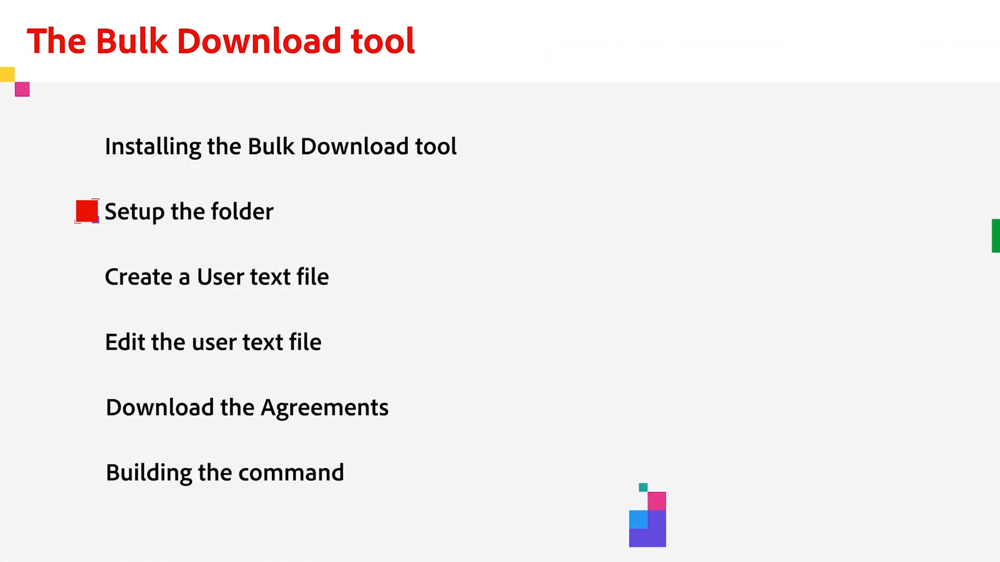
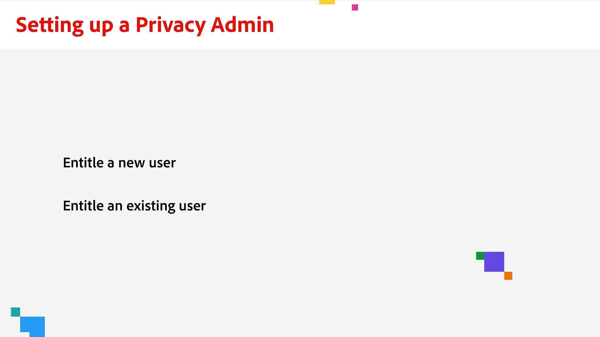

# 管理員總覽

瞭解如何將使用者新增至您的帳戶、設定群組、共用存取權，以及設定工作流程、外部封存以及共用的事件和警告。 這些教學課程是專為已進入安裝階段且已準備好開始管理 Acrobat Sign 的管理員所設計。 「進階工作」涵蓋從管理員設定擴展並開始定義全域設定、帳戶存取和共用以及文字標記的主題。

## 新增功能

>[!BEGINTABS]

>[!TAB 新增使用者]

瞭解 [如何新增和管理 Acrobat Sign](add-users-to-your-account.md) 的使用者。

>[!TAB 如何設定隱私權管理員]

瞭解如何設定和使用 [隱私權](privacy.md)管理員。

>[!TAB 大量下載工具]

瞭解如何使用「 [大量下載」工具](bulk-download-tool.md) ，快速下載所有已簽署的合約。

>[!ENDTABS]

## 快速入門

<table style="table-layout:fixed">
<tr>
  <td>
    
    

    <a href="get-started-admin.md"><strong>新管理員快速入門</strong></a>
    

    <em>在這個全面的影片指南中，瞭解讓您的組織開始執行 Acrobat Sign 所需的所有工具</em>
     
  </td>
  <td>
    
    

    <a href="up-and-running-admin.md"><strong>已啟動並執行管理員</strong></a>
    

    <em>管理員在 Acrobat Sign 中快速上手和執行的 7 個關鍵區域概覽</em>
     
  </td>
  <td>
    
    

    <a href="set-up-shared-events-and-alert.md"><strong>設定事件和警告的通知</strong></a>
    

    <em>設定帳戶的事件和警告通知</em>
     
  </td>
  <td>
    
    

    <a href="add-users-to-your-account.md"><strong>新增使用者</strong></a>
    

    <em>將新使用者新增至 Acrobat Sign</em>
     
  </td>
</tr>
<tr>
 <td>
    
    

    <a href="create-and-manage-groups.md"><strong>建立和管理群組</strong></a>
    

    <em>建立群組、將使用者新增至群組，以及編輯群組設定</em>
     
  </td>
  <td>
    
    

    <a href="set-up-your-external-archive.md"><strong>設定外部封存</strong></a>
    

    <em>為已簽署的合約備份建立外部封存盤</em>
     
  </td>
  <td>
    
    

    <a href="../sign-advanced-users/create-a-template.md"><strong>建立文件範本</strong></a>
    

    <em>建立可重複使用的文件範本，以加快與一致性</em>
     
  </td>
  <td>
    
    

    <a href="../sign-advanced-users/creating-a-report.md"><strong>報告和交易使用方式</strong></a>
    

    <em>瞭解如何產生報告並追蹤交易使用量</em>
     
  </td>
</tr>
<tr>
  <td>
    
    

    <a href="report-options.md"><strong>用戶的報告選項</strong></a>
    

    <em>瞭解如何為用戶設定報告選項</em>
     
  </td>
  <td>
    
    

    <a href="../sign-advanced-users/webform.md"><strong>建立網頁表單</strong></a>
    

    <em>建立可直接在您的網站上進行電子簽署的檔</em>
     
  </td>
  <td>
    
    

    <a href="../sign-advanced-users/modify-webform.md"><strong>修改現有的網頁表單</strong></a>
    

    <em>瞭解如何停用、編輯和重新啟用現有的網頁窗體</em>
     
  </td>
  <td>
    
    

    <a href="../sign-advanced-users/megasign.md"><strong>「大量傳送」</strong></a>
    

    <em>針對任何檔一次收集數千個簽名</em>
     
  </td>
</tr>
<tr>
  <td>
    
    

    <a href="building-a-custom-workflow.md"><strong>設定工作流程</strong></a>
    

    <em>自動化檔工作流程，快速取得電子簽名和數據</em>
     
  </td>
  <td>
    
    

    <a href="audit-reports.md"><strong>稽核報告</strong></a>
    

    <em>瞭解如何存取、使用和設定稽核報告</em>
     
  </td>
  <td>
    
    

    <a href="promote-admin.md"><strong>指派產品和支援管理員角色</strong></a>
    

    <em>瞭解如何使用 Admin Console 將使用者提升至 Acrobat Sign 產品或支援管理員角色</em>
     
  </td>
   <td>
    
    

     
  </td>
</table>

## 進階工作

<table style="table-layout:fixed">
<tr>
  <td>
    
    

    <a href="learn-about-global-settings.md"><strong>全域設定</strong></a>
    

    <em>全域編輯整個組織或特定群組的產品設定</em>
     
  </td>
  <td>
      
    

    <a href="share-account-access.md"><strong>共用帳戶存取權</strong></a>
    

    <em>設定另一個用戶帳戶中交易的僅限檢視存取權</em>
     
  </td>
  <td>
    
    

    <a href="advanced-account-sharing.md"><strong>進階帳戶共用</strong></a>
    

    <em>設定帳戶共用，以允許管理員和使用者委派傳送、修改和檢視許可權</em>
     
  </td>
  <td>
    
    

    <a href="bulk-download-tool.md"><strong>大量下載工具</strong></a>
    

    <em>瞭解如何使用「大量下載」工具，快速下載所有已簽署的合約</em>
     
  </td> 
</tr>
<tr>
   <td>
     
    

    <a href="../sign-advanced-users/adobe-sign-text-tagging.md"><strong>Acrobat簽署文字標記</strong></a>
    

    <em>使用Adobe Acrobat標記文字來建立Acrobat簽署表單域</em>
     
  </td>
  <td>
    
    

    <a href="use-bio-pharma-settings.md"><strong>使用生技識別設定</strong></a>
    

    <em>設定可讓您符合 FDA 21 CFR Part 11 需求的生技識別設定</em>
     
  </td>
  <td>
    
    

    <a href="privacy.md"><strong>如何設定隱私權管理員</strong></a>
    

    <em>瞭解如何設定和使用隱私權管理員</em>
     
  </td>
  <td>
    
    

     
  </td>
</tr>
</table>
