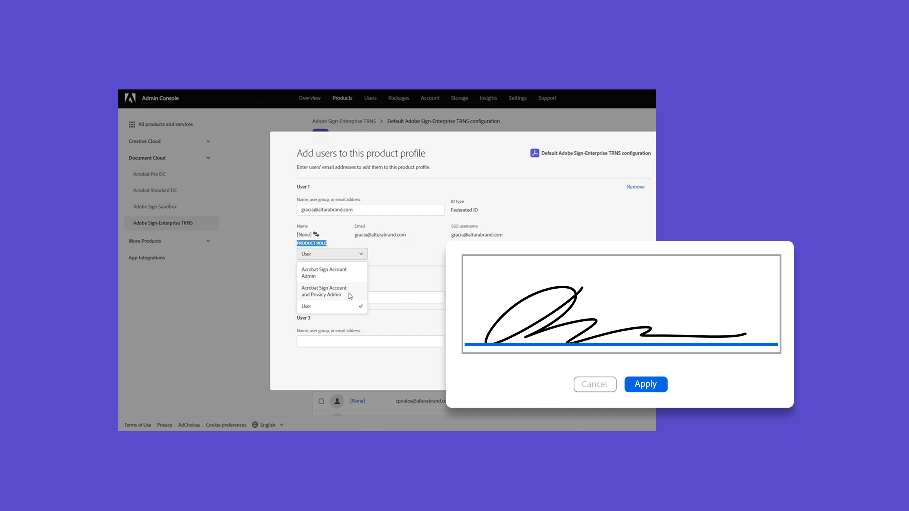
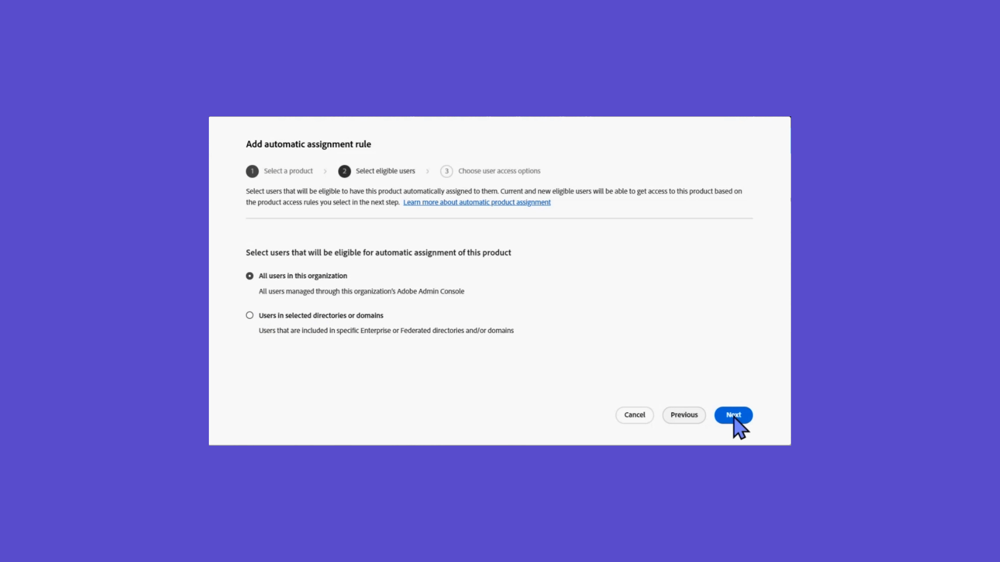

# 管理員概觀

瞭解如何將使用者新增至您的帳戶、設定群組、共用存取權，以及設定工作流程、外部封存和共用事件與警示。 這些教學課程是專為已度過安裝階段並準備好開始管理Acrobat Sign的管理員所設計。 進階工作涵蓋的主題已超出管理員設定，並進入定義全域設定、帳戶存取與共用，以及文字標籤。

## 新增功能

>[!BEGINTABS]

>[!TAB 設定並控管修改協定]

瞭解如何在Acrobat Sign中設定及控管[修改合約](configure-modify-agreement.md)。

>[!TAB 建置自訂工作流程]

瞭解如何建立並使用[自訂工作流程](building-a-custom-workflow.md)，以加速建立和傳送合約的程式。

>[!TAB 建立可重複使用的範本]

瞭解如何建立[可重複使用的檔案範本](../sign-advanced-users/create-a-template.md)。

>[!TAB 啟用自動使用者指派規則]

瞭解如何設定[自動指派規則](automatic-assignment-rules.md)，以授與使用者在Admin Console中存取Acrobat Sign的許可權。

>[!ENDTABS]

## 快速入門

<table style="table-layout:fixed">
<tr>
  <td>
    
    

    <a href="get-started-admin.md"><strong>新管理員快速入門</strong></a>
    

    <em>在這個完整的影片指南中，瞭解讓您的組織開始運作Acrobat Sign所需的所有工具</em>
    
  </td>
  <td>
    
    

    管理員的<a href="up-and-running-admin.md"><strong>已啟動且正在執行</strong></a>
    

    <em>管理員在Acrobat Sign中快速上手和執行的7大關鍵區域概觀</em>
    
  </td>
  <td>
    
    

    <a href="docusign-templates.md"><strong>移轉檔案範本</strong></a>
    

    <em>瞭解如何順暢地移轉Docusign範本和工作流程</em>
    
  </td>
  <td>
    
    

    <a href="add-users-to-your-account.md"><strong>新增使用者</strong></a>
    

    <em>瞭解如何新增使用者至Acrobat Sign</em>
    
  </td>
</tr>
<tr>
  <td>
    
    

    <a href="automatic-assignment-rules.md"><strong>啟用自動使用者指派規則</strong></a>
    

    <em>瞭解如何設定自動指派規則，以授予使用者在Admin Console中Acrobat Sign的存取權</em>
    
  </td>
  <td>
    
    

    <a href="add-admin.md"><strong>新增帳戶管理員</strong></a>
    

    <em>瞭解如何建立新使用者或將現有使用者升級為Acrobat Sign管理員角色</em>
    
  </td>
    <td>
      
      

      <a href="promote-admin.md"><strong>指派產品與支援管理員角色</strong></a>
      

      <em>瞭解如何在Admin Console中指派Acrobat Sign使用者產品管理員和支援管理員角色</em>
      
    </td>
    <td>
      
      

      <a href="create-and-manage-groups.md"><strong>建立和管理群組</strong></a>
      

      <em>建立群組、新增使用者至群組，以及編輯群組設定</em>
      
    </td>
</tr>
<tr>
 <td>
      
      

      <a href="set-up-your-external-archive.md"><strong>正在設定外部封存</strong></a>
      

      <em>為已簽署的協定備份復本建立外部封存</em>
      
    </td>
  <td>
    
    

    <a href="../sign-advanced-users/create-a-template.md"><strong>建立可重複使用的範本</strong></a>
    

    <em>建立可重複使用的檔案範本以提高速度和一致性</em>
    
  </td>
  <td>
    
    

    <a href="../sign-advanced-users/creating-a-report.md"><strong>報告和交易使用量</strong></a>
    

    <em>瞭解如何產生報告及追蹤交易使用情況</em>
    
  </td>
  <td>
    
    

    <a href="report-options.md"><strong>使用者的報表選項</strong></a>
    

    <em>瞭解如何設定使用者的報表選項</em>
    
  </td>
</tr>  
<tr>
   <td>
    
    

    <a href="../sign-advanced-users/webform.md"><strong>正在建立網路表單</strong></a>
    

    <em>建立可直接在您的網站上以電子方式簽署的檔案</em>
    
  </td>
  <td>
    
    

    <a href="../sign-advanced-users/modify-webform.md"><strong>修改現有的Web表單</strong></a>
    

    <em>瞭解如何停用、編輯和重新啟用現有的Web表單</em>
    
  </td>
  <td>
    
    

    <a href="../sign-advanced-users/megasign.md"><strong>大量傳送</strong></a>
    

    <em>針對任何檔案一次收集數千個簽章</em>
    
  </td>
  <td>
    
    

    <a href="building-a-custom-workflow.md"><strong>建置自訂工作流程</strong></a>
    

    <em>瞭解如何建立和使用自訂工作流程，以加速建立和傳送合約的程式</em>
    
  </td>
</tr>
<tr>
     <td>
    
    

    <a href="audit-reports.md"><strong>稽核報告</strong></a>
    

    <em>瞭解如何存取、利用及設定稽核報告</em>
    
    </td>
    <td>
      
      

      <a href="set-up-shared-events-and-alert.md"><strong>設定事件和警示的通知</strong></a>
      

      <em>設定您帳戶的事件和警示通知</em>
      
    </td>
    <td>
      
      

      <a href="configure-modify-agreement.md"><strong>設定並控管修改協定</strong></a>
      

      <em>瞭解如何設定及控管修改合約</em>
      
    </td>
    <td>
      
      

       
    </td>
</tr>    
</table>

## 進階工作

<table style="table-layout:fixed">
<tr>
  <td>
    
    

    <a href="learn-about-global-settings.md"><strong>全域設定</strong></a>
    

    <em>針對整個組織或特定群組，全域編輯產品設定</em>
    
  </td>
  <td>
      
    

    <a href="share-account-access.md"><strong>共用帳戶存取權</strong></a>
    

    <em>設定對其他使用者帳戶中交易的僅檢視存取權</em>
    
  </td>
  <td>
    
    

    <a href="advanced-account-sharing.md"><strong>進階帳戶共用</strong></a>
    

    <em>設定帳戶共用，以允許管理員和使用者委派其傳送、修改和檢視許可權</em>
    
  </td>
  <td>
    
    

    <a href="bulk-download-tool.md"><strong>大量下載工具</strong></a>
    

    <em>瞭解如何使用大量下載工具來快速下載所有您簽署的合約</em>
    
  </td> 
</tr>
<tr>
   <td>
     
    

    <a href="../sign-advanced-users/adobe-sign-text-tagging.md"><strong>Acrobat Sign文字標籤</strong></a>
    

    <em>使用Adobe Acrobat以文字標籤建置Acrobat Sign表單欄位</em>
    
  </td>
  <td>
    
    

    <a href="use-bio-pharma-settings.md"><strong>使用生物製藥設定</strong></a>
    

    <em>設定生物製藥設定，讓您符合FDA 21 CFR Part 11需求</em>
    
  </td>
  <td>
    
    

    <a href="privacy.md"><strong>如何設定隱私權管理員</strong></a>
    

    <em>瞭解如何設定及使用隱私權管理員</em>
    
  </td>
  <td>
    
    

     
  </td>
</tr>
</table>
