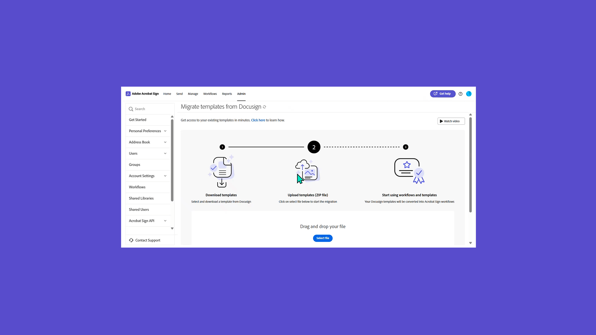

# 管理員概觀

瞭解如何將使用者新增至您的帳戶、設定群組、共用存取權，以及設定工作流程、外部封存，以及共用事件和快訊。 這些教學課程是專為已過安裝階段並準備開始管理 Acrobat Sign 的管理員所設計。 進階工作涵蓋的主題會從管理員設定擴展到定義全域設定、帳戶存取和共用，以及文字標籤。

## 新增功能

>[!BEGINTABS]

>[!TAB 移轉 Docusign 範本]

瞭解如何透過三個簡單步驟順暢地 [移轉 Docusign 範本](docusign-templates.md) 和工作流程。

>[!TAB 新增使用者]

了解如何 [將新使用者新增至 Acrobat Sign](add-users-to-your-account.md)。

>[!TAB 如何設定隱私權管理員]

瞭解如何設定和使用 [隱私權管理員](privacy.md)。

>[!ENDTABS]

## 快速入門

<table style="table-layout:fixed">
<tr>
  <td>
    
    

    <a href="get-started-admin.md"><strong>新系統管理員入門</strong></a>
    

    <em>在這份詳盡的影片指南中，瞭解讓您的組織使用 Acrobat Sign 啟動和執行所需的所有工具</em>
     
  </td>
  <td>
    
    

    <a href="up-and-running-admin.md"><strong>為管理員啟動並運行</strong></a>
    

    <em>管理員在 Acrobat Sign 中快速啟動和執行的 7 個關鍵區域概觀</em>
     
  </td>
  <td>
    
    

    <a href="docusign-templates.md"><strong>移轉 Docusign 範本</strong></a>
    

    <em>瞭解如何順暢地移轉 Docusign 範本和工作流程</em>
     
  </td>
  <td>
    
    

    <a href="add-users-to-your-account.md"><strong>新增使用者</strong></a>
    

    <em>了解如何將新使用者新增至 Acrobat Sign</em>
     
  </td>
</tr>
<tr>
  <td>
    
    

    <a href="add-admin.md"><strong>新增帳戶管理員</strong></a>
    

    <em>瞭解如何建立新使用者，或將現有使用者升級為 Acrobat Sign 管理員角色</em>
     
  </td>
  <td>
      
      

      <a href="set-up-shared-events-and-alert.md"><strong>設定事件和警示的通知</strong></a>
      

      <em>設定帳戶的事件和警示通知</em>
       
    </td>
    <td>
      
      

      <a href="create-and-manage-groups.md"><strong>建立和管理群組</strong></a>
      

      <em>建立群組、將使用者新增至群組，以及編輯群組設定</em>
       
    </td>
    <td>
      
      

      <a href="set-up-your-external-archive.md"><strong>設定外部封存</strong></a>
      

      <em>建立已簽署合約備份副本的外部封存</em>
       
    </td>
</tr>
<tr>
  <td>
    
    

    <a href="../sign-advanced-users/create-a-template.md"><strong>建立文件範本</strong></a>
    

    <em>創建可重複使用的文件模板以提高速度和一致性</em>
     
  </td>
  <td>
    
    

    <a href="../sign-advanced-users/creating-a-report.md"><strong>報告和交易使用情況</strong></a>
    

    <em>瞭解如何產生報告和追蹤交易使用情況</em>
     
  </td>
  <td>
    
    

    <a href="report-options.md"><strong>使用者的報告選項</strong></a>
    

    <em>瞭解如何為使用者設定報表選項</em>
     
  </td>
  <td>
    
    

    <a href="../sign-advanced-users/webform.md"><strong>建立網頁表單</strong></a>
    

    <em>建立可直接在您的網站上以電子方式簽署的文件</em>
     
  </td>
</tr>  
<tr>
   <td>
    
    

    <a href="../sign-advanced-users/modify-webform.md"><strong>修改現有的網頁表單</strong></a>
    

    <em>瞭解如何停用、編輯和重新啟用現有的網頁表單</em>
     
  </td>
  <td>
    
    

    <a href="../sign-advanced-users/megasign.md"><strong>大量發送</strong></a>
    

    <em>一次收集任何文件的數千個簽名</em>
     
  </td>
  <td>
    
    

    <a href="building-a-custom-workflow.md"><strong>設定工作流程</strong></a>
    

    <em>自動化文件工作流程以快速取得電子簽名和資料</em>
     
  </td>
  <td>
    
    

    <a href="audit-reports.md"><strong>審計報告</strong></a>
    

    <em>瞭解如何存取、使用及設定稽核報告</em>
     
  </td>
</tr>
<tr>
    <td>
      
      

      <a href="promote-admin.md"><strong>指派產品與支援管理員角色</strong></a>
      

      <em>了解如何在 Admin Console 中指派 Acrobat Sign 使用者產品管理員和支援管理員角色</em>
       
    </td>
    <td>
      
      

       
    </td>
    <td>
      
      

       
    </td>
    <td>
      
      

       
    </td>
</tr>    
</table>

## 進階工作

<table style="table-layout:fixed">
<tr>
  <td>
    
    

    <a href="learn-about-global-settings.md"><strong>全域設定</strong></a>
    

    <em>全域編輯整個組織或特定群組的產品設定</em>
     
  </td>
  <td>
      
    

    <a href="share-account-access.md"><strong>共用帳戶存取權</strong></a>
    

    <em>設定對其他使用者帳戶中交易的僅供檢視存取權</em>
     
  </td>
  <td>
    
    

    <a href="advanced-account-sharing.md"><strong>進階帳戶共用</strong></a>
    

    <em>設定帳戶共用，以允許管理員和使用者委派其傳送、修改和檢視權限</em>
     
  </td>
  <td>
    
    

    <a href="bulk-download-tool.md"><strong>批量下載工具</strong></a>
    

    <em>瞭解如何使用大量下載工具快速下載所有已簽署的合約</em>
     
  </td> 
</tr>
<tr>
   <td>
     
    

    <a href="../sign-advanced-users/adobe-sign-text-tagging.md"><strong>Acrobat Sign 文字標記</strong></a>
    

    <em>使用 Adobe Acrobat 透過文字標記來建立 Acrobat Sign 表單欄位</em>
     
  </td>
  <td>
    
    

    <a href="use-bio-pharma-settings.md"><strong>使用生物製藥設定</strong></a>
    

    <em>設定生物製藥設定，讓您符合 FDA 21 CFR 第 11 部分的要求</em>
     
  </td>
  <td>
    
    

    <a href="privacy.md"><strong>如何設定隱私權管理員</strong></a>
    

    <em>瞭解如何設定和使用隱私權管理員</em>
     
  </td>
  <td>
    
    

     
  </td>
</tr>
</table>
