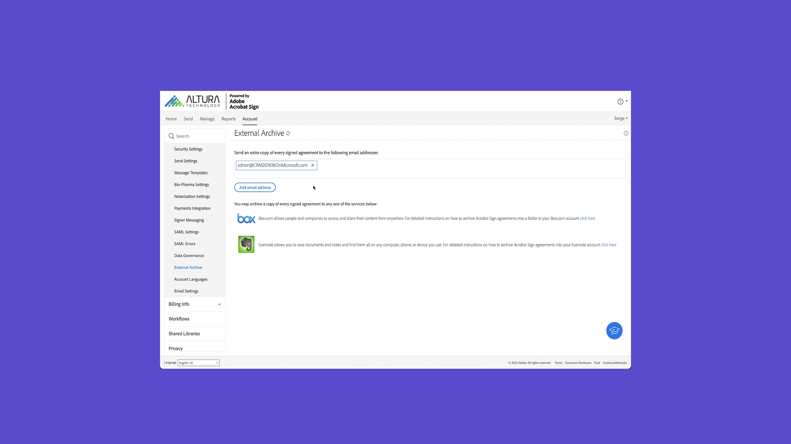
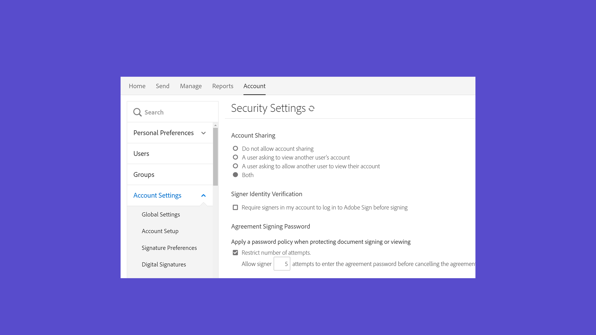

# 管理員概述

瞭解如何將用戶添加到帳戶、設定組、共用訪問以及設定工作流、外部存檔以及共用事件和警報。 這些教程是為已經過安裝階段並準備開始管理Acrobat Sign的管理員設計的。 「高級任務」涵蓋的主題超過管理員設定，並進入定義全局設定、帳戶訪問和共用以及文本標籤。

## 新增功能

>[!BEGINTABS]

>[!TAB 生成自定義工作流]

瞭解如何建立和使用[自定義工作流](building-a-custom-workflow.md)以加快建立和發送協定的過程。

>[!TAB 建立可重用模板]

瞭解如何建立[可重用的文檔模板](../sign-advanced-users/create-a-template.md)。

>[!TAB 啟用自動用戶分配規則]

瞭解如何設定[自動分配規則](automatic-assignment-rules.md)，以授予用戶對Admin Console中的Acrobat Sign的訪問權限。

>[!TAB 遷移文檔模板]

瞭解如何以三個簡單步驟無縫遷移[文檔模板](docusign-templates.md)和工作流。

>[!ENDTABS]

## 快速入門

<table style="table-layout:fixed">
<tr>
  <td>
    
    

    <a href="get-started-admin.md"><strong>新管理員入門</strong></a>
    

    <em>在此綜合視頻指南中，瞭解使您的組織能夠與Acrobat Sign一起運行所需的所有工具</em>
     
  </td>
  <td>
    
    

    <a href="up-and-running-admin.md"><strong>為管理員啟動並運行</strong></a>
    

    <em>概述7個關鍵區域，供管理員在Acrobat Sign快速啟動和運行</em>
     
  </td>
  <td>
    
    

    <a href="docusign-templates.md"><strong>遷移文檔模板</strong></a>
    

    <em>瞭解如何無縫遷移文檔模板和工作流</em>
     
  </td>
  <td>
    
    

    <a href="add-users-to-your-account.md"><strong>添加新用戶</strong></a>
    

    <em>瞭解如何向Acrobat Sign添加新用戶</em>
     
  </td>
</tr>
<tr>
  <td>
    
    

    <a href="automatic-assignment-rules.md"><strong>啟用自動用戶分配規則</strong></a>
    

    <em>瞭解如何設定自動分配規則，以授予用戶在Admin Console中訪問Acrobat Sign的權限</em>
     
  </td>
  <td>
    
    

    <a href="add-admin.md"><strong>添加新帳戶管理員</strong></a>
    

    <em>瞭解如何建立新用戶或將現有用戶提升為Acrobat Sign管理員角色</em>
     
  </td>
    <td>
      
      

      <a href="promote-admin.md"><strong>分配產品和支援管理員角色</strong></a>
      

      <em>瞭解如何在Admin Console中分配Acrobat Sign用戶產品管理和支援管理員角色</em>
       
    </td>
    <td>
      
      

      <a href="create-and-manage-groups.md"><strong>建立和管理組</strong></a>
      

      <em>建立組、將用戶添加到組以及編輯組設定</em>
       
    </td>
</tr>
<tr>
 <td>
      
      

      <a href="set-up-your-external-archive.md"><strong>設定外部存檔</strong></a>
      

      <em>為已簽署的協定的備份副本建立外部存檔</em>
       
    </td>
  <td>
    
    

    <a href="../sign-advanced-users/create-a-template.md"><strong>建立可重用模板</strong></a>
    

    <em>為速度和一致性建立可重用的文檔模板</em>
     
  </td>
  <td>
    
    

    <a href="../sign-advanced-users/creating-a-report.md"><strong>報告和事務使用率</strong></a>
    

    <em>瞭解如何生成報告和跟蹤事務使用情況</em>
     
  </td>
  <td>
    
    

    <a href="report-options.md"><strong>用戶報告選項</strong></a>
    

    <em>瞭解如何為用戶設定報表選項</em>
     
  </td>
</tr>  
<tr>
   <td>
    
    

    <a href="../sign-advanced-users/webform.md"><strong>建立Web表單</strong></a>
    

    <em>建立可直接在您的網站上以電子方式簽名的文檔</em>
     
  </td>
  <td>
    
    

    <a href="../sign-advanced-users/modify-webform.md"><strong>修改現有Web表單</strong></a>
    

    <em>瞭解如何禁用、編輯和重新啟用現有Web表單</em>
     
  </td>
  <td>
    
    

    <a href="../sign-advanced-users/megasign.md"><strong>批量發送</strong></a>
    

    <em>立即收集任何文檔的數千個簽名</em>
     
  </td>
  <td>
    
    

    <a href="building-a-custom-workflow.md"><strong>生成自定義工作流</strong></a>
    

    <em>瞭解如何建立和使用自定義工作流以加快建立和發送協定的過程</em>
     
  </td>
</tr>
<tr>
     <td>
    
    

    <a href="audit-reports.md"><strong>審核報告</strong></a>
    

    <em>瞭解如何訪問、利用和配置審計報告</em>
     
    </td>
    <td>
      
      

      <a href="set-up-shared-events-and-alert.md"><strong>為事件和警報配置通知</strong></a>
      

      <em>為您的帳戶配置事件和警報通知</em>
       
    </td>
    <td>
      
      

       
    </td>
    <td>
      
      

       
    </td>
</tr>    
</table>

## 高級任務

<table style="table-layout:fixed">
<tr>
  <td>
    
    

    <a href="learn-about-global-settings.md"><strong>全局設定</strong></a>
    

    <em>為整個組織或特定組全局編輯產品設定</em>
     
  </td>
  <td>
      
    

    <a href="share-account-access.md"><strong>共用帳戶訪問</strong></a>
    

    <em>設定對其他用戶帳戶中事務的僅查看訪問權限</em>
     
  </td>
  <td>
    
    

    <a href="advanced-account-sharing.md"><strong>高級帳戶共用</strong></a>
    

    <em>設定帳戶共用以允許管理員和用戶委託其發送、修改和查看權限</em>
     
  </td>
  <td>
    
    

    <a href="bulk-download-tool.md"><strong>批量下載工具</strong></a>
    

    <em>瞭解如何使用批量下載工具快速下載所有已簽署的協定</em>
     
  </td> 
</tr>
<tr>
   <td>
     
    

    <a href="../sign-advanced-users/adobe-sign-text-tagging.md"><strong>Acrobat Sign文本標籤</strong></a>
    

    <em>使用Adobe Acrobat通過文本標籤生成Acrobat Sign表單域</em>
     
  </td>
  <td>
    
    

    <a href="use-bio-pharma-settings.md"><strong>使用Bio-Pharma設定</strong></a>
    

    <em>設定生物製藥設定，使您能夠滿足FDA 21 CFR第11部分要求</em>
     
  </td>
  <td>
    
    

    <a href="privacy.md"><strong>如何設定隱私管理員</strong></a>
    

    <em>瞭解如何設定和使用隱私管理員</em>
     
  </td>
  <td>
    
    

     
  </td>
</tr>
</table>
