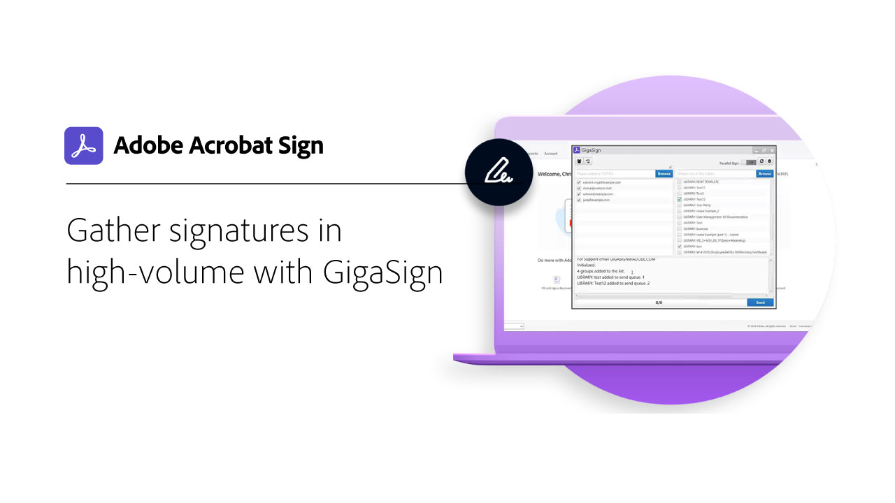
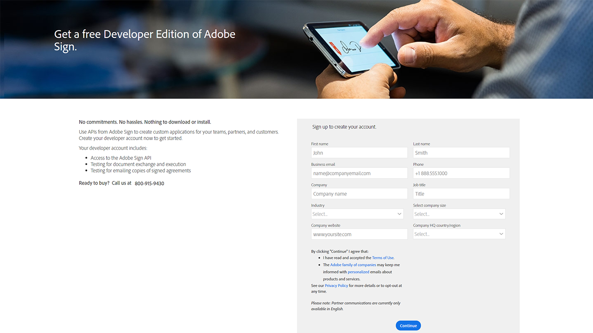

# 開發概覽

Acrobat Sign中40%的協定是使用API建立。 使用API為您的團隊、合作夥伴和客戶建立自訂應用程式。

## 新增功能

>[!BEGINTABS]

>[!TAB 如何設定Webhook]

瞭解如何建立[webhook](webhooks.md)，以自動化通常需要手動介入的流程。

>[!ENDTABS]

<table style="table-layout:fixed">
<tr>
  <td>
    
    

    <a href="https://www.adobe.io/apis/documentcloud/sign.html" target="_blank"><strong>建立開發人員帳戶</strong></a>
    

    <em>瞭解如何開始使用開發人員帳戶</em>
     
  </td>
  <td>
    
    

    <a href="https://www.adobe.io/apis/documentcloud/sign/docs.html" target="_blank"><strong>瞭解您可以做什麼</strong></a>
    

    <em>瞭解如何將Acrobat Sign的功能整合至任何外部應用程式</em>
     
  </td>  
  <td>
    
    

    <a href="gigasign.md"><strong>使用GigaSign收集大量檔案</strong></a>
    

    <em>同時傳送、收集及追蹤檔案以供數千人簽署</em>
     
  </td>
   <td>
    
    

    <a href="embeddedesignature.md"><strong>建立內嵌式電子簽章和檔案體驗</strong></a>
    

    <em>瞭解如何使用Acrobat Sign API將電子簽章和檔案體驗內嵌到您的Web平台以及內容和檔案管理系統中</em>
     
  </td>
</tr>
<tr>
  <td>
    
    

    <a href="webhooks.md"><strong>如何設定Webhook</strong></a>
    

    <em>瞭解如何建立webhook以自動化通常需要手動介入的流程</em>
     
  </td>
  <td>
    
    

     
  </td>
  <td>
    
    

     
  </td>
  <td>
    
    

     
  </td>
</tr>
</table>
