# 建立內嵌式電子簽章和檔案體驗

瞭解如何使用Acrobat Sign API將電子簽章和檔案體驗內嵌到您的網站平台以及內容和檔案管理系統中。 此實作教學課程分為四個部分。

## 第1部分：您需要什麼

在第1部分中，瞭解如何開始使用第2-4部分所需的一切。 讓我們從取得API認證開始。

+++檢視有關如何取得API認證的詳細資料

* [Acrobat Sign開發人員帳戶](https://www.adobe.com/acrobat/business/developer-form.html)
* [入門程式碼](https://github.com/benvanderberg/adobe-sign-api-tutorial)
* [VS程式碼（或您選擇的編輯器）](https://code.visualstudio.com)
* Python 3.x
   * Mac — Homebrew
   * Linux — 內建安裝程式
   * Windows — 巧克力
   * 全部 — https://www.python.org/downloads/

+++

## 第2部分：低/無代碼 — 網路表單的強大功能

在第2部分中，探索使用網路表單的低代碼/無代碼選項。 最好先看看您是否可以避免撰寫程式碼。

+++檢視有關如何建立網頁表單的詳細資訊

1. 使用您的開發人員帳戶存取Acrobat Sign。

1. 在首頁上選取&#x200B;**發佈網頁表單**。

   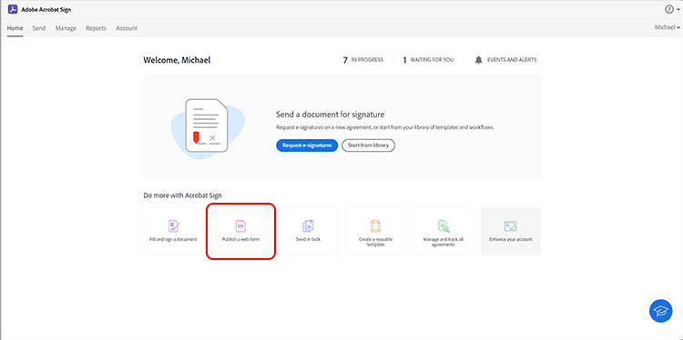

1. 建立您的合約。

   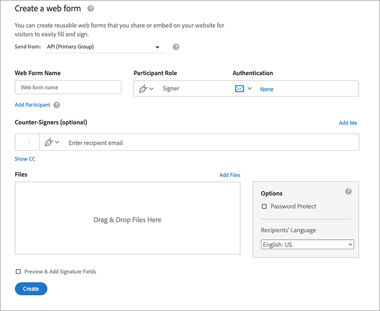

1. 將合約內嵌於一般HTML頁面上。

1. 嘗試動態新增查詢引數。

   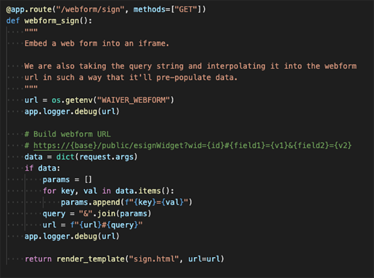

+++

## 第3部分：傳送包含表單和合併資料的協定

在第3部分中，以動態方式建立協定。

+++檢視如何動態建立協定的詳細資訊

首先，您必須建立存取權。 使用Acrobat Sign時，有兩種透過API連線的方法。 OAuth權杖和整合金鑰。 除非您有非常明確的原因要搭配應用程式使用OAuth，否則您應該先探索整合金鑰。

1. 在Acrobat Sign中&#x200B;**帳戶**&#x200B;標籤下的&#x200B;**API資訊**&#x200B;功能表上選取&#x200B;**整合金鑰**。

   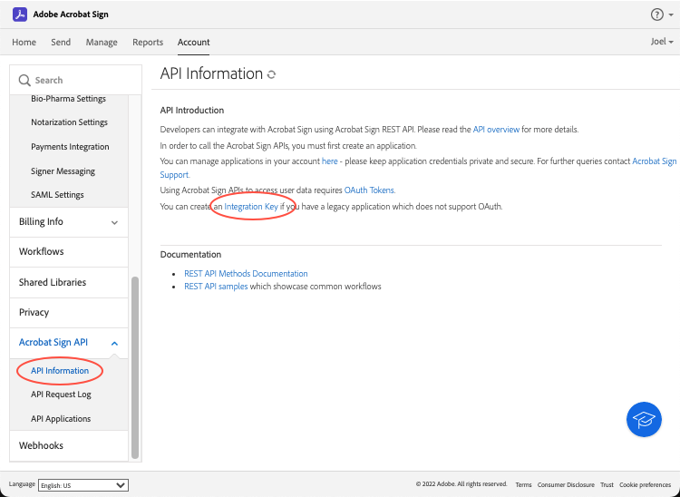

現在您擁有存取權並且可以與API互動，看看您可以使用API做什麼。

1. 導覽至[Acrobat Sign REST API Version 6方法](http://adobesign.com/public/docs/restapi/v6)。

   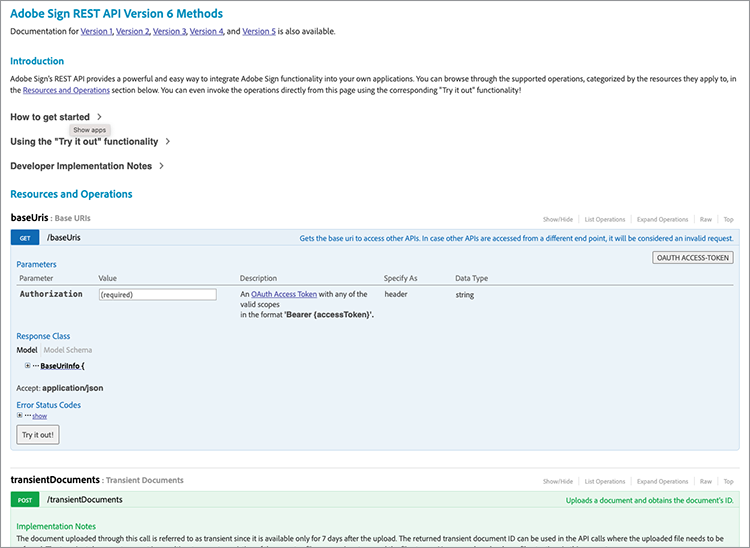

1. 將代號用作「持有人」值。

   

若要傳送您的第一個合約，最好瞭解如何使用API。

1. 建立暫時性檔案並傳送。

>[!NOTE]
>
>JSON型請求呼叫具有「模型」和「最小模型結構描述」選項。 這會提供規格和最低裝載設定。

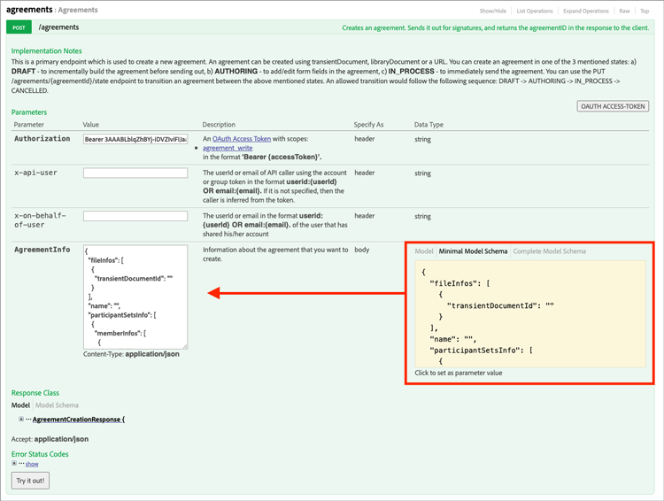

第一次傳送合約後，您就可以新增邏輯了。 建立一些協助程式以儘可能減少重複永遠是很好的做法。 以下是一些範例：

**驗證**

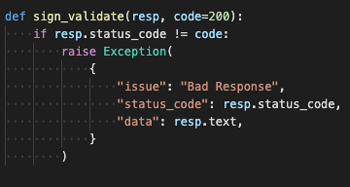

**標頭/驗證**

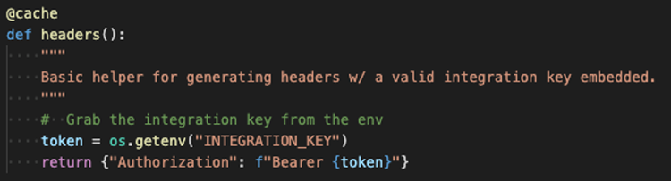

**基底URI**

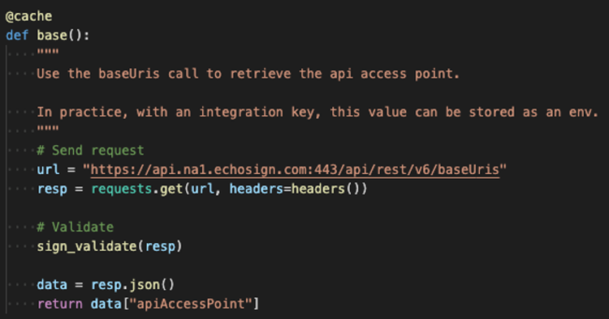

請留意Transient檔案在Sign生態系統的宏大配置中的登陸位置。
暫時性 — >合約
暫時性 — >範本 — >合約
暫時性 — > Widget ->合約

此範例使用範本作為檔案來源。 除非您有充分理由動態產生檔案以供簽名（例如，舊版程式碼或檔案產生），否則這通常是最好的方法。

程式碼相當簡單明瞭；它使用程式庫檔案（範本）作為檔案來源。 會動態指派第一和第二位簽署者。 `IN_PROCESS`狀態表示會立即傳送檔案。 此外，運用`mergeFieldInfo`以動態填入欄位。

+++

## 第4部分：內嵌簽名體驗、重新導向等

在許多情況下，您可能希望允許觸發的參與者立即簽署協定。 這對於面對客戶的應用程式和資訊站非常有用。

+++檢視如何內嵌簽名體驗的詳細資訊

如果您不想觸發第一個傳送電子郵件，管理行為的簡單方法是修改API呼叫。

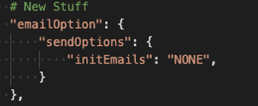

以下說明如何控制簽署後重新導向：

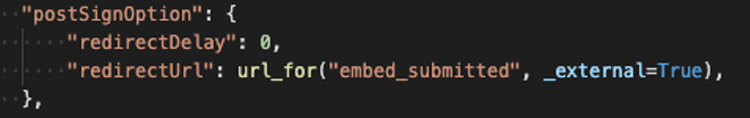

更新合約建立程式後，最後一個步驟是產生簽署URL。 此呼叫也相當簡單明瞭，會產生URL，簽署者可用來存取其簽署程式的一部分。

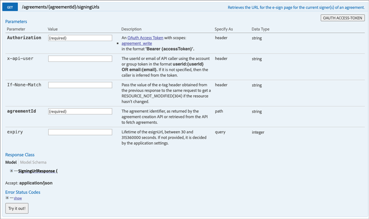

>[!NOTE]
>
>請注意，合約建立呼叫在技術上為非同步。 這表示可以進行&#39;POST&#39;合約呼叫，但合約尚未就緒。 最佳實務是建立重試回圈。 重試或採用您環境的最佳實務。

當一切準備就緒後，解決方案就會相當簡單明瞭。 您正在訂立合約，然後產生簽署URL以供簽署者按一下並開始簽署儀式。

+++

## 其他主題

* [JS事件](https://www.adobe.io/apis/documentcloud/sign/docs.html#!adobedocs/adobe-sign/master/events.md)
* Webhook活動
   * [REST API](https://sign-acs.na1.echosign.com/public/docs/restapi/v6#!/webhooks/createWebhook)
   * [Acrobat Sign v6中的Webhook](https://www.adobe.io/apis/documentcloud/sign/docs.html#!adobedocs/adobe-sign/master/webhooks.md)
* [重新啟用請求電子郵件（含事件）](https://sign-acs.na1.echosign.com/public/docs/restapi/v6#!/agreements/updateAgreement)
* [以重試取代逾時](https://stackoverflow.com/questions/23267409/how-to-implement-retry-mechanism-into-python-requests-library)
* 自訂提醒
   * 透過初始建立

     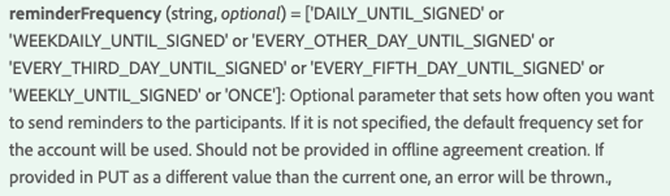

   * 或新增一個[小眾測試版](https://sign-acs.na1.echosign.com/public/docs/restapi/v6#!/agreements/createReminderOnParticipant)
