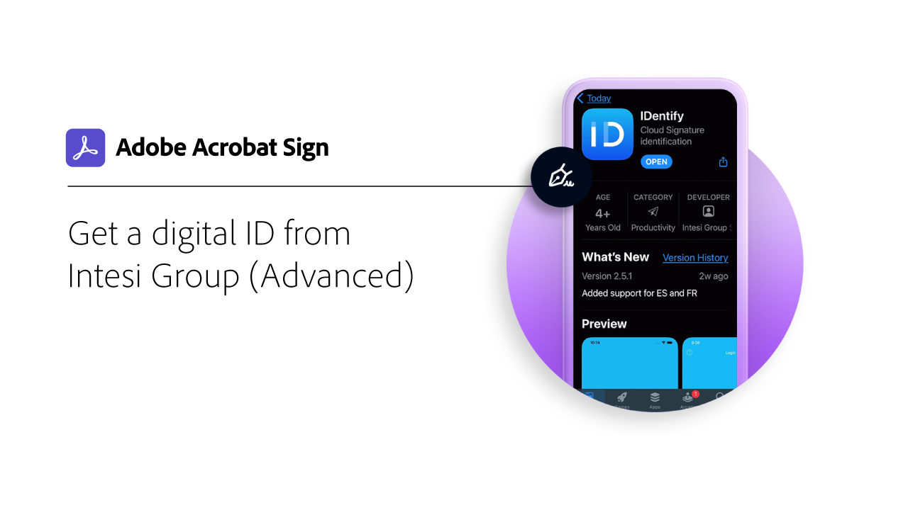

# 數位 ID 概觀

與試算表中的護照類似，數位身分 （數位 ID） 可讓您安全地證明自己是誰。 此外，在 Acrobat Sign 中進行電子簽名時，使用數位 ID 可為您提供更高程度的保證，確保您已授權該特定檔上的電子簽名。 下列教學課程將說明如何使用世界各地使用 Acrobat Sign 的數位 ID。

>[!NOTE]
>
>在使用具有雲端簽名的數位 ID 之前，請先與貴組織的管理員確認在 Acrobat Sign 中已啟用提供者的解決方案。

## 新增功能

* [使用 Digidentity ](digidentity-sign.md) 進行註冊和簽署
瞭解如何使用 Acrobat Sign 註冊及使用您的 [!DNL Digidentity] 數位 ID
* [使用 D-Trust ](d-trust.md) 進行註冊和簽署
瞭解如何註冊您的身 [!DNL D-Trust] 分，然後在 Acrobat Sign 中使用 [!DNL D-Trust] 檔的數位簽章

## [!DNL Aadhaar]

<table style="table-layout:fixed">
<tr>
 <td>
    
    

    <a href="aadhaar-sign.md"><strong>使用 [!DNL Aadhaar]</strong></a>
    

    <em>瞭解如何搭配 Acrobat Sign 使用您的 [!DNL Aadhaar] 數位 ID</em>
     
  </td>
  <td>
    
    

     
  </td>
  <td>
    
    

     
  </td>
  <td>
    
    

     
  </td>
</tr>
</table>

## [!DNL Digidentity]

<table style="table-layout:fixed">
<tr>
  <td>
    
    

    <a href="digidentity-sign.md"><strong>使用 [!DNL Digidentity]</strong></a>
    

    <em>瞭解如何使用 Acrobat Sign 註冊及使用您的 [!DNL Digidentity] 數位 ID</em>
     
  </td>
  <td>
    
    

     
  </td>
  <td>
    
    

     
  </td>
  <td>
    
    

     
  </td>
</tr>
</table>

## [!DNL D-Trust]

<table style="table-layout:fixed">
<tr>
  <td>
    
    

    <a href="d-trust.md"><strong>使用 D-Trust 進行註冊和簽署</strong></a>
    

    <em>瞭解如何註冊您的身 [!DNL D-Trust] 分，然後在 Acrobat Sign 中使用 [!DNL D-Trust] 檔的數位簽章</em>
     
  </td>
  <td>
    
    

     
  </td>
  <td>
    
    

     
  </td>
  <td>
    
    

     
  </td>
  </tr>
  </table>

## [!DNL Intesi Group]

<table style="table-layout:fixed">
<tr>
  <td>
    
    

    <a href="intesi-advanced.md"><strong>取得來自 [!DNL Intesi Group] （進階） 的數位 ID</strong></a>
    

    <em>瞭解如何從中取得進階數位簽署憑證 [!DNL Intesi Group]</em>
     
  </td>
  <td>
    
    

    <a href="intesi-qualified.md"><strong>取得數位 ID （ [!DNL Intesi Group] 合格）</strong></a>
    

    <em>瞭解如何從中取得合格數位簽署憑證 [!DNL Intesi Group]</em>
     
  </td>
  <td>
    
    

    <a href="intesi-sign.md"><strong>使用 [!DNL Intesi Group]</strong></a>
    

    <em>瞭解如何搭配 Acrobat Sign 使用您的 [!DNL Intesi Group] 數位 ID</em>
     
  </td>
  <td>
    
    

     
  </td>
</tr>
</table>
