# 使用Microsoft Power Platform的Acrobat Sign實現檔案自動化

瞭解如何啟用及使用適用於Microsoft Power Apps的Acrobat Sign和Adobe PDF Tools聯結器。 建立無需任何程式碼即可快速安全地自動執行業務核准和簽名流程的工作流程。 此實作教學課程包含四個部分，概述於下列連結：

<table style="table-layout:fixed">
<tr>
  <td>
    <a href="documentautomation.md#part1">
        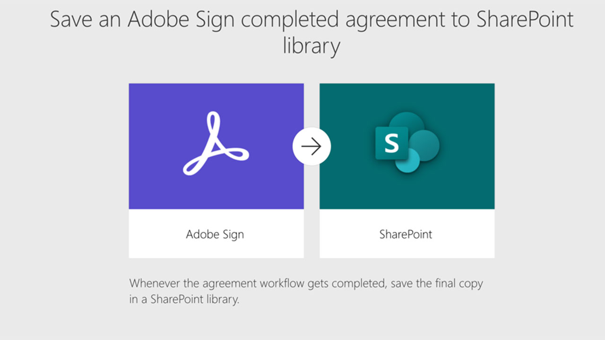
    </a>
    

    <a href="documentautomation.md#part1"><strong>第1部分：與Acrobat Sign在SharePoint中儲存已簽署的合約</strong></a>
    

  </td>
  <td>
    <a href="documentautomation.md#part2">
        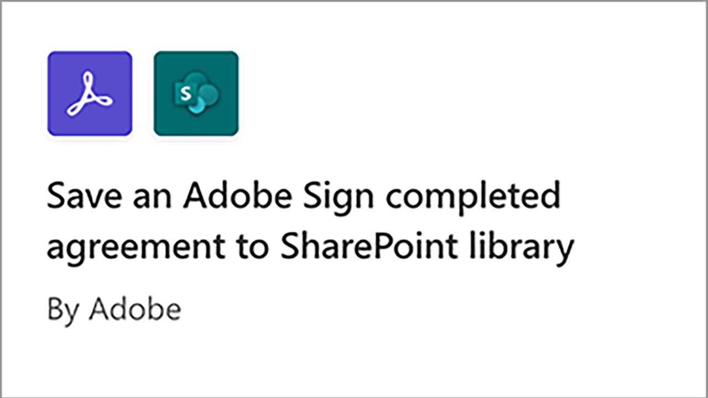
    </a>
    

    <a href="documentautomation.md#part2"><strong>第2部分：使用Acrobat Sign取得電子簽章的自動核准程式</strong></a>
    

  </td>
  <td>
   <a href="documentautomation.md#part3">
      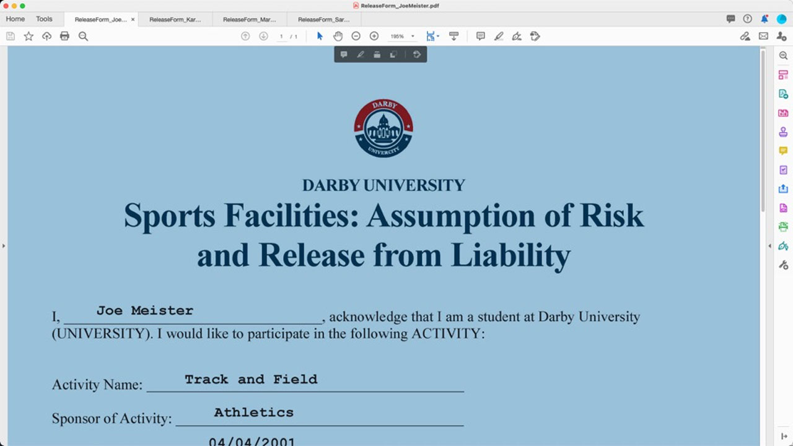
   </a>
    

    <a href="documentautomation.md#part3"><strong>第3部分：使用Adobe PDF Tools的自動化檔案OCR</strong></a>
    

  </td>
  <td>
   <a href="documentautomation.md#part4">
      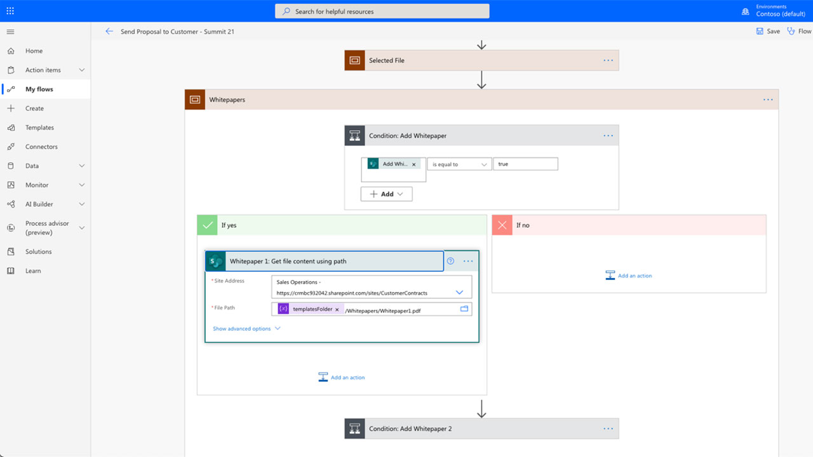
   </a>
    

    <a href="documentautomation.md#part4"><strong>第4部分：使用Adobe PDF Tools的自動化檔案元件</strong></a>
    

  </td>
</tr>
</table>

## 必要條件

* 熟悉Microsoft 365和Power Automate
* Acrobat Sign知識
* 可存取SharePoint和Power Automate的Microsoft 365帳戶（Acrobat Sign為基本功能，Adobe PDF工具為Premium）
* 適用於企業的Acrobat Sign或Acrobat Sign開發人員帳戶

**練習1和2**

* 可存取API的Acrobat Sign帳戶。 開發人員帳戶或企業帳戶。
* 您可透過Power Automate存取的SharePoint網站（擁有編輯許可權）。 建議使用完整管理員存取權。
* 簽章核准要求與簽署的範例檔案。

**練習3和4**

在[這裡](https://github.com/benvanderberg/adobe-sign-pdftools-powerautomate-tutorial)下載資料

## 第1部分：在SharePoint中與Acrobat Sign商店簽署合約 {#part1}

在第一部分中，您將使用Power Automate流程範本來設定自動化工作流程，此工作流程會將所有已簽署的協定儲存至您的SharePoint網站。

1. 導覽至Power Automate。
1. 搜尋Acrobat Sign。

   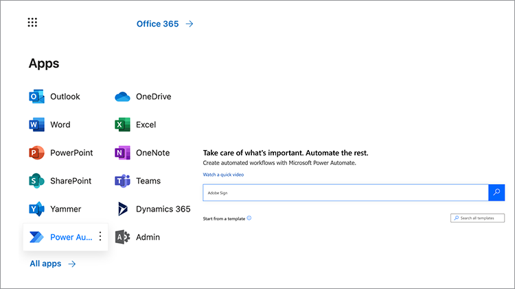

1. 選擇&#x200B;**將Acrobat Sign完成的合約儲存至SharePoint資料庫**。

   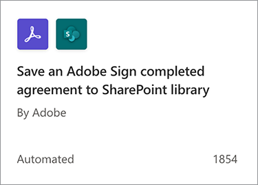

1. 檢閱畫面並設定任何需要的連線。 啟用Acrobat Sign連線。
1. 按一下藍色`+`符號。

   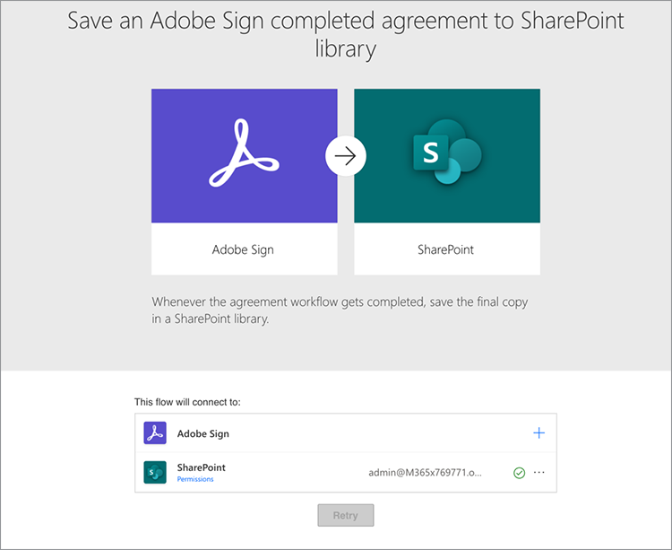

1. 輸入您的Acrobat Sign帳戶電子郵件，然後按一下新視窗中的密碼欄位。

   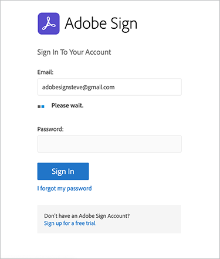

   請稍候片刻，讓Adobe檢查您的帳戶。

   >[!NOTE]
   >
   >如果您使用Adobe ID或我們的企業SSO，此檢查將引導您至適當的登入頁面。

1. 完成登入。
1. 按一下&#x200B;**繼續**，前往流量編輯畫面。
1. 為觸發器命名。

   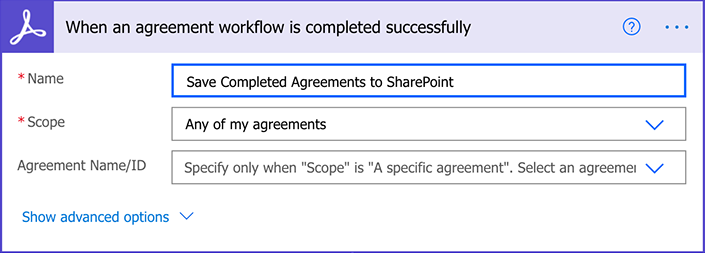

1. 設定SharePoint。

   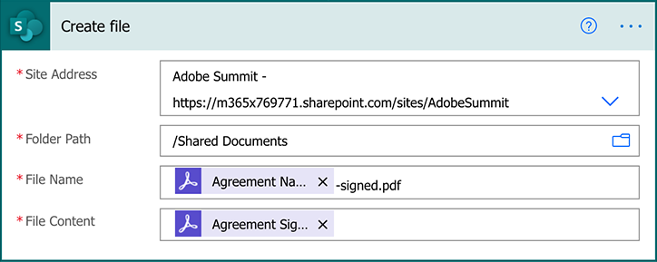

   **網站位址：**&#x200B;您的SharePoint網站
   **資料夾路徑：**&#x200B;您要使用的共用檔案路徑
   **檔案名稱：**&#x200B;接受預設值
   **檔案內容：**&#x200B;接受預設值

1. 儲存流程。

   

1. 使用藍色向後箭頭導覽至流量概觀畫面。 您將在第2部分測試此流程。

   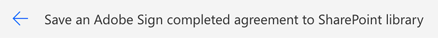

您將在下一部分測試此流程。

## 第2部分：透過Acrobat Sign取得電子簽章的自動核准程式 {#part2}

在第二部分中，我們以更強大的流程建置第一部分，並測試兩個流程以檢視其運作情況。

1. 從Power Automate介面選取左側的&#x200B;**範本**。

   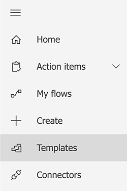

1. 搜尋「經理核准」。
1. 選取&#x200B;**要求管理員核准選取的檔案**。

   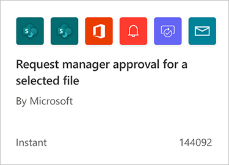

   檢閱連線並新增任何遺漏的專案。

   >[!NOTE]
   >
   >如果這是您使用核准執行的第一個流程，則當流程執行時，會完全設定這些流程。

1. 按一下&#x200B;**繼續**，移至流量編輯畫面。

   此流程有許多預先設定的步驟，包括錯誤檢查和巢狀條件步驟。

1. 為選取的檔案&#x200B;**設定**，如下所示：
   **網站位址：**&#x200B;您的SharePoint網站
   **資料庫名稱：**&#x200B;您的檔案存放庫
1. 新增輸入，如下所示：
   **型別**：電子郵件
   **名稱**：簽署者電子郵件

   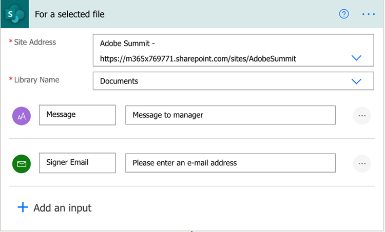

1. 設定&#x200B;**取得檔案屬性：**，如下所示：
   **網站位址：**&#x200B;您的SharePoint網站
   **資料庫名稱：**&#x200B;您的檔案存放庫

1. 向下捲動並尋找&#x200B;**如果是**。

   如果是，則是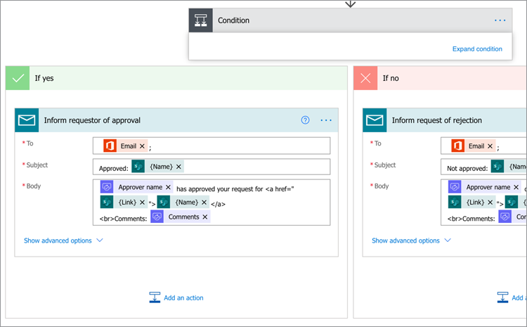

1. 在&#x200B;**如果是**&#x200B;方塊（不是最下方的方塊）中按一下&#x200B;**新增動作**&#x200B;以新增要傳送以索取簽名的步驟。

   ![在[如果是]方塊中新增動作的熒幕擷圖](assets/documentautomation/automation_13.png)

1. 搜尋&#x200B;**SharePoint取得檔案內容**&#x200B;並選擇&#x200B;**取得檔案內容**。

   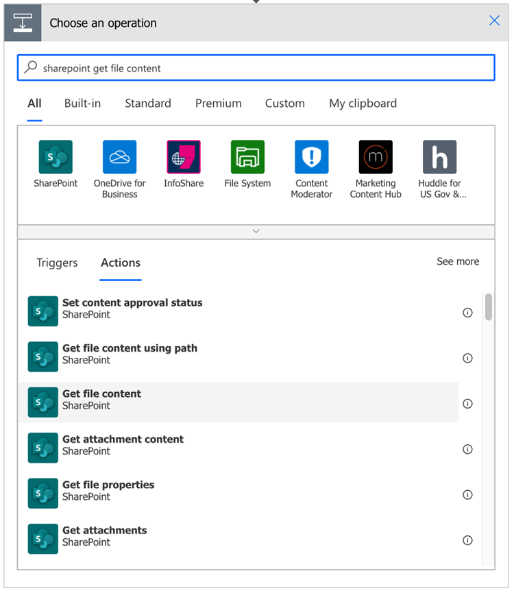

1. 設定&#x200B;**取得檔案內容**，如下所示：

   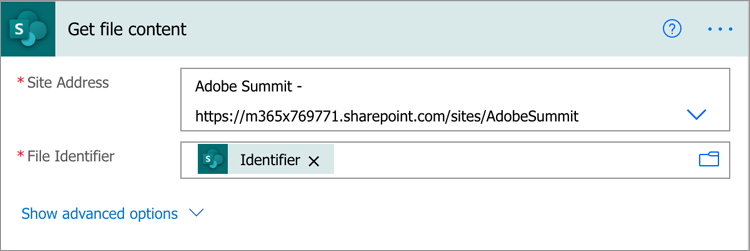

   **網站位址：**&#x200B;您的SharePoint網站。
   **檔案識別碼：**&#x200B;搜尋「識別碼」，並從&#x200B;**取得檔案內容**&#x200B;步驟中選擇識別碼。
1. 搜尋「Adobe」並選擇&#x200B;**Acrobat Sign**&#x200B;以新增其他動作。

   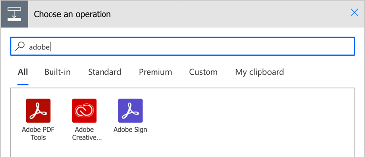

1. 在Acrobat Sign的搜尋方塊中輸入「上傳」，並選取&#x200B;**上傳檔案並取得檔案識別碼**。
1. 搜尋動態變數&#x200B;**Name**，以取得在&#x200B;**檔案名稱**&#x200B;下觸發器中選取的專案/檔名稱。
1. 按一下&#x200B;**檔案內容**&#x200B;下的變數助理中的&#x200B;**運算式**。

   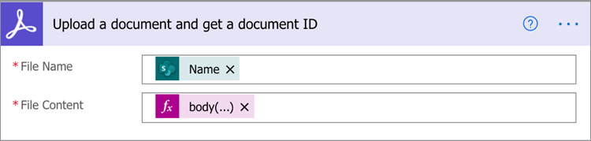

1. 新增單一縮寫符號，然後按一下返回&#x200B;**動態內容**，刪除您的縮寫符號，選取&#x200B;**檔案內容**，然後按一下&#x200B;**確定**。

   請確定沒有其他撇號，看起來像下面的範例。

   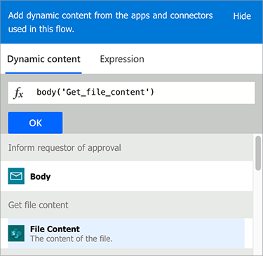

1. 在Acrobat Sign搜尋區域中搜尋「建立」，以新增其他Acrobat Sign動作。
1. 選取&#x200B;**從上傳的檔案建立並簽署合約，並傳送以索取簽名**。

   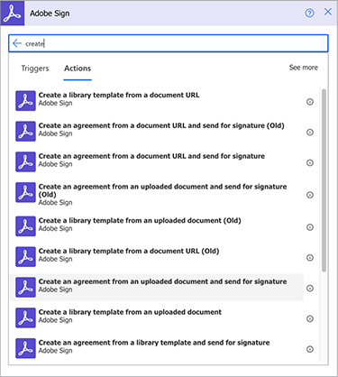

1. 設定必要資訊：
從&#x200B;**合約名稱**&#x200B;的動態變數助理中選擇&#x200B;**名稱**。
從&#x200B;**檔案識別碼**&#x200B;中的動態變數助理中選擇&#x200B;**檔案識別碼**。
從&#x200B;**參與者電子郵件**&#x200B;的動態變數助理中選擇&#x200B;**簽署者電子郵件**。
在&#x200B;**參與者順序**&#x200B;中輸入「1」。
從&#x200B;**參與者角色**&#x200B;的下拉式清單中選擇&#x200B;**簽署者**。

   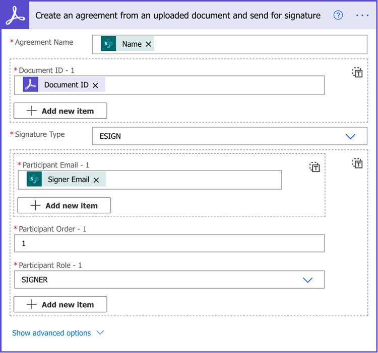

1. **儲存**&#x200B;流量。

### 測試流量

前往SharePoint網站的檔案存放庫進行測試。

1. 選取檔案，然後選擇&#x200B;**自動化**&#x200B;以及您剛建立的&#x200B;**流程**。

   ![選取[自動]功能表和流程的熒幕擷圖](assets/documentautomation/automation_21.png)

1. 啟動流程以驗證連線（僅限流程的首次執行）。
1. 在&#x200B;**訊息**&#x200B;中輸入好訊息給核准者。
1. 在&#x200B;**簽署者電子郵件**&#x200B;中輸入檔案簽署者的電子郵件。
1. 按一下&#x200B;**執行流程**。

針對啟動流程的使用者設定的核准者將獲得核准請求。 您可以透過電子郵件或Power Automate動作專案功能表進行核准。
核准後，請簽署您的檔案。 根據您的使用者以及他們是否登入Sign，您可能需要在私人瀏覽器視窗中開啟登入視窗。

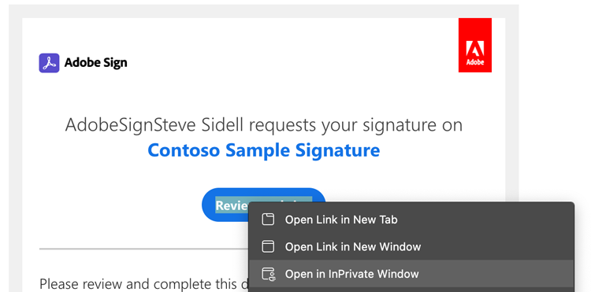

完成簽署，然後回頭檢視SharePoint資料夾。

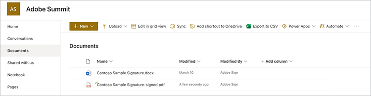

## 第3部分：使用Adobe PDF工具自動化檔案OCR {#part3}

在第三部分中，您將瞭解如何在PDF匯入Microsoft SharePoint時自動化OCR。 這解決了掃描的PDF檔案無法在SharePoint中搜尋的問題。

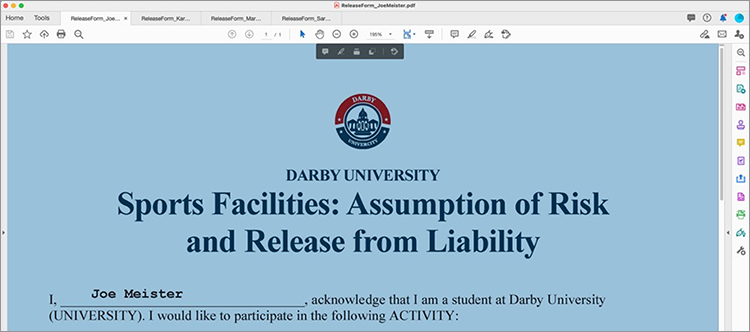

### 在SharePoint中設定資料夾

前往Microsoft SharePoint您要儲存檔案的位置。

1. 按一下&#x200B;**+新增**&#x200B;以建立名為「已處理合約」的新資料夾。
1. 按一下&#x200B;**+新增**&#x200B;以建立名為「舊合約」的新資料夾。

   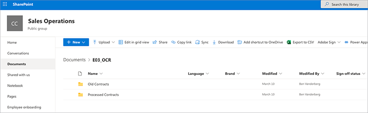

這些資料夾現在被引用為Power Automate流程的一部分。

### 從範本建立流量

1. 登入https://flow.microsoft.com。
1. 按一下側邊欄中的&#x200B;**範本**。

   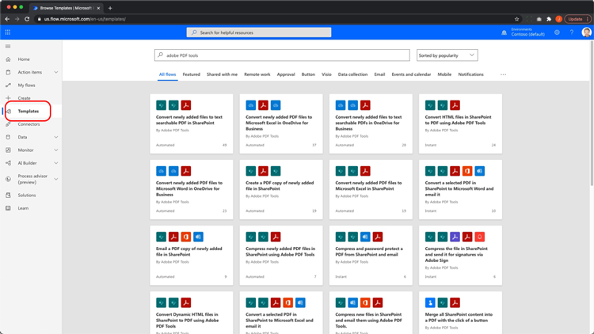

1. 選取&#x200B;**在SharePoint**&#x200B;中將新加入的檔案轉換為可搜尋文字的PDF。
1. 按一下Adobe PDF工具旁的&#x200B;**+**&#x200B;符號。

   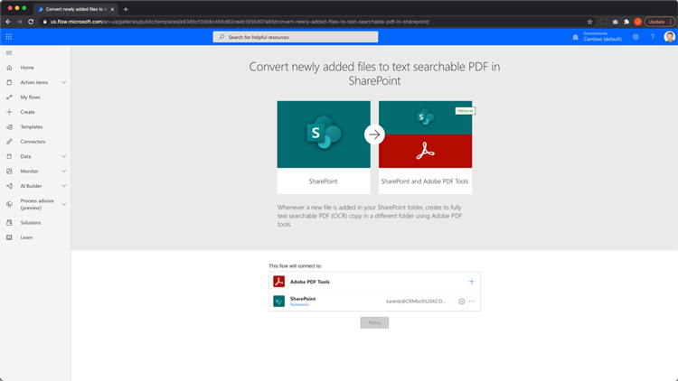

1. 在新索引標籤中導覽至https://www.adobe.com/go/powerautomate_getstarted 。
1. 按一下&#x200B;**「開始使用」**。

   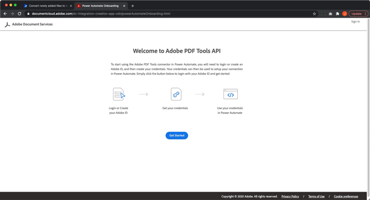

1. 使用您的 Adobe ID 登入。

   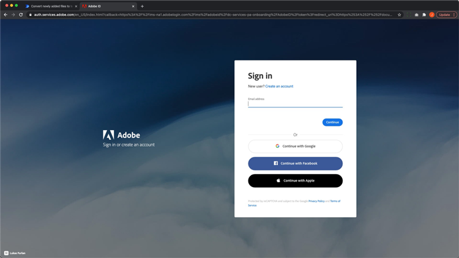

1. 輸入認證名稱和認證描述，然後按一下&#x200B;**建立認證**。

   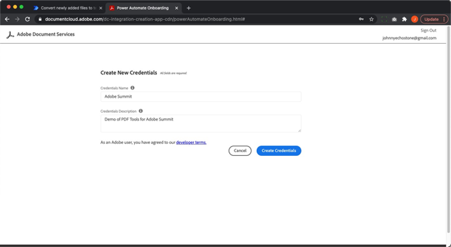

   讓憑證開啟的視窗保持開啟。 您需要將它們輸入到Microsoft Power Automate中。

   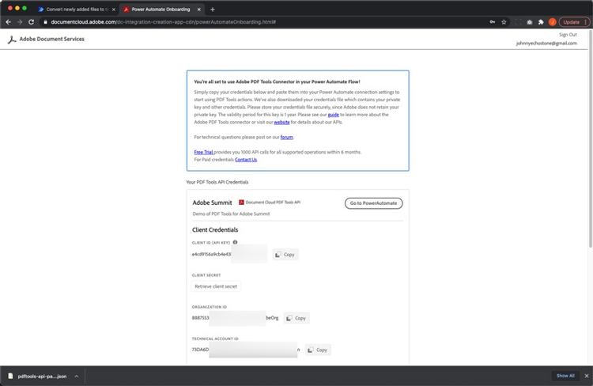

1. 輸入認證，然後按一下Microsoft Power Automate中的&#x200B;**建立**。

   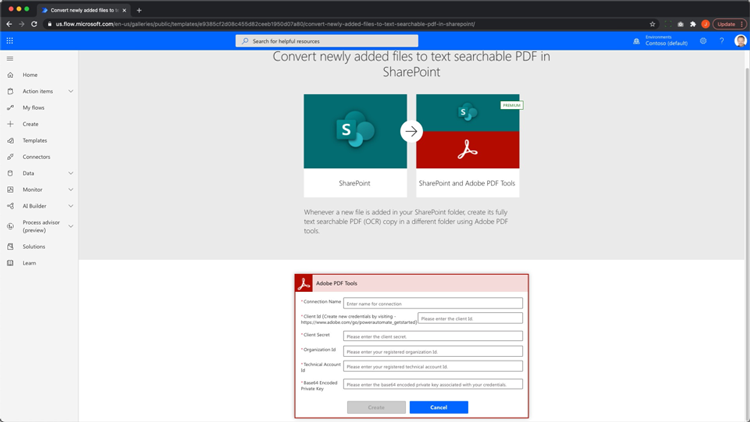

1. 按一下「**繼續**」。

   ![按一下[繼續]的熒幕擷圖](assets/documentautomation/automation_33.png)

   現在您可以檢視工作流程的檢視，並需要為您的環境進行設定。

1. 選取[網站位址]欄位，並在名為&#x200B;**的觸發程式下選擇您正在使用的SharePoint網站。在資料夾**&#x200B;中建立檔案時。

   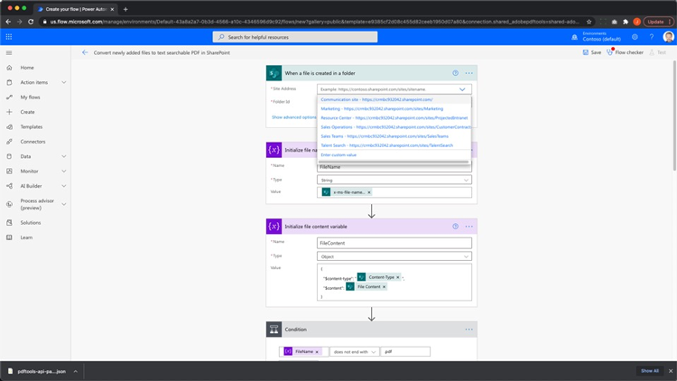

1. 按一下資料夾圖示以瀏覽至「資料夾識別碼」下的「舊合約」資料夾。

   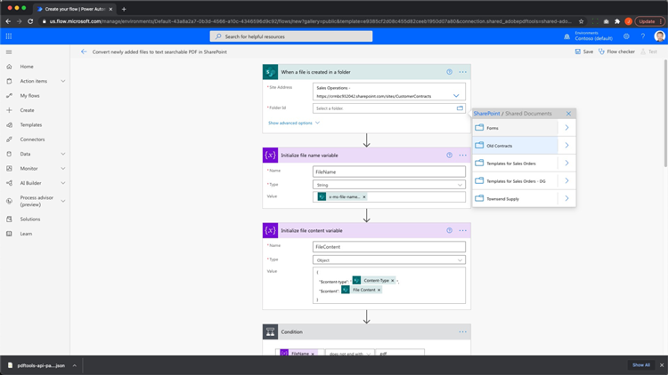

1. 編輯流程底部的&#x200B;**建立檔案**&#x200B;動作：

   將&#x200B;**網站位址**&#x200B;變更為您的網站位址。
指定已處理合約資料夾在資料夾路徑中的位置。

1. 按一下右上角的「**儲存**」。
1. 按一下&#x200B;**測試**。
1. 選取&#x200B;**手動**。
1. 按一下&#x200B;**測試**。

   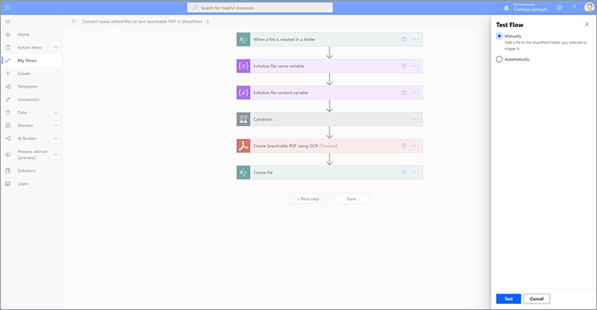

### 嘗試您的新流程

1. 切換作業選項至SharePoint中的「舊合約」資料夾。
1. 在您下載的練習檔案中，瀏覽至E03/舊合約。
1. 將ReleaseFormXX.pdf檔案複製到SharePoint的「舊合約」資料夾中。

   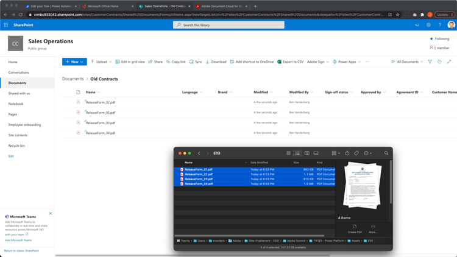

現在，如果您切換作業選項至「已處理合約」資料夾，您可以在流程執行一段時間後，看到可用的PDF。 如果您開啟PDF，您可以看到文字是可選的。
此外，SharePoint會編制檔案的索引，讓您能夠從SharePoint的搜尋列搜尋檔案的內容。

## 第4部分：使用Adobe PDF Tools自動組裝檔案 {#part4}

在第四部分中，您將瞭解如何根據提供的資訊合併許多檔案，同時從Microsoft SharePoint選取並開始流程。 在此案例中，流程會：

* 詢問資訊，以便為客戶選擇包含在套件中的內容。
* 它會根據提供的資訊，將許多檔案合併在一起。 這些檔案包含封面頁和選用的白皮書。
* 合併的檔案會儲存至SharePoint。

### 將練習檔案匯入SharePoint

1. 在「練習」檔案中開啟E04資料夾。
1. 將提案、範本和產生的檔案資料夾匯入SharePoint。

   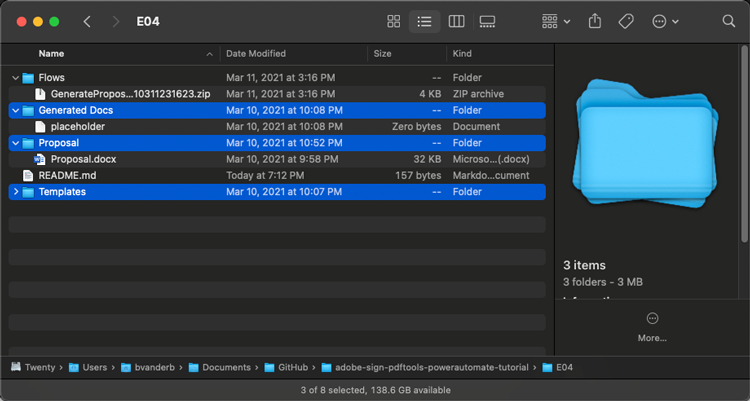

這些資料夾將用作參考。 尤其是，您將使用Proposal.docx檔案來製作提案。

在「範本」資料夾中，有一個「封面」資料夾，其中包含不同城市的封面設計。 此外，還有一個「白皮書」資料夾，其中包含選用的其他白皮書，若選取這些白皮書，則會附加至結尾。

### 將流程匯入Microsoft Power Automate

1. 登入Microsoft Power Automate (https://flow.microsoft.com)。
1. 按一下&#x200B;**我的流程**。

   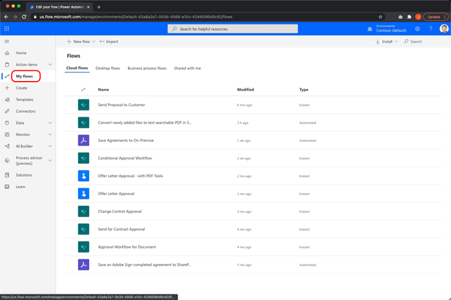

1. 按一下&#x200B;**「讀入」**。

   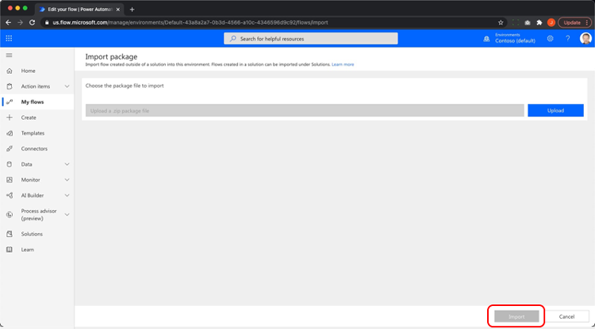

1. 按一下&#x200B;**上傳**，然後選擇E04/Flows/中的GenerateProposal_20210311231623.zip資料夾。

   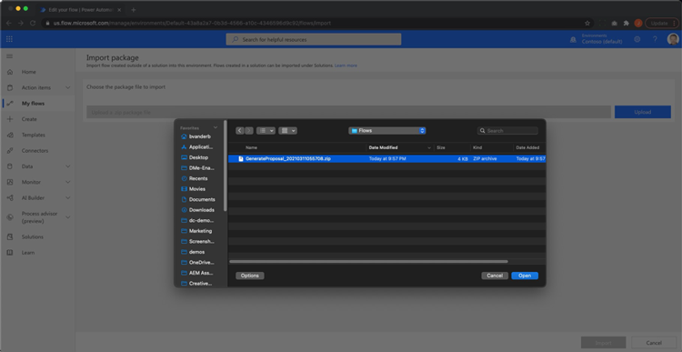

1. 按一下&#x200B;**「讀入」**。

1. 按一下&#x200B;**傳送提案給客戶**&#x200B;旁的[動作]底下的[扳手]圖示。

   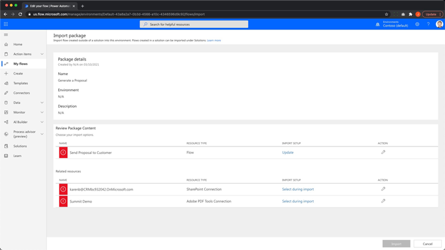

1. 在[設定]下選取&#x200B;**建立為新的**。
1. 在「資源名稱」下設定流程的名稱。
1. 按一下「**儲存**」。

   對其他相關資源重複此步驟並選取您的連線。

   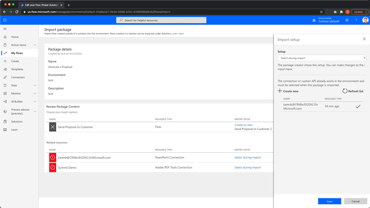

1. 完成所有連線後，按一下&#x200B;**匯入**。

### 為選取的檔案設定

現在流量已建立，請執行以下操作：

1. 按一下&#x200B;**「編輯」**。

   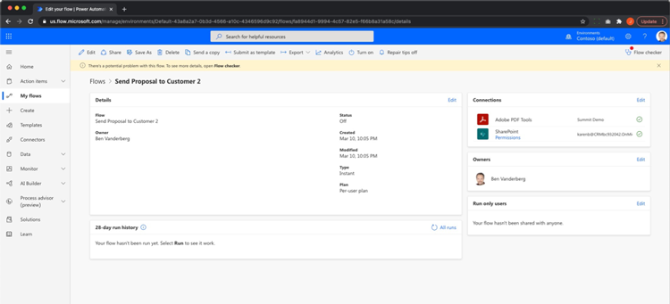

1. 為選取的檔案&#x200B;**選取觸發程式**。

   在網站地址中新增您的SharePoint網站。
在程式庫中新增程式庫。

   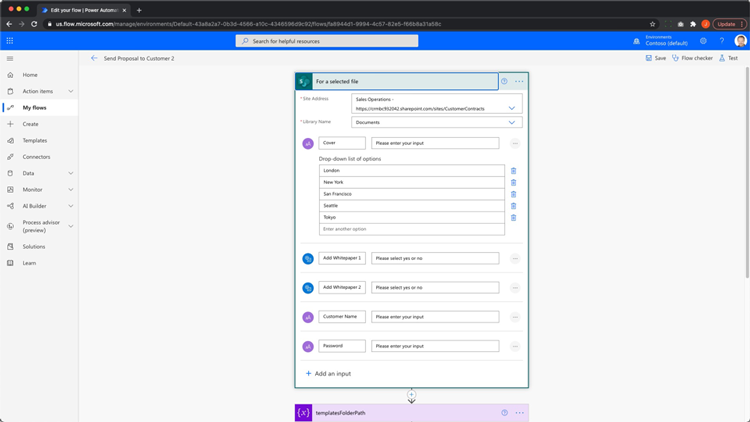

### 設定範本資料夾路徑

1. 按一下templateFolderPath變數。
1. 設定Templates資料夾在您匯入的SharePoint網站中的路徑。

### 設定封面取得檔案內容

1. 按一下&#x200B;**封面**&#x200B;動作，以展開範圍。
1. 展開&#x200B;**封面：取得檔案內容**。

   設定您的SharePoint網站的網站位址。

   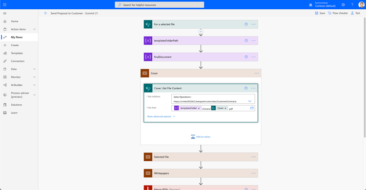

### 設定選取的檔案

1. 展開&#x200B;**選取的檔案**&#x200B;範圍動作。

   在&#x200B;**取得檔案屬性**&#x200B;底下，將[網站位址]和[媒體櫃名稱]分別變更為SharePoint網站和媒體櫃。
在&#x200B;**取得檔案內容**&#x200B;下將網站位址變更為您的SharePoint網站。

   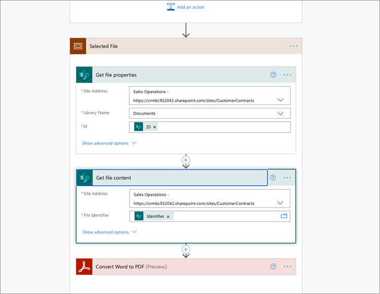

### 設定白皮書

1. 按一下&#x200B;**白皮書**&#x200B;動作。
1. 展開&#x200B;**條件：新增白皮書**。

   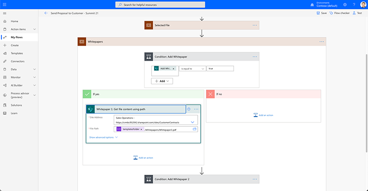

1. 展開&#x200B;**白皮書1：使用路徑**&#x200B;取得檔案內容。
編輯您指定SharePoint網站的網站位址。

對&#x200B;**狀況重複相同的步驟：新增白皮書2**。

### 設定建立檔案

1. 展開&#x200B;**建立檔案**。

   編輯SharePoint網站的網站位址和資料夾路徑，以及產生的檔案資料夾所在的路徑。

1. 按一下「**儲存**」。

### 測試您的流程

1. 導覽至SharePoint中的「提案」資料夾。
1. 選取Proposal.docx資料夾。

   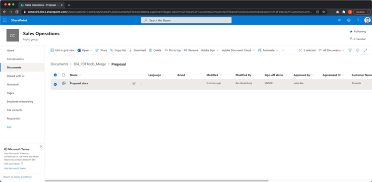

1. 在&#x200B;**自動化**&#x200B;功能表下選取您的流程。

   ![選取[自動]功能表的熒幕擷圖](assets/documentautomation/automation_50.png)

1. 按一下&#x200B;**繼續**&#x200B;開始流程。

   ![選取[繼續]按鈕的熒幕擷圖](assets/documentautomation/automation_51.png)

1. 選擇您的封面以及要附加的白皮書。
1. 按一下&#x200B;**執行流程**。

   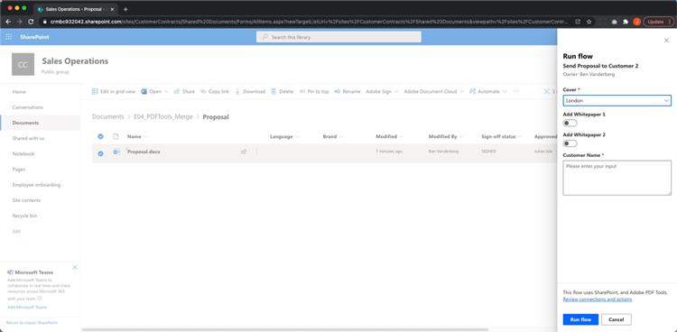

瀏覽至「產生檔案」資料夾。 您現在應該會看到產生的PDF檔案。

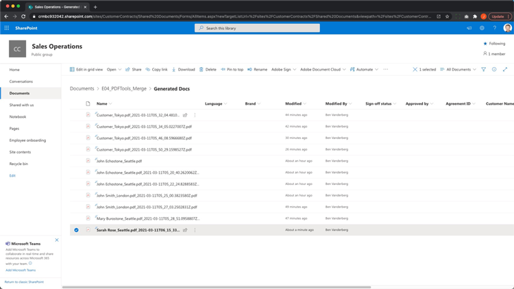

### 新增保護和其他動作以流動

現在您已成功建立流程，接下來要編輯流程以使用密碼加密PDF檔案。 本課程也會逐步說明您如何運用其他動作。

1. 導覽回到流程的結尾。
1. 按一下&#x200B;**合併PDF**&#x200B;和&#x200B;**建立檔案**&#x200B;之間的&#x200B;**+**&#x200B;符號。

   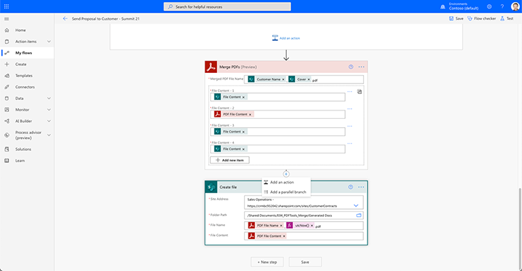

1. 選取&#x200B;**新增動作**。
1. 搜尋「Adobe PDF工具」。

   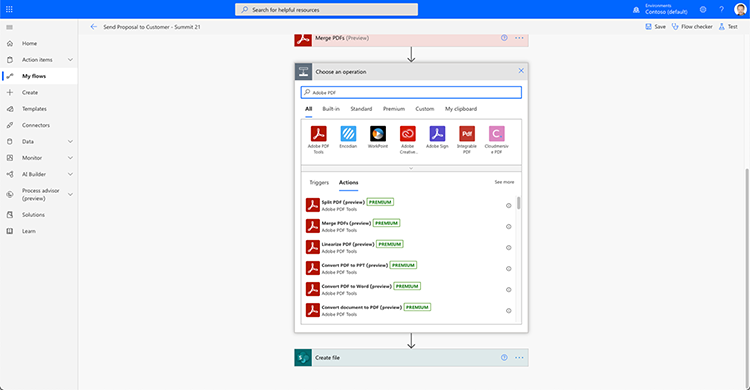

1. 選取&#x200B;**保護PDF不被檢視**。
1. 使用動態內容將檔案名稱欄位設定為來自合併PDF **的** PDF檔案名稱。

   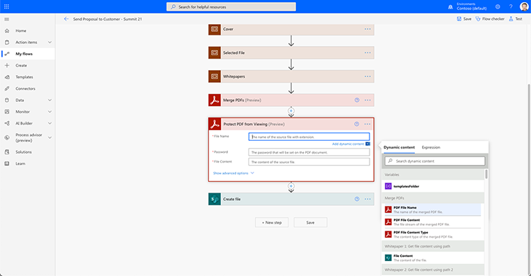

   在觸發器中，有一個「密碼」欄位是初始化表單的一部分。 我們可以在這裡使用它。

1. 使用動態內容搜尋&#x200B;**密碼欄位**，並將它放在[密碼]欄位中。

   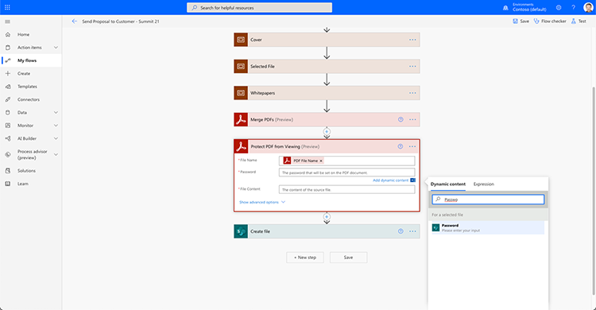

1. 使用「動態內容」，將其設定為「檔案內容」欄位中合併PDF的&#x200B;**PDF檔案內容**。
1. 變更&#x200B;**建立檔案**&#x200B;以從「保護PDF」取得檔案內容，而非合併PDF。
1. 展開&#x200B;**建立檔案**。
1. 清除檔案內容欄位。
1. 使用動態內容置入&#x200B;**的** PDF檔案內容&#x200B;**以保護PDF不被檢視**。

### 測試您的流程

1. 導覽至SharePoint中的「提案」資料夾。
1. 選取「提案」.docx。

   

1. 選取&#x200B;**自動化**&#x200B;以選擇您的流程。

   ![從功能表選取[自動]的熒幕擷圖](assets/documentautomation/automation_59.png)

1. 按一下&#x200B;**繼續**&#x200B;開始流程。

   ![選取[繼續]的熒幕擷圖](assets/documentautomation/automation_60.png)

1. 選擇封面及要附加的白皮書。
1. 將「密碼」欄位設定為您要設定的密碼。
1. 按一下&#x200B;**執行流程**。

   

1. 瀏覽至「產生檔案」資料夾。
您應該會看到產生的PDF檔案。 開啟PDF檔案，並提示您輸入PDF密碼。

   
