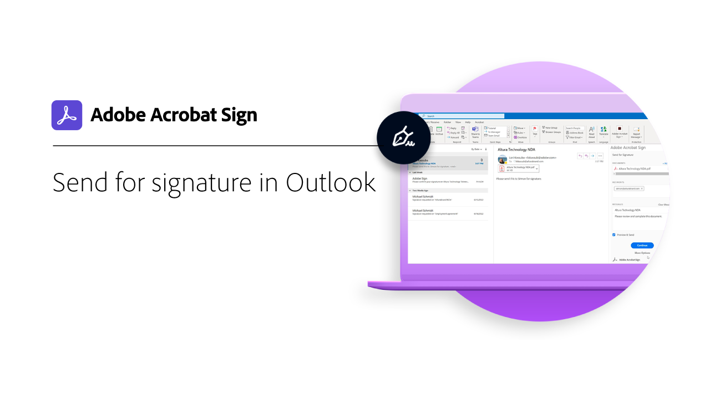
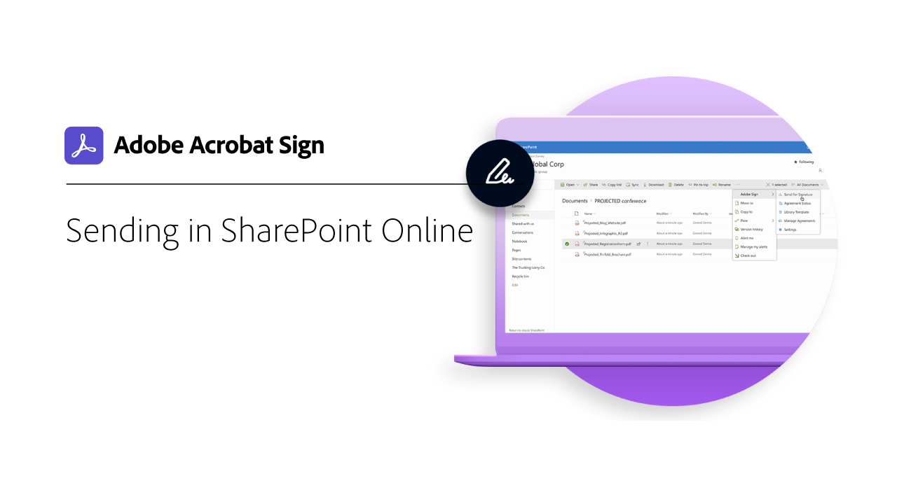
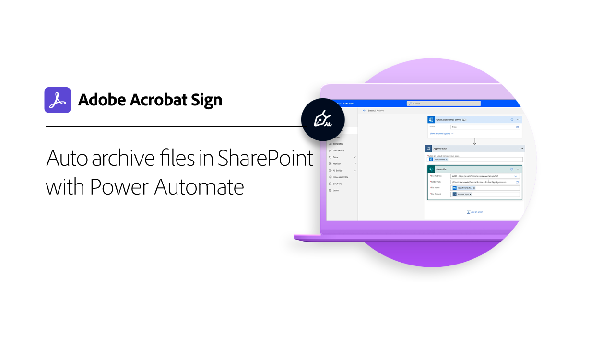
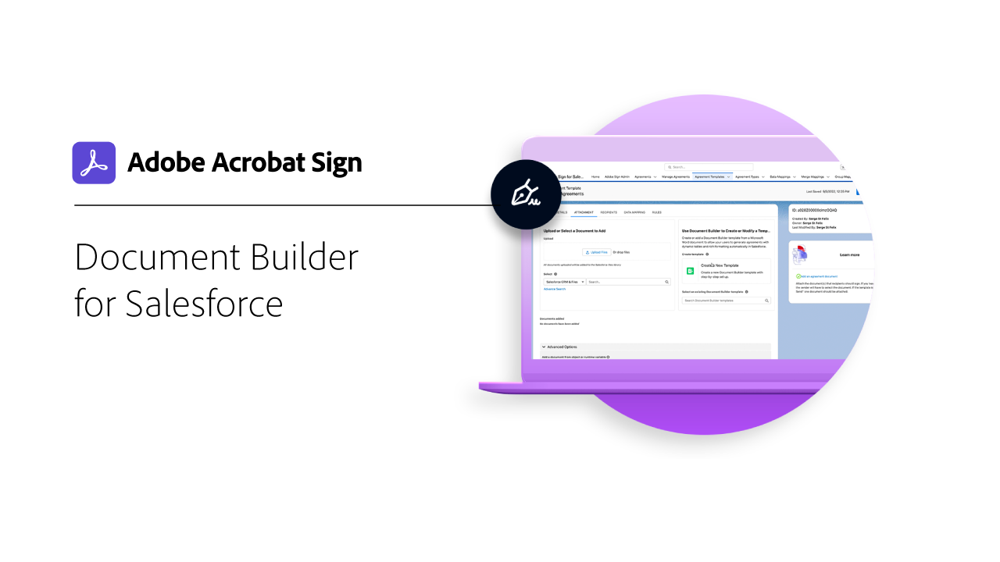

# 整合概觀

您可以在貴組織已在其他已使用的應用程式 （例如 Microsoft、Salesforce、Workday 和 Marketo） 中使用 Acrobat Sign 來命名一些名稱。 透過這些整合指南和教學課程，瞭解如何簡化電子簽名工作流程。

>[!NOTE]
> 如果您在存取任何功能時發生問題，請向貴組織的管理員確認整合已啟用。

## 新增功能

* [透過 Power Automate ](auto-archive-sharepoint-power-automate.md) 在 SharePoint 中自動封存檔案
瞭解如何使用 Power Automate 自動將已簽署的檔封存至 SharePoint 資料庫
* [適用于 Salesforce ](create-an-agreement-template.md) 的檔建立程式
瞭解如何使用 Salesforce 檔建立器建立可重複使用的檔範本

## Microsoft 整合教學課程

<table style="table-layout:fixed">
<tr>
  <td>
    
    

    <a href="fill-and-sign-doc-microsoft-outlook.md"><strong>在 Microsoft Outlook 中填寫和簽署</strong></a>
    

    <em>直接在 Microsoft Outlook 中填寫和簽署表格</em>
     
  </td>
  <td>
    
    

    <a href="send-for-signature-with-outlook.md"><strong>Outlook 中的傳送以供簽署</strong></a>
    

    <em>直接在 Microsoft Outlook 中傳送檔以索取簽名</em>
     
  </td>
  <td>
    
    

    <a href="send-for-signature-with-sharepoint-online.md"><strong>在 SharePoint Online 中傳送以索取簽名</strong></a>
    

    <em>直接在 Sharepoint Online 中傳送檔以索取簽名</em>
     
  </td>
</tr>
<tr>
  <td>
    
    

    <a href="track-an-agreement-with-sharepoint-online.md"><strong>SharePoint Online 中的追蹤</strong></a>
    

    <em>直接在 Microsoft Sharepoint 內追蹤合約進度</em>
     
  </td>
  <td>
    
    

    <a href="adobe-sign-teams-mortgage.md"><strong>傳送以供簽署 [!DNL Microsoft Teams]</strong></a>
    

    <em>直接在內部傳送檔以索取簽名 [!DNL Microsoft Teams]</em>
     
  </td>
  <td>
    
    

    <a href="auto-archive-sharepoint-power-automate.md"><strong>使用下列方式 [!DNL SharePoint] 自動存檔檔案 [!DNL Power Automate]</strong></a>
    

    <em>瞭解如何使用 [!DNL SharePoint][!DNL Power Automate]</em>
     
  </td>
</tr>
<tr>
  <td>
    
    

    <a href="documentautomation.md"><strong>檔自動化與 [!DNL Acrobat Sign for Microsoft Power Platform]</strong></a>
    

    <em>瞭解如何啟用和使用應用程式的 [!DNL Acrobat Sign] [!DNL Adobe PDF Tools] 連接器 [!DNL Microsoft Power]</em>
     
  </td>
  <td>
    
    

     
  </td>
  <td>
    
    

     
  </td>
</tr>
</table>

## Salesforce 整合教學課程

<table style="table-layout:fixed">
<tr>
  <td>
    
    

    <a href="create-an-agreement-template.md"><strong>Document Builder for [!DNL Salesforce]</strong></a>
    

    <em>瞭解如何使用 Document Builder 建立可重複使用的檔範本 [!DNL Salesforce]</em>
     
  </td>
  <td>
    
    

    <a href="set-up-data-mapping.md"><strong>設定資料對應</strong></a>
    

    <em>合約簽署完成後將資料拉回 Salesforce</em>
     
  </td>
  <td>
    
    

    <a href="set-up-merging-map.md"><strong>在 Salesforce 中設定合併對應</strong></a>
    

    <em>瞭解如何將 Salesforce 的資料直接合並到 Acrobat Sign 檔</em>
     
  </td>
</tr>
<tr>
  <td>
    
    

    <a href="create-a-custom-button.md"><strong>建立自訂按鈕</strong></a>
    

    <em>建立自訂按鈕以啟動傳送程式並自動填入 Salesforce 中的合約</em>
     
  </td>
  <td>
    
    

     
  </td>
  <td>
    
    

     
  </td>
</tr>
</table>

## Workday 整合教學課程

<table style="table-layout:fixed">
<tr>
  <td>
    
    

    <a href="workday.md"><strong>使用 Workday 設定 Acrobat Sign</strong></a>
    

    <em>瞭解如何將 Acrobat Sign 設定為直接在 Workday 中運作，以順暢管理所有人力資源文書工作</em>
     
  </td>
  <td>
    
    

     
  </td>
  <td>
    
    

     
  </td>
</tr>
</table>

## Marketo 整合教學課程和設定指南

<table style="table-layout:fixed">
<tr>
  <td>
    
    

    <a href="marketo-salesforce-sms.md"><strong>使用適用于 Salesforce 和 Marketo 的 Acrobat Sign 傳送通知</strong></a>
    

    <em>瞭解如何傳送簡訊、電子郵件或推送通知，讓簽署者知道合約即將推出</em>
     
  </td>
  <td>
    
    

    <a href="marketo-salesforce-reminder.md"><strong>使用 Adobe Sign for Salesforce 和 Marketo 視訊教學課程傳送提醒</strong></a>
    

    <em>瞭解如何在合約一段時間後仍未簽署時，向 Marketo 傳送電子郵件提醒</em>
     
  </td>
  <td>
    
    

    <a href="marketo-salesforce-reminder.md"><strong>使用 Acrobat Sign for Salesforce 和 Marketo 設定指南傳送提醒</strong></a>
    

    <em>閱讀如何在合約一段時間後仍未簽署時，向 Marketo 傳送電子郵件提醒</em>
     
  </td>
</tr>
<tr>
  <td>
    
    

    <a href="marketo-dynamics-reminder.md"><strong>使用適用于 Microsoft Dynamics 和 Marketo 的 Acrobat Sign 傳送提醒</strong></a>
    

    <em>瞭解如何在合約一段時間後仍未簽署時傳送電子郵件提醒</em>
     
  </td>
  <td>
    
    

    <a href="marketo-dynamics-sms.md"><strong>使用適用于 Microsoft Dynamics 和 Marketo 的 Acrobat Sign 傳送通知</strong></a>
    

    <em>瞭解如何傳送簡訊、電子郵件或推送通知，讓簽署者知道合約即將推出</em>
     
  </td>
  <td>
    
    

     
  </td>
</tr>
</table>
