# 整合總覽

您可以在貴組織已使用的其他應用程式中使用Acrobat Sign，例如Microsoft、Salesforce、Workday和Marketo等。 透過這些整合指南和教學課程，瞭解如何簡化您的電子簽章工作流程。

>[!NOTE]
> 如果您無法存取其中任何功能，請洽詢組織的管理員，以確保啟用整合。

## 新增功能

>[!BEGINTABS]

>[!TAB 設定大型檔案與推播對應]

瞭解如何在Salesforce中設定[大型檔案和推播合約服務](salesforce-large-files.md)。

>[!TAB 設定自動更新]

瞭解如何輕鬆將您的帳戶連結至Salesforce，以取得[自動更新](salesforce-automatic-updates.md)。

>[!TAB Microsoft Teams的檔案索引標籤整合]

瞭解如何直接從[!DNL Microsoft Teams]中的[檔案索引標籤](acrobat-sign-teams-documents-tab.md)傳送檔案以索取簽名。

>[!ENDTABS]

## Microsoft整合教學課程

<table style="table-layout:fixed">
<tr>
  <td>
    <a href="fill-and-sign-doc-microsoft-outlook.md">
      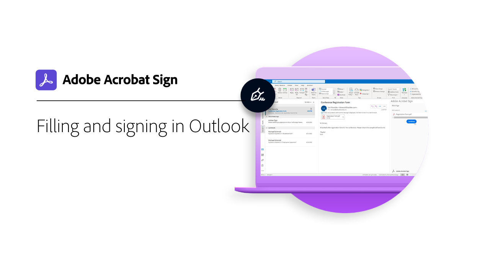
    </a>
    

    <a href="fill-and-sign-doc-microsoft-outlook.md"><strong>在Microsoft Outlook中填寫和簽署</strong></a>
    

    <em>直接在Microsoft Outlook中填寫並簽署表單</em>
     
  </td>
  <td>
    <a href="send-for-signature-with-outlook.md">
      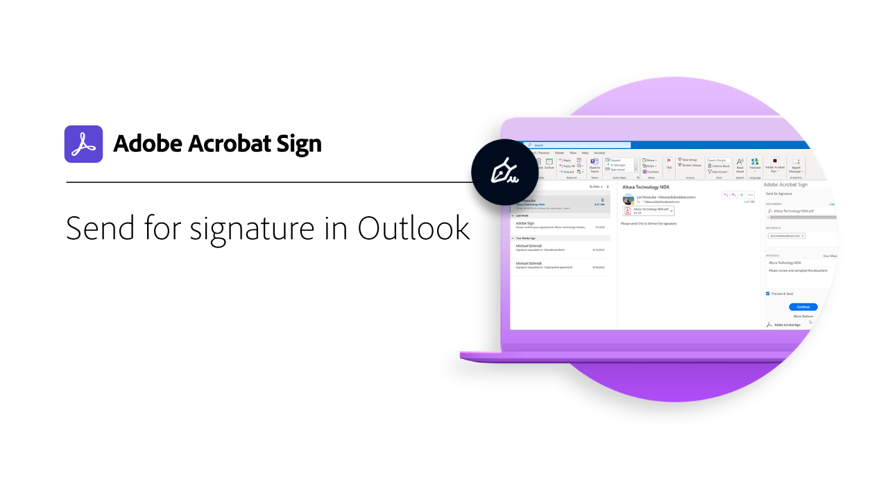
    </a>
    

    <a href="send-for-signature-with-outlook.md"><strong>在Outlook中傳送以索取簽名</strong></a>
    

    <em>直接在Microsoft Outlook中傳送檔案以索取簽名</em>
     
  </td>
  <td>
    <a href="send-for-signature-with-sharepoint-online.md">
      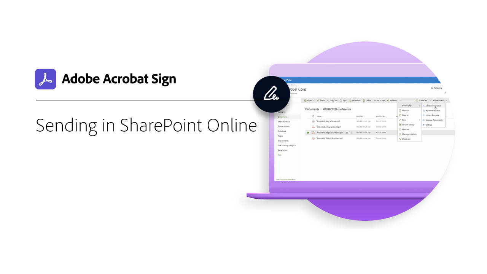
    </a>
    

    <a href="send-for-signature-with-sharepoint-online.md"><strong>在SharePoint Online中傳送以索取簽名</strong></a>
    

    <em>直接在Sharepoint Online中傳送檔案以索取簽名</em>
     
  </td>
   <td>
    <a href="track-an-agreement-with-sharepoint-online.md">
      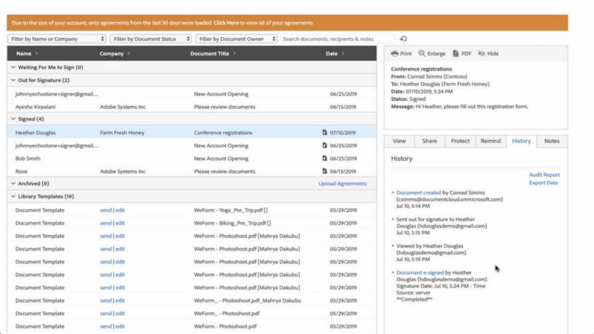
    </a>
    

    在SharePoint Online中追蹤<a href="track-an-agreement-with-sharepoint-online.md"><strong></strong></a>
    

    <em>直接在Microsoft Sharepoint中追蹤合約進度</em>
     
  </td>
</tr>
<tr>
  <td>
    <a href="integrate-web-form-sharepoint-online.md">
      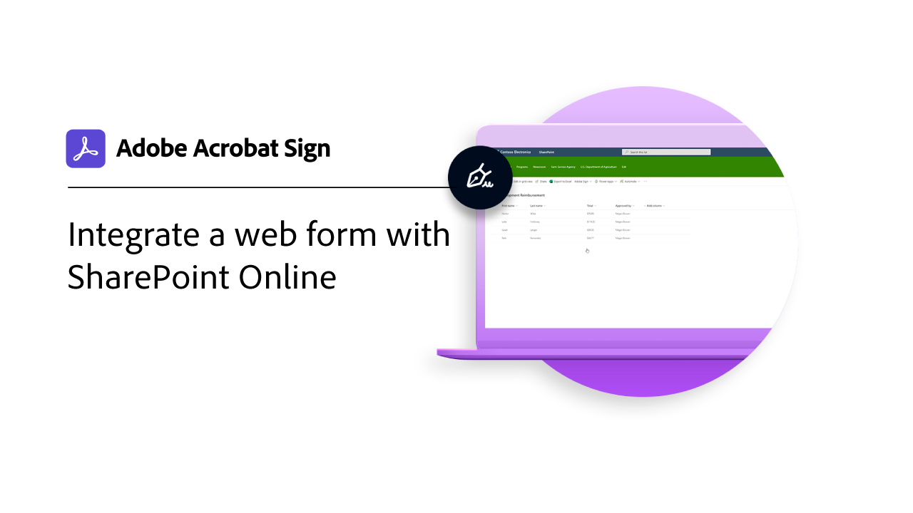
    </a>
    

    <a href="integrate-web-form-sharepoint-online.md"><strong>整合Web表單與[!DNL SharePoint Online]</strong></a>
    

    <em>瞭解如何將從網路表單收集的資料對應至[!DNL SharePoint]清單</em>
     
  </td>
  <td>
    <a href="auto-archive-sharepoint-power-automate.md">
      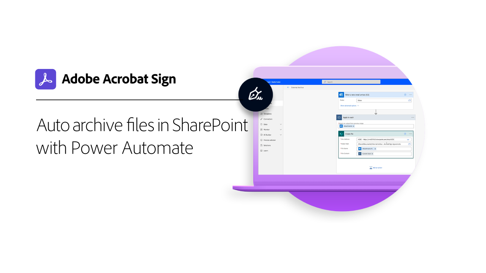
    </a>
    

    <a href="auto-archive-sharepoint-power-automate.md"><strong>使用[!DNL Power Automate]</strong></a>自動封存[!DNL SharePoint]中的檔案
    

    <em>瞭解如何使用[!DNL Power Automate]</em>自動封存已簽署檔案至[!DNL SharePoint]資料庫
     
  </td>
  <td>
    <a href="documentautomation.md">
      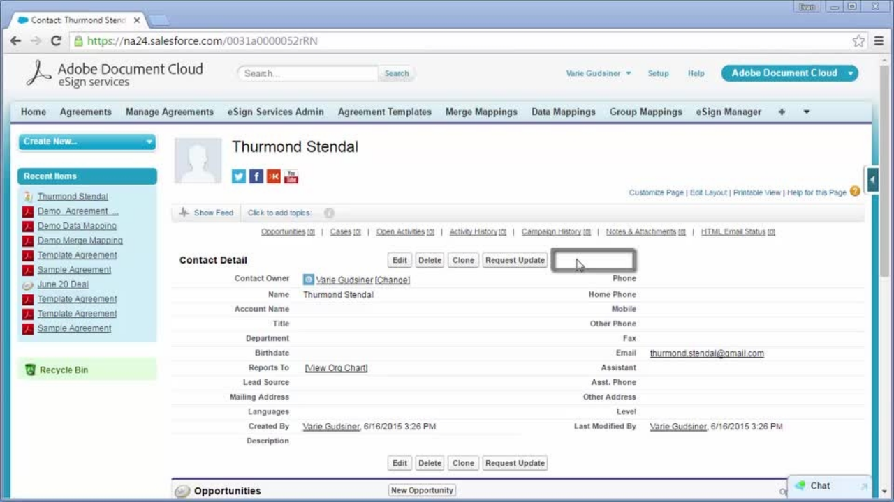
    </a>
    

    <a href="documentautomation.md"><strong>使用[!DNL Acrobat Sign for Microsoft Power Platform]</strong></a>的檔案自動化
    

    <em>瞭解如何啟用及使用[!DNL Microsoft Power]應用程式的[!DNL Acrobat Sign]和[!DNL Adobe PDF Tools]聯結器</em>
     
  </td>
   <td>
    <a href="adobe-sign-teams-mortgage.md">
      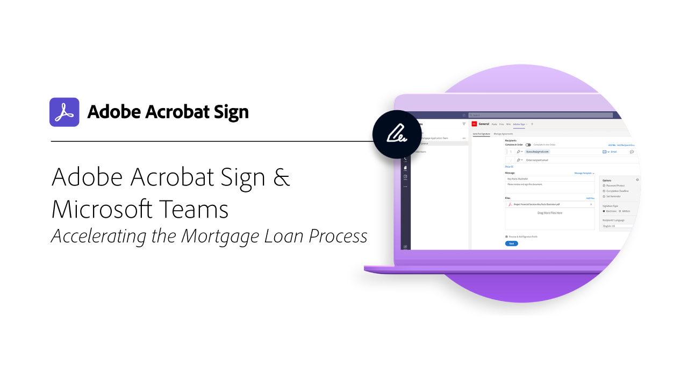
    </a>
    

    <a href="adobe-sign-teams-mortgage.md"><strong>在[!DNL Microsoft Teams]</strong></a>中傳送以索取簽名
    

    <em>直接在[!DNL Microsoft Teams]</em>中傳送檔案以索取簽名
     
  </td>
</tr>
<tr>
  <td>
    <a href="live-sign-microsoft-teams.md">
      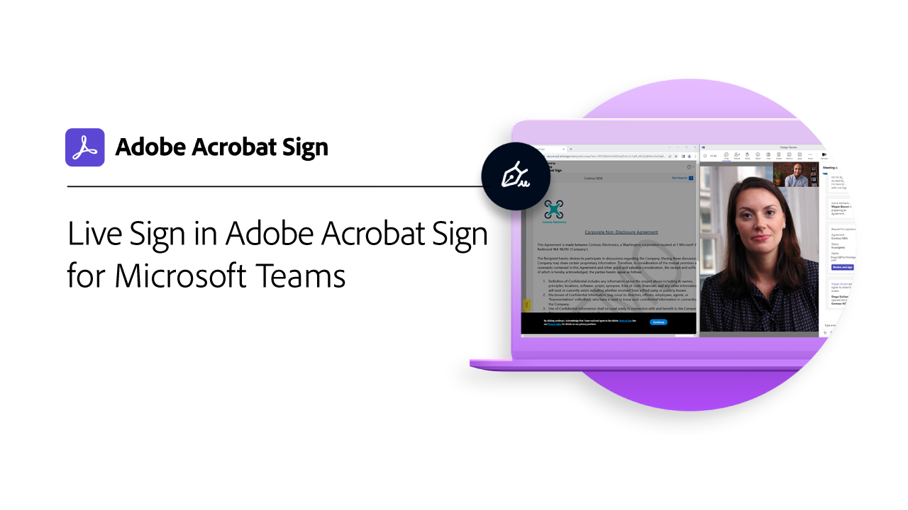
    </a>
    

    <a href="live-sign-microsoft-teams.md"><strong>即時登入[!DNL Microsoft Teams]</strong></a>的Adobe Acrobat Sign
    

    <em>瞭解如何建立類似在[!DNL Microsoft Teams]會議期間親自簽署的線上簽署體驗</em>
     
  </td>
   <td>
    <a href="acrobat-sign-teams-documents-tab.md">
      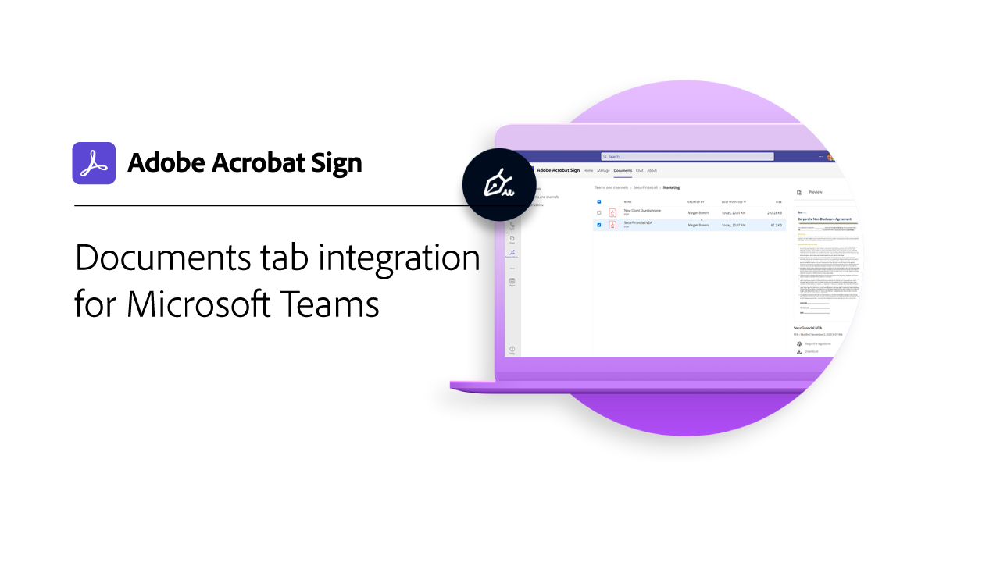
    </a>
    

    [!DNL Microsoft Teams]</strong></a>的<a href="acrobat-sign-teams-documents-tab.md"><strong>檔案索引標籤整合
    

    <em>瞭解如何直接從[!DNL Microsoft Teams]</em>中的[檔案]索引標籤傳送檔案以索取簽名
     
  </td>
 <td>
    <a href="simple-workflow-power-automate.md">
      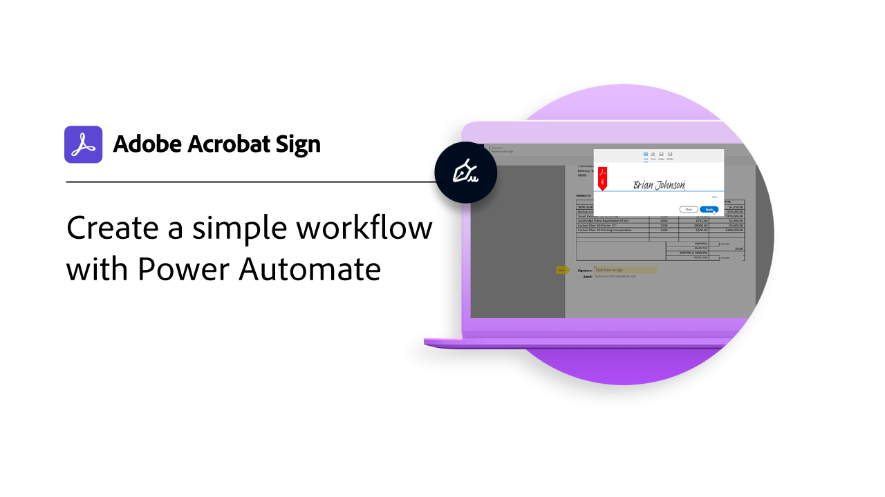
    </a>
    

    <a href="simple-workflow-power-automate.md"><strong>使用[!DNL Power Automate]</strong></a>建立簡單的工作流程
    

    <em>瞭解如何使用[!DNL Power Automate]聯結器建立簡單的工作流程</em>
     
  </td>
  <td>
    <a href="advanced-workflow-power-automate.md">
      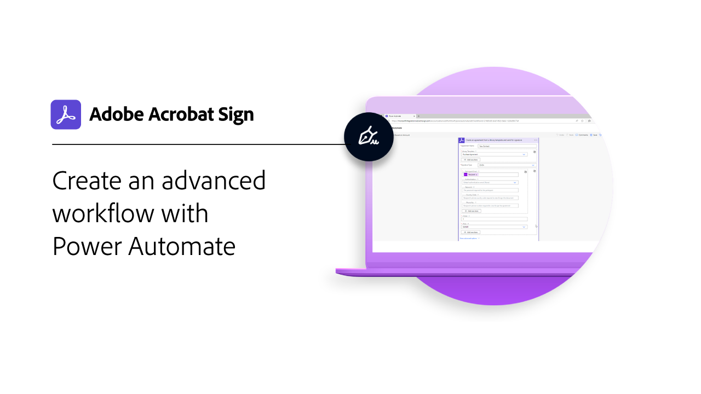
    </a>
    

    <a href="advanced-workflow-power-automate.md"><strong>使用Power Automate建立進階工作流程</strong></a>
    

    <em>瞭解如何使用[!DNL Power Automate]聯結器建立進階工作流程</em>
     
  </td>
<tr>
  <td>
    <a href="dynamics-customer-service.md">
      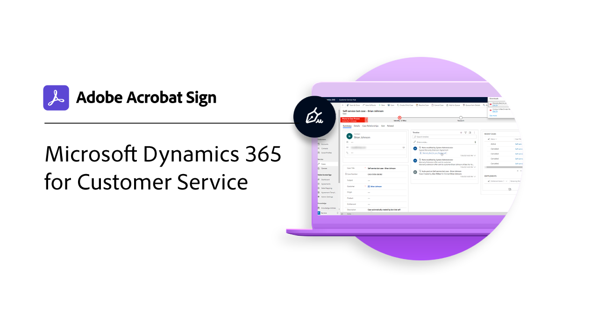
    </a>
    

    <a href="dynamics-customer-service.md"><strong>適用於客戶服務的Microsoft Dynamics 365</strong></a>
    

    <em>瞭解如何使用Acrobat Sign和客戶服務的[!DNL Microsoft Dynamics 365]，在自助服務客戶入口網站提高客戶滿意度</em>
     
  </td>
  <td>
    <a href="dynamics-field-service.md">
      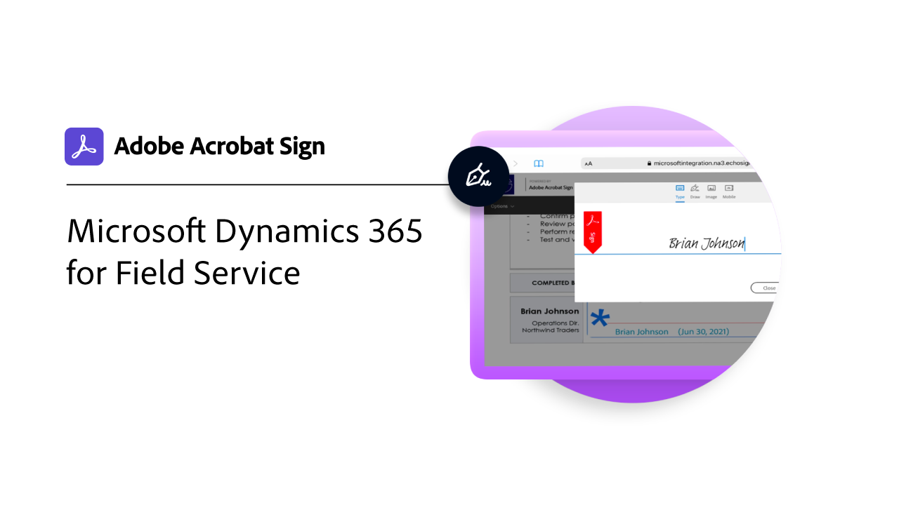
    </a>
    

    <a href="dynamics-field-service.md"><strong>現場服務的Microsoft Dynamics 365</strong></a>
    

    <em>瞭解如何使用現場服務的Acrobat Sign、[!DNL Power Automate]和[!DNL Microsoft Dynamics 365]來簡化客戶現場參與</em>
     
  </td>
  <td>
    <a href="dynamics-sales.md">
      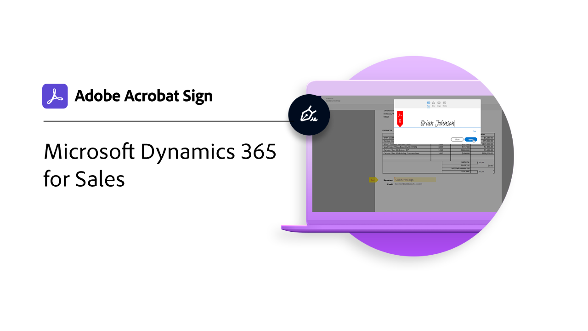
    </a>
    

    <a href="dynamics-sales.md"><strong>銷售Microsoft Dynamics 365</strong></a>
    

    <em>瞭解如何使用Acrobat Sign和[!DNL Microsoft Dynamics 365] for Sales來自動化銷售報價簽署程式</em>
     
  </td>
  <td>
    
    

     
  </td>
</tr>
</table>

## [!DNL Notarize]整合教學課程

<table style="table-layout:fixed">
<tr>
  <td>
    <a href="send-document-notarize.md">
      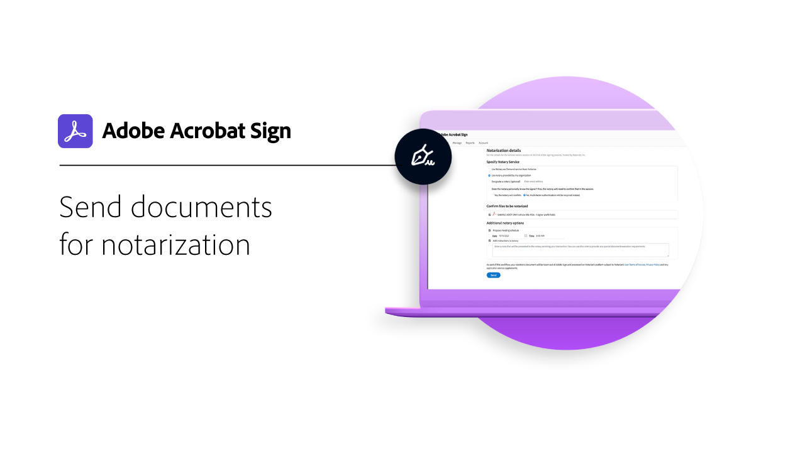
    </a>
    

    <a href="send-document-notarize.md"><strong>傳送檔案以進行公證</strong></a>
    

    <em>瞭解如何傳送檔案以進行公證</em>
     
  </td>
  <td>
    
    

     
  </td>
  <td>
    
    

     
  </td>
  <td>
    
    

     
  </td>
</tr>
</table>

## Salesforce整合教學課程

<table style="table-layout:fixed">
<tr>
  <td>
    
    

    [!DNL Salesforce]</strong></a>的<a href="create-an-agreement-template.md"><strong>Document Builder
    

    <em>瞭解如何使用Document Builder為[!DNL Salesforce]</em>建立可重複使用的檔案範本
     
  </td>
  <td>
    
    

    <a href="set-up-data-mapping.md"><strong>正在設定資料對應</strong></a>
    

    <em>簽署合約後，將資料提取回Salesforce</em>
     
  </td>
  <td>
    <a href="set-up-merging-map.md">
      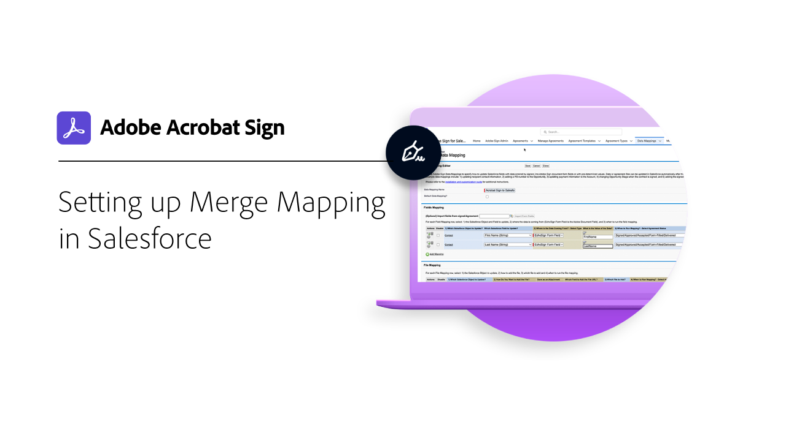
    </a>
    

    <a href="set-up-merging-map.md"><strong>在Salesforce中設定合併對應</strong></a>
    

    <em>瞭解如何將Salesforce中的資料直接合併到Acrobat Sign檔案中</em>
     
  </td>
  <td>
    
    

    <a href="create-a-custom-button.md"><strong>正在建立自訂按鈕</strong></a>
    

    <em>建立自訂按鈕，以開始傳送程式並在Salesforce中自動填入協定</em>
     
  </td>
</tr>
<tr>
  <td>
    <a href="salesforce-automatic-updates.md">
      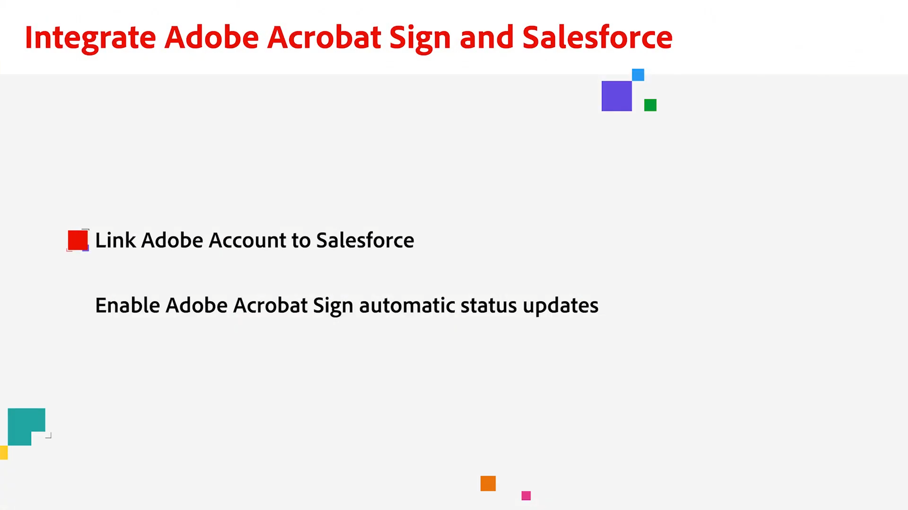
    </a>
    

    <a href="salesforce-automatic-updates.md"><strong>設定自動更新</strong></a>
    

    <em>瞭解如何輕鬆將您的帳戶連結至Salesforce，以取得自動更新</em>
     
  </td>
 <td>
    <a href="salesforce-large-files.md">
      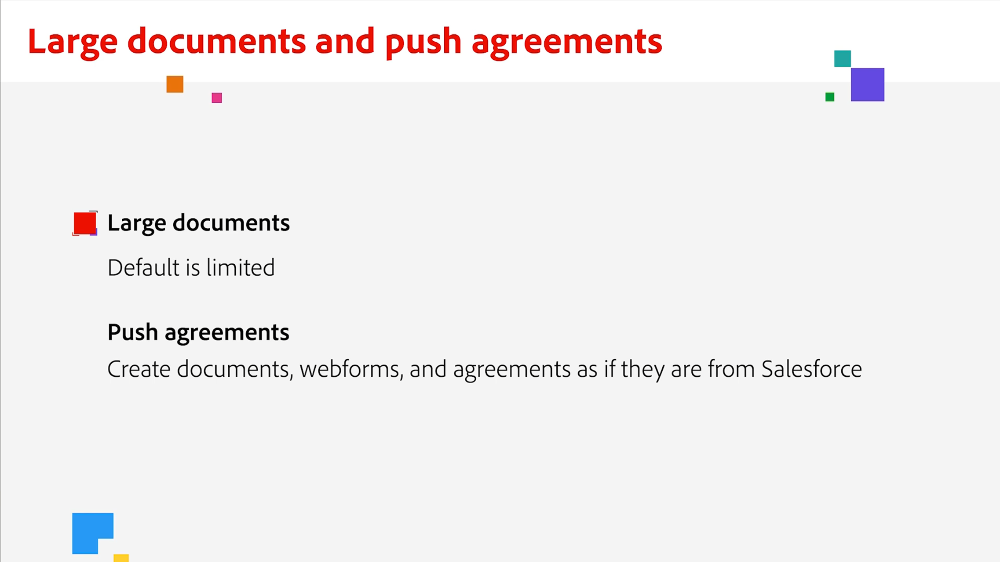
    </a>
    

    <a href="salesforce-large-files.md"><strong>設定大型檔案與推播對應</strong></a>
    

    <em>瞭解如何在Salesforce中設定大型檔案和推播合約服務</em>
     
  </td>
  <td>
      
      

       
  </td>
  <td>
      
      

       
  </td>
</tr>
</table>

## Workday整合教學課程

<table style="table-layout:fixed">
<tr>
 <td>
    <a href="acrobat-sign-workday-onboarding.md">
      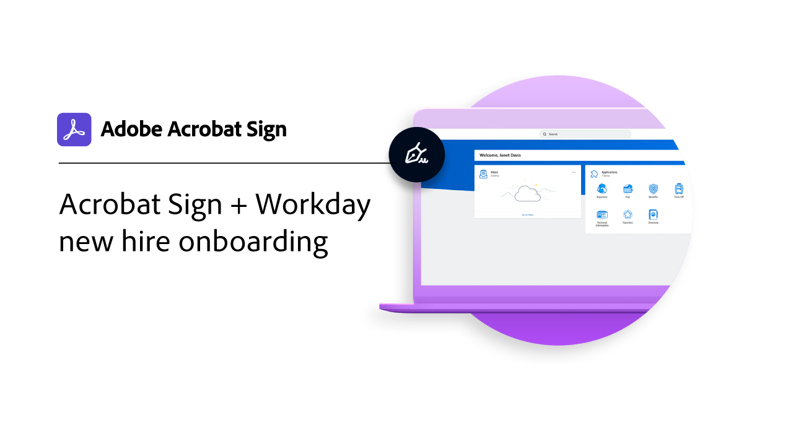
    </a>
    

    <a href="acrobat-sign-workday-onboarding.md"><strong>Acrobat Sign + Workday新員工上線</strong></a>
    

    <em>瞭解如何使用Acrobat Sign + Workday簡化入門工作流程</em>
     
  </td>
 <td>
    
    

     
  </td>
  <td>
    
    

     
  </td>
  <td>
    
    

     
  </td>
</tr>
</table>

## Marketo整合教學課程與設定指南

<table style="table-layout:fixed">
<tr>
  <td>
    <a href="marketo-salesforce-sms.md">
      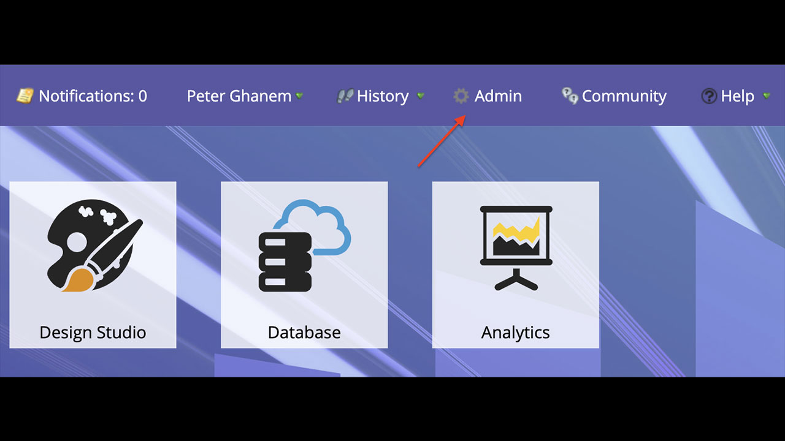
    </a>
    

    <a href="marketo-salesforce-sms.md"><strong>使用適用於Salesforce和Marketo的Acrobat Sign傳送通知</strong></a>
    

    <em>瞭解如何傳送簡訊、電子郵件或推播通知，讓簽署者知道合約即將達成</em>
     
  </td>
  <td>
    <a href="marketo-salesforce-reminder-video.md">
      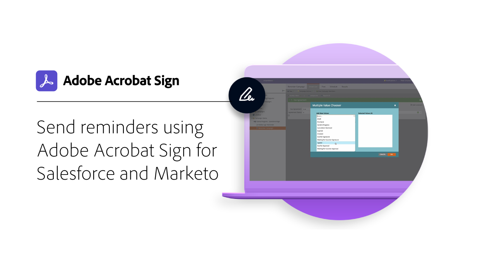
    </a>
    

    <a href="marketo-salesforce-reminder.md"><strong>使用Adobe Sign for Salesforce和Marketo教學課程影片傳送提醒</strong></a>
    

    <em>瞭解當一段時間後仍未簽署協定時，如何從Marketo傳送電子郵件提醒</em>
     
  </td>
  <td>
    <a href="marketo-salesforce-reminder.md">
      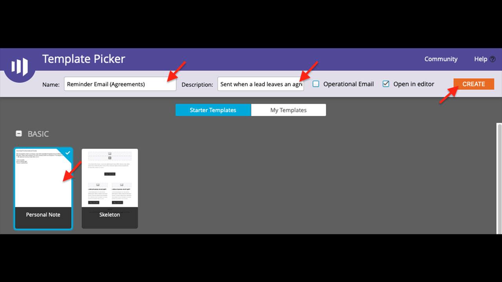
    </a>
    

    <a href="marketo-salesforce-reminder.md"><strong>使用Acrobat Sign for Salesforce和Marketo設定指南傳送提醒</strong></a>
    

    <em>閱讀如何在一段時間後仍未簽署合約時從Marketo傳送電子郵件提醒</em>
     
  </td>
   <td>
    <a href="marketo-dynamics-reminder.md">
      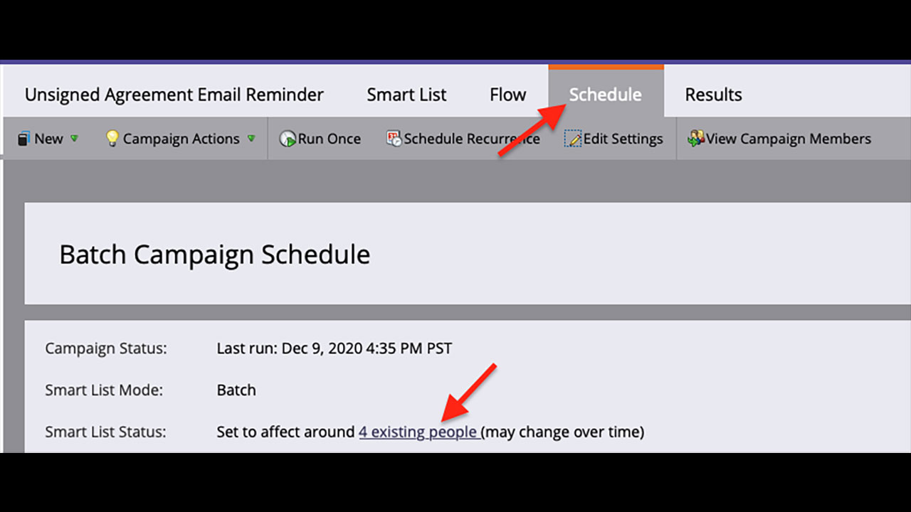
    </a>
    

    使用Microsoft Dynamics和Marketo的Acrobat Sign <a href="marketo-dynamics-reminder.md"><strong>傳送提醒</strong></a>
    

    <em>瞭解如何在一段時間後仍未簽署合約時傳送電子郵件提醒</em>
     
  </td>
</tr>
<tr>
  <td>
    <a href="marketo-dynamics-sms.md">
      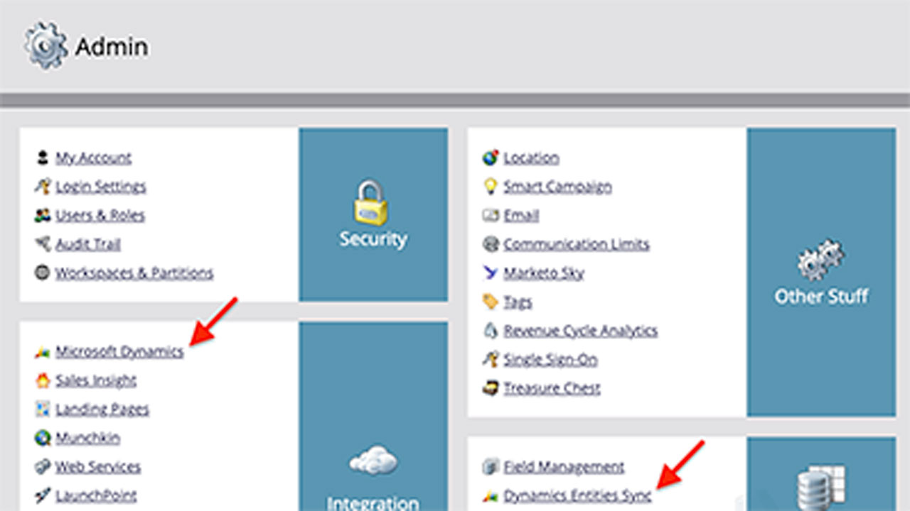
    </a>
    

    <a href="marketo-dynamics-sms.md"><strong>使用適用於Microsoft Dynamics和Marketo的Acrobat Sign傳送通知</strong></a>
    

    <em>瞭解如何傳送簡訊、電子郵件或推播通知，讓簽署者知道合約即將達成</em>
     
  </td>
  <td>
    
    

     
  </td>
  <td>
    
    

     
  </td>
  <td>
    
    

     
  </td>
</tr>
</table>
