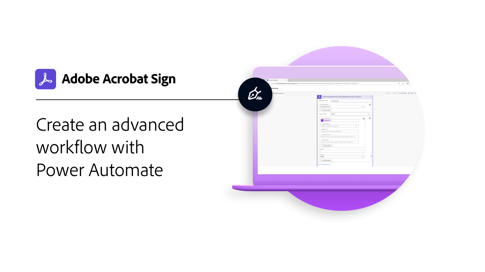

# 整合概觀

您可以在貴組織已經在使用的其他應用程式 （例如 Microsoft、Salesforce、Workday 和 Marketo） 中使用 Acrobat Sign 來命名一些應用程式。 透過這些整合指南和教學課程，瞭解如何簡化電子簽名工作流程。

>[!NOTE]
> 如果您在存取任何功能時發生問題，請向貴組織的管理員確認整合已啟用。

## 新增功能

>[!BEGINTABS]

>[!TAB 設定大型檔案和推送對應]

瞭解如何在 Salesforce 中 [設定大型檔和推送合約服務](salesforce-large-files.md) 。

>[!TAB 設定自動更新]

瞭解如何輕鬆將您的帳戶連結至 Salesforce 以取得 [自動更新](salesforce-automatic-updates.md)。

>[!TAB 適用於 Microsoft Teams 的文件索引標籤整合]

瞭解如何直接從 [「檔」索引卷標](acrobat-sign-teams-documents-tab.md) 中 [!DNL Microsoft Teams]傳送檔以索取簽名。

>[!ENDTABS]

## Microsoft整合教學課程

<table style="table-layout:fixed">
<tr>
  <td>
    
    

    <a href="fill-and-sign-doc-microsoft-outlook.md"><strong>在 Microsoft Outlook 中填寫和簽署</strong></a>
    

    <em>直接在 Microsoft Outlook 內填寫和簽署表格</em>
     
  </td>
  <td>
    
    

    <a href="send-for-signature-with-outlook.md"><strong>Outlook 中的傳送以供簽署</strong></a>
    

    <em>直接在 Microsoft Outlook 中傳送檔以索取簽名</em>
     
  </td>
  <td>
    
    

    <a href="send-for-signature-with-sharepoint-online.md"><strong>在 SharePoint Online 中傳送以索取簽名</strong></a>
    

    <em>直接在 Sharepoint Online 中傳送檔以索取簽名</em>
     
  </td>
   <td>
    
    

    <a href="track-an-agreement-with-sharepoint-online.md"><strong>SharePoint Online 中的追蹤</strong></a>
    

    <em>直接在 Microsoft Sharepoint 內追蹤合約進度</em>
     
  </td>
</tr>
<tr>
  <td>
    
    

    <a href="integrate-web-form-sharepoint-online.md"><strong>整合網頁表單 [!DNL SharePoint Online]</strong></a>
    

    <em>瞭解如何將從網頁窗體收集的數據對應到清單中[!DNL SharePoint]</em>
     
  </td>
  <td>
    
    

    <a href="auto-archive-sharepoint-power-automate.md"><strong>使用下列方式 [!DNL SharePoint] 自動存盤檔案 [!DNL Power Automate]</strong></a>
    

    <em>瞭解如何使用[!DNL SharePoint]&#x200B;[!DNL Power Automate]</em>
     
  </td>
  <td>
    
    

    <a href="documentautomation.md"><strong>檔自動化與 [!DNL Acrobat Sign for Microsoft Power Platform]</strong></a>
    

    <em>瞭解如何啟用和使用應用程式的[!DNL Acrobat Sign]&#x200B;[!DNL Adobe PDF Tools]連接器[!DNL Microsoft Power]</em>
     
  </td>
   <td>
    
    

    <a href="adobe-sign-teams-mortgage.md"><strong>傳送以供簽署 [!DNL Microsoft Teams]</strong></a>
    

    <em>直接在內部傳送檔以索取簽名 [!DNL Microsoft Teams]</em>
     
  </td>
</tr>
<tr>
  <td>
    
    

    <a href="live-sign-microsoft-teams.md"><strong>即時登入 Adobe Acrobat Sign [!DNL Microsoft Teams]</strong></a>
    

    <em>瞭解如何建立類似於會議中 [!DNL Microsoft Teams] 當面簽署的在線簽署體驗</em>
     
  </td>
   <td>
    
    

    <a href="acrobat-sign-teams-documents-tab.md"><strong>檔索引標籤整合 [!DNL Microsoft Teams]</strong></a>
    

    <em>瞭解如何直接從「檔」索引卷標中傳送檔以索取簽名 [!DNL Microsoft Teams]</em>
     
  </td>
 <td>
    
    

    <a href="simple-workflow-power-automate.md"><strong>使用 [!DNL Power Automate]</strong></a>
    

    <em>瞭解如何使用 [!DNL Power Automate] 連接器建立簡單的工作流程</em>
     
  </td>
  <td>
    
    

    <a href="advanced-workflow-power-automate.md"><strong>使用Power Automate 建立進階工作流程</strong></a>
    

    <em>瞭解如何使用 [!DNL Power Automate] 連接器建立進階工作流程</em>
     
  </td>
<tr>
  <td>
    
    

    <a href="dynamics-customer-service.md"><strong>客戶服務Microsoft Dynamics 365</strong></a>
    

    <em>瞭解如何使用 Acrobat Sign 和 [!DNL Microsoft Dynamics 365] 客戶服務來提高自助服務客戶網路入口網站的客戶滿意度</em>
     
  </td>
  <td>
    
    

    <a href="dynamics-field-service.md"><strong>適用於 Field Service 的 Microsoft Dynamics 365</strong></a>
    

    <em>瞭解如何使用 Acrobat Sign [!DNL Power Automate]和 [!DNL Microsoft Dynamics 365] Field Service 來簡化客戶的現場互動</em>
     
  </td>
  <td>
    
    

    <a href="dynamics-sales.md"><strong>適用於銷售Microsoft Dynamics 365</strong></a>
    

    <em>瞭解如何使用「Acrobat Sign」和 [!DNL Microsoft Dynamics 365] 「供銷售」將銷售報價簽署程式自動化</em>
     
  </td>
  <td>
    
    

     
  </td>
</tr>
</table>

## [!DNL Notarize] 整合教學課程

<table style="table-layout:fixed">
<tr>
  <td>
    
    

    <a href="send-document-notarize.md"><strong>傳送檔以供公證</strong></a>
    

    <em>瞭解如何傳送檔以供公證</em>
     
  </td>
  <td>
    
    

     
  </td>
  <td>
    
    

     
  </td>
  <td>
    
    

     
  </td>
</tr>
</table>

## Salesforce 整合教學課程

<table style="table-layout:fixed">
<tr>
  <td>
    
    

    <a href="create-an-agreement-template.md"><strong>Document Builder for [!DNL Salesforce]</strong></a>
    

    <em>瞭解如何使用 Document Builder 建立可重複使用的文件範本 [!DNL Salesforce]</em>
     
  </td>
  <td>
    
    

    <a href="set-up-data-mapping.md"><strong>設定數據對應</strong></a>
    

    <em>合約簽署完成後將數據拉回 Salesforce</em>
     
  </td>
  <td>
    
    

    <a href="set-up-merging-map.md"><strong>在 Salesforce 中設定合併對應</strong></a>
    

    <em>瞭解如何將 Salesforce 的數據直接合併到 Acrobat Sign 檔</em>
     
  </td>
  <td>
    
    

    <a href="create-a-custom-button.md"><strong>建立自定義按鈕</strong></a>
    

    <em>建立自定義按鈕以啟動傳送程式並自動填入 Salesforce 中的合約</em>
     
  </td>
</tr>
<tr>
  <td>
    
    

    <a href="salesforce-automatic-updates.md"><strong>設定自動更新</strong></a>
    

    <em>瞭解如何輕鬆將您的帳戶連結至 Salesforce 以取得自動更新</em>
     
  </td>
 <td>
    
    

    <a href="salesforce-large-files.md"><strong>設定大型檔案和推送對應</strong></a>
    

    <em>瞭解如何在 Salesforce 中設定大型檔和推送合約服務</em>
     
  </td>
  <td>
      
      

       
  </td>
  <td>
      
      

       
  </td>
</tr>
</table>

## Workday 整合教學課程

<table style="table-layout:fixed">
<tr>
 <td>
    
    

    <a href="acrobat-sign-workday-onboarding.md"><strong>Acrobat Sign + Workday 新進員工到職工作</strong></a>
    

    <em>瞭解如何使用 Acrobat Sign + Workday 簡化登入工作流程</em>
     
  </td>
 <td>
    
    

     
  </td>
  <td>
    
    

     
  </td>
  <td>
    
    

     
  </td>
</tr>
</table>

## Marketo 整合教學課程和設定指南

<table style="table-layout:fixed">
<tr>
  <td>
    
    

    <a href="marketo-salesforce-sms.md"><strong>使用適用於 Salesforce 和 Marketo 的 Acrobat Sign 傳送通知</strong></a>
    

    <em>瞭解如何傳送簡訊、電子郵件或推送通知，讓簽署者知道合約即將推出</em>
     
  </td>
  <td>
    
    

    <a href="marketo-salesforce-reminder.md"><strong>使用 Adobe Sign for Salesforce 和 Marketo 視訊教學課程傳送提醒</strong></a>
    

    <em>瞭解如何在合約一段時間后仍未簽署時，向 Marketo 傳送電子郵件提醒</em>
     
  </td>
  <td>
    
    

    <a href="marketo-salesforce-reminder.md"><strong>使用 Acrobat Sign for Salesforce 和 Marketo 設定指南傳送提醒</strong></a>
    

    <em>閱讀如何在合約一段時間后仍未簽署時，向 Marketo 傳送電子郵件提醒</em>
     
  </td>
   <td>
    
    

    <a href="marketo-dynamics-reminder.md"><strong>使用適用於 Microsoft Dynamics 和 Marketo 的 Acrobat Sign 傳送提醒</strong></a>
    

    <em>瞭解如何在合約一段時間后仍未簽署時傳送電子郵件提醒</em>
     
  </td>
</tr>
<tr>
  <td>
    
    

    <a href="marketo-dynamics-sms.md"><strong>使用適用於 Microsoft Dynamics 和 Marketo 的 Acrobat Sign 傳送通知</strong></a>
    

    <em>瞭解如何傳送簡訊、電子郵件或推送通知，讓簽署者知道合約即將推出</em>
     
  </td>
  <td>
    
    

     
  </td>
  <td>
    
    

     
  </td>
  <td>
    
    

     
  </td>
</tr>
</table>
