# 使用適用於Microsoft Dynamics 365和Marketo的Acrobat Sign傳送提醒

瞭解當一段時間後仍未簽署協定時，如何傳送電子郵件提醒。 此整合使用Acrobat Sign、適用於Microsoft Dynamics的Acrobat Sign、Marketo以及Marketo Microsoft Dynamics Sync。

## 必要條件

1. 安裝Marketo Microsoft Dynamics Sync。

   [此處](https://experienceleague.adobe.com/docs/marketo/using/product-docs/crm-sync/microsoft-dynamics/marketo-plugin-releases-for-microsoft-dynamics.html)提供Microsoft Dynamics Sync的資訊和最新外掛程式。

1. 安裝適用於Microsoft Dynamics](https://appsource.microsoft.com/zh-tw/product/dynamics-365/adobesign.f3b856fc-a427-4d47-ad4b-d5d1baba6f86)的[Acrobat Sign。

   [此處](https://helpx.adobe.com/ca/sign/using/microsoft-dynamics-integration-installation-guide.html)提供此外掛程式的資訊。

## 尋找自訂物件

Marketo Microsoft Dynamics同步和Acrobat Sign for Dynamics設定完成後，「Marketo管理終端機」中會出現兩個新選項。


1. 按一下&#x200B;**[!UICONTROL Dynamics Entities Sync]**。

   同步處理自訂實體前，必須先停用同步。 如果您是第一次，請按一下&#x200B;**同步結構描述**。 否則，請按一下&#x200B;**重新整理結構描述**。

   

## 同步處理自訂物件

1. 在右側，找到[!UICONTROL 銷售機會]、[!UICONTROL 連絡人]和[!UICONTROL 帳戶]型自訂物件。

   * 如果要在[!UICONTROL 銷售機會]尚未在Dynamics中簽署合約時傳送提醒，請為&#x200B;**[!UICONTROL 銷售機會]**&#x200B;下的物件&#x200B;**啟用同步**。

   * 如果要在[!UICONTROL 連絡人]尚未在Dynamics中簽署合約時傳送提醒，請&#x200B;**啟用**[!UICONTROL &#x200B;連絡人&#x200B;]**下物件的同步**。

   * 如果要在[!UICONTROL 帳戶]尚未在Dynamics中簽署合約時傳送提醒，請&#x200B;**啟用**[!UICONTROL &#x200B;帳戶&#x200B;]**下物件的同步**。

   * **為所需**[!UICONTROL &#x200B;父系&#x200B;]**（[!UICONTROL 潛在客戶]、[!UICONTROL 連絡人]或[!UICONTROL 帳戶]）下的合約物件啟用Sync**。

   

1. 在新視窗中，在[合約]下選取您想要的屬性，然後啟用[限制] ****&#x200B;和[觸發] ****&#x200B;下的方塊，以公開您的行銷活動。

   

   

1. 在自訂物件上啟用同步後，重新啟用同步。

   返回[管理終端機]，按一下&#x200B;**Microsoft Dynamics**，然後按一下&#x200B;**[啟用同步處理]**。

   

   

## 建立程式和Token

1. 在Marketo的「行銷活動」區段中，在左側列上的「**行銷活動**」上按一下滑鼠右鍵。

   選取&#x200B;**新行銷活動資料夾**，並指定其名稱。

   

1. 以滑鼠右鍵按一下建立的資料夾，選取&#x200B;**新程式**，然後為其命名。

   保留其他專案為預設值，然後按一下[建立]。****

   

   

1. 按一下&#x200B;**我的Token**，然後將&#x200B;**電子郵件指令碼**&#x200B;拖曳到畫布上。

   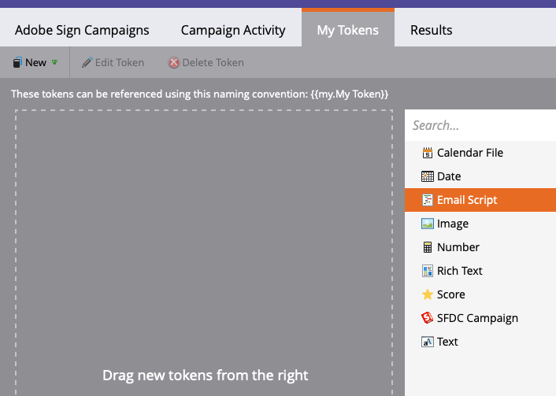

1. 提供名稱，然後按一下&#x200B;**按一下以編輯**。

   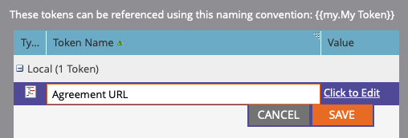

1. 展開右側的&#x200B;**[!UICONTROL 自訂物件]**，然後展開&#x200B;**[!UICONTROL 合約]**&#x200B;物件。

   尋找[!UICONTROL 名稱]、合約狀態、傳送日期，以及目前的簽署者URL並拖曳到畫布上。

1. 使用這些權杖撰寫Velocity指令碼，以顯示一週內未簽署的合約URL。 以下是比較目前日期與「傳送日期」的範例：

   ```
   #foreach($agreement in $adobe_agreementList)
       #if($agreement.adobe_esagreementstatus == "Out for Signature")
           #set($todayCalObj = $date.toCalendar($date.toDate("yyyy-MM-dd",$date.get('yyyy-MM-dd'))) )
           #set($dateSentCalObj = $date.toCalendar($date.toDate("yyyy-MM-dd",$agreement.adobe_datesent)) )
           #set($dateDiff = ($todayCalObj.getTimeInMillis() - $dateSentCalObj.getTimeInMillis()) / 86400000 )
   
           #if($dateDiff >= 7)
               #set($agreementName = $agreement.adobe_name)
               #set($agreementURL = $agreement.adobe_currentsignerurl.substring(8))
               #break
           #else
           #end
       #else
       #end
   #end
   
   #if(${agreementName})
       <a href="https://${agreementURL}">${agreementName}</a>
   #else
       Please contact us. 
   #end
   ```

1. 按一下「**[!UICONTROL 儲存]**」。

## 建立提醒並新增個人化

個人化的範例包括：簽署者名稱、協定名稱、協定連結等。

1. 用滑鼠右鍵按一下您建立的程式，然後按一下&#x200B;**[!UICONTROL 新增本機資產]**，然後選取&#x200B;**[!UICONTROL 電子郵件]**。

   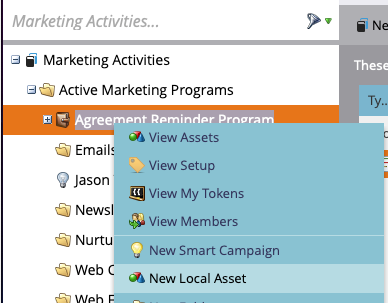

1. 在新索引標籤中，輸入電子郵件的&#x200B;**[!UICONTROL 名稱]**&#x200B;和&#x200B;**[!UICONTROL 描述]**，並從範本選擇器中選取範本。

   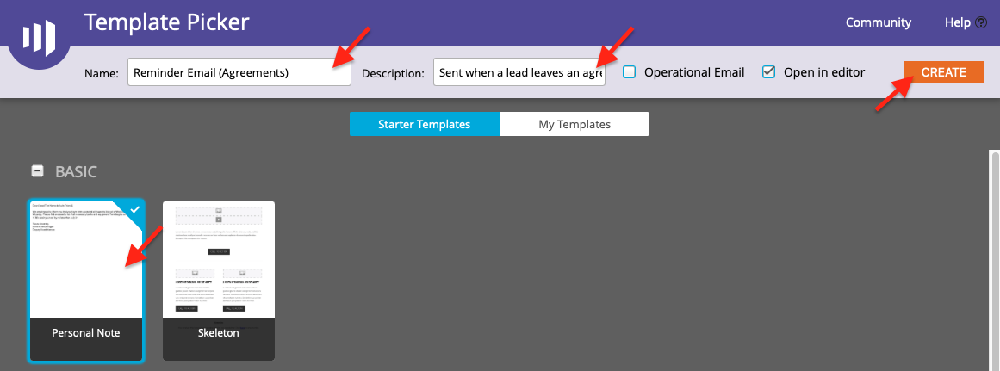

1. 按一下&#x200B;**[!UICONTROL 「建立」]**。

1. 設定&#x200B;**[!UICONTROL 寄件者名稱]**&#x200B;和&#x200B;**[!UICONTROL 寄件者地址]**。

   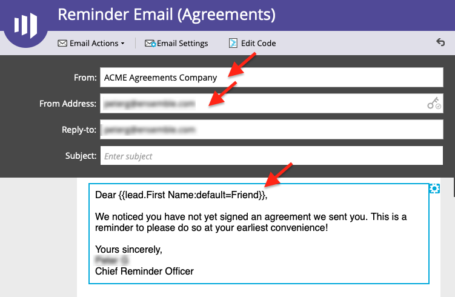

1. 按一下訊息本文以啟動編輯器。

   按一下&#x200B;**[!UICONTROL 插入權杖]**&#x200B;按鈕，尋找您建立的自訂合約URL權杖，然後按一下&#x200B;**[!UICONTROL 插入]**。 完成自訂您的電子郵件，然後按一下&#x200B;**[!UICONTROL 儲存]**。

   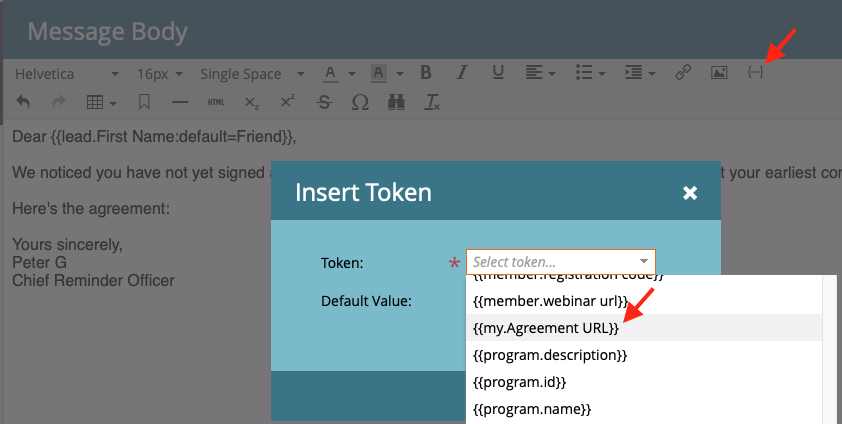

1. 使用已指派合約的設定檔預覽。

   您應該會看到連至URL的連結，其中的「合約名稱」為標籤。

   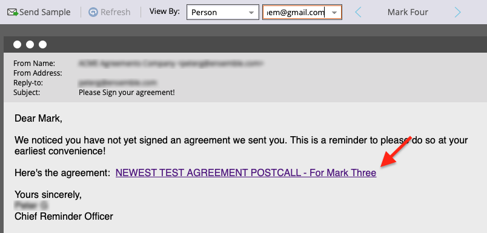

## 設定智慧行銷活動篩選器

1. 以滑鼠右鍵按一下您建立的方案，然後按一下&#x200B;**[!UICONTROL 新增Smart Campaign]**。

   

1. 為您選擇的名稱命名，然後按一下[建立]。****

   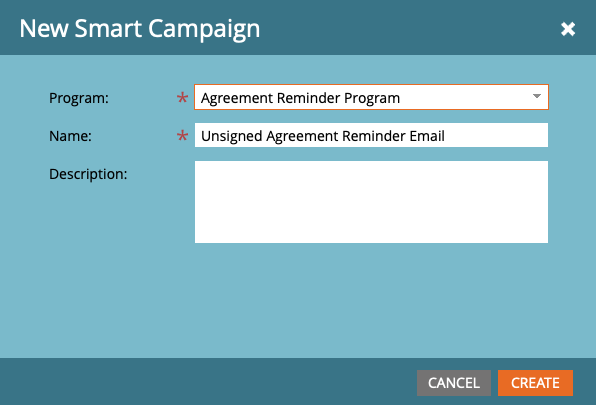

1. 搜尋，然後按一下並將&#x200B;**[!UICONTROL 具有合約]**&#x200B;拖曳到智慧列示。

   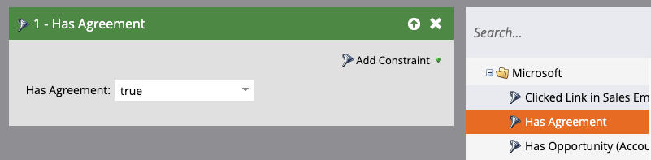

   您公開給觸發器的欄位應該可以在&#x200B;**[!UICONTROL 新增限制]**&#x200B;中使用。

1. 選取「**[!UICONTROL 合約狀態]**」以及您想要作為篩選依據的任何其他欄位。

   對於每個新增的欄位，定義要作為篩選依據的值。 在此情況下，只有當&#x200B;**[!UICONTROL 合約狀態]**&#x200B;為&#x200B;*簽章結束*，且&#x200B;**[!UICONTROL 傳送日期]**&#x200B;為&#x200B;*且早於1週*&#x200B;時，才會觸發。

   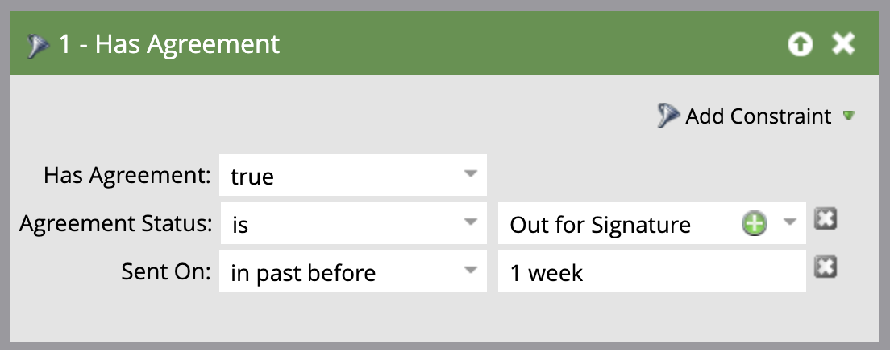

   >[!NOTE]
   >
   > 如果您希望此行銷活動只針對特定合約執行，請將唯一識別碼新增至條件約束，例如&#x200B;**Name**。

1. 確認行銷活動對象，並在「排程」標籤中檢視誰符合資格。

   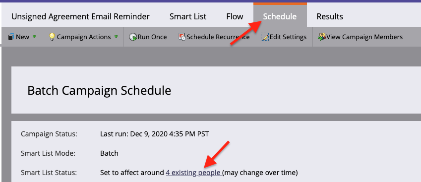

## 設定Smart Campaign流程

由於已使用行銷活動篩選&#x200B;**到期前的天數**，因此您可以使用已排程的週期進行行銷活動。

1. 按一下[!UICONTROL 智慧行銷活動]中的&#x200B;**[!UICONTROL 流量]**&#x200B;索引標籤。

   搜尋&#x200B;**傳送電子郵件**&#x200B;流程，並將其拖曳至畫布上，並選取您在上一節建立的提醒電子郵件。

   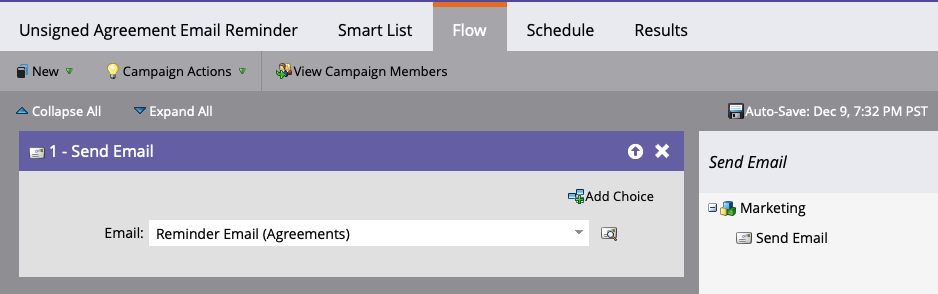

1. 按一下Smart Campaign中的&#x200B;**[!UICONTROL 排程]**&#x200B;索引標籤。 請確定&#x200B;**智慧行銷活動設定**&#x200B;中的行銷活動流程限製為每人執行一次。 然後，按一下&#x200B;**排程週期**&#x200B;索引標籤。

   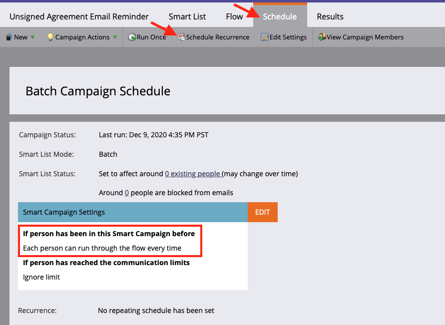

1. 將&#x200B;**排程**&#x200B;設定為&#x200B;_每日_。 視需要選擇行銷活動的開始日期、時間與結束日期。

   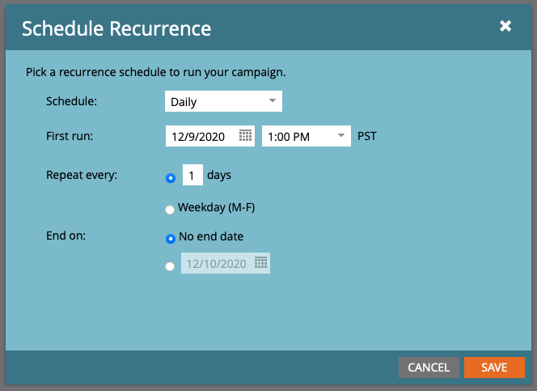
