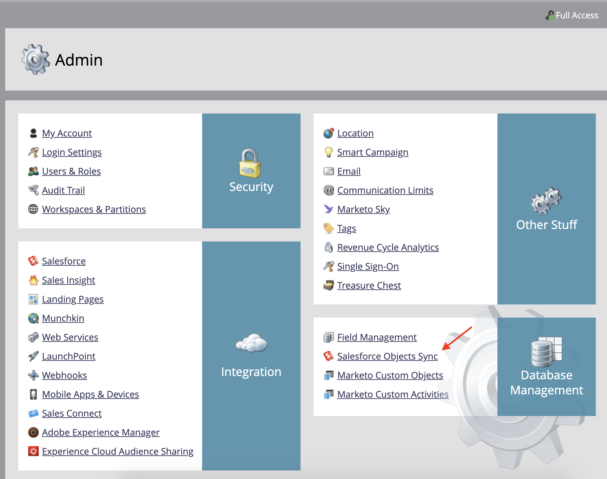
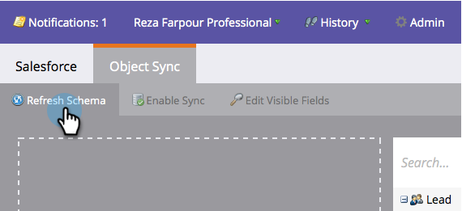
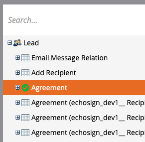
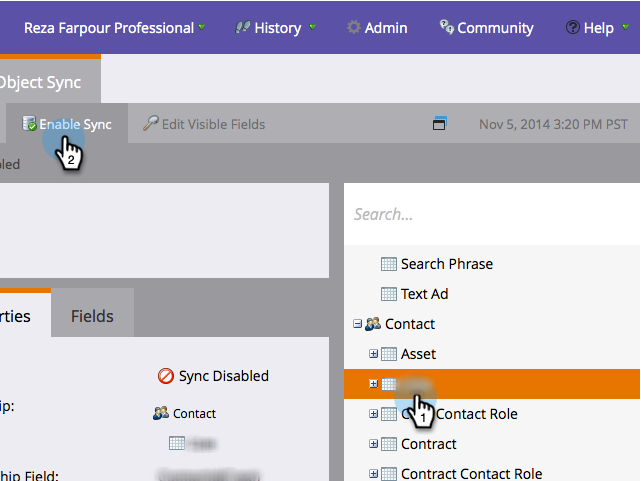
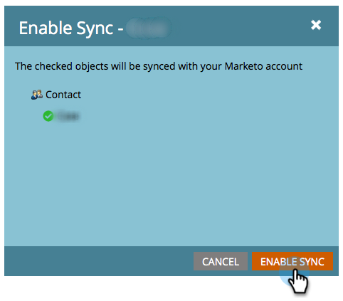
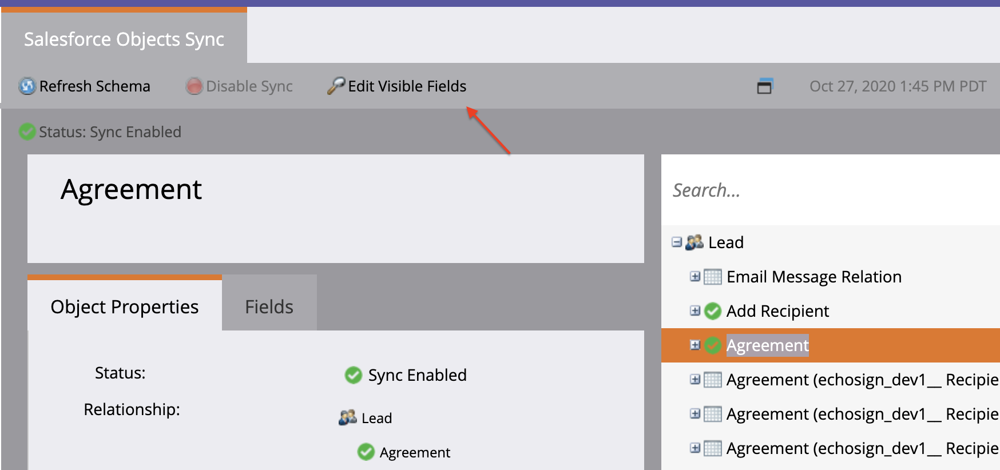
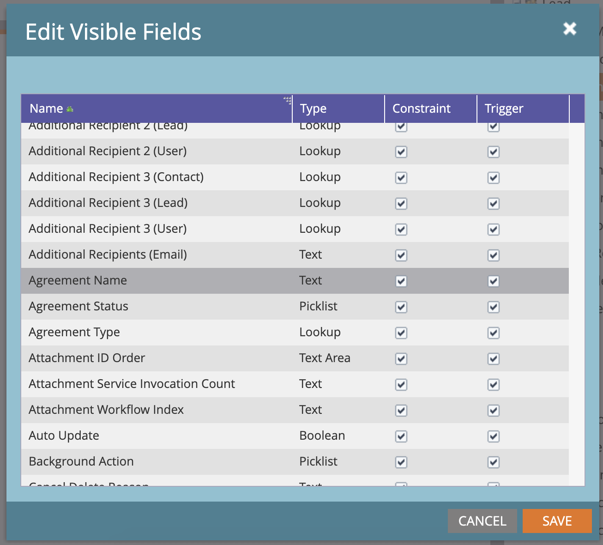
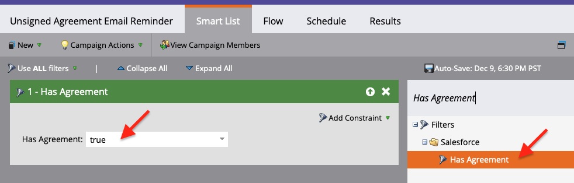
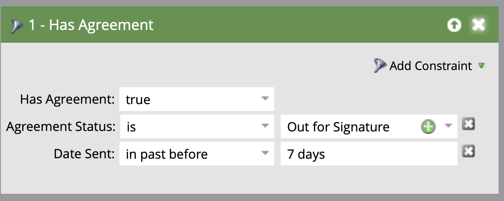

# 使用適用於Salesforce的Acrobat Sign和Marketo設定指南傳送提醒

瞭解當一段時間後仍未簽署協定時，如何從Marketo傳送電子郵件提醒。 此整合使用Acrobat Sign、適用於Salesforce的Acrobat Sign、Marketo，以及Marketo和Salesforce Sync。

## 必要條件

1. 安裝Marketo Salesforce Sync。

   [此處](https://experienceleague.adobe.com/docs/marketo/using/product-docs/crm-sync/salesforce-sync/understanding-the-salesforce-sync.html?lang=zh-Hant)提供Salesforce Sync的資訊和最新外掛程式。

1. 安裝適用於Salesforce的Acrobat Sign。

   [此處](https://helpx.adobe.com/ca/sign/using/salesforce-integration-installation-guide.html)提供此外掛程式的資訊。

## 尋找自訂物件

Marketo Salesforce同步和適用於Salesforce的Acrobat Sign設定完成後，Marketo管理終端機中會顯示數個新選項。




1. 如果您是第一次，請按一下&#x200B;**同步結構描述**。 否則，請按一下&#x200B;**重新整理結構描述**。

   

1. 如果正在執行全域同步處理，請按一下[停用全域同步處理] **來停用。**

   

1. 按一下&#x200B;**重新整理結構描述**。

   

## 同步處理自訂物件

在右側，請參閱Lead、Contact和Account型自訂物件。

如果您想要在Lead尚未在Salesforce中簽署合約時傳送提醒，請為Lead底下的物件&#x200B;**啟用Sync**。

**如果您要在連絡人尚未在Salesforce中簽署合約時傳送提醒，請為連絡人底下的物件**&#x200B;啟用同步處理。

如果要在帳戶尚未在Salesforce中簽署合約時傳送提醒，請為[帳戶]下的物件&#x200B;**啟用Sync**。

1. **為顯示在所需父項（潛在客戶、連絡人或帳戶）下的**&#x200B;合約&#x200B;**物件啟用同步**。 針對您想要同步的任何其他自訂物件執行此動作。

   

1. 下列資產顯示如何&#x200B;**啟用同步**。

   

   

## 向觸發器公開自訂物件欄位

1. 停用全域同步時，請選取您啟用同步處理的協定自訂物件，然後&#x200B;**編輯可見欄位**。

1. 勾選觸發程式欄位中的「合約名稱」欄位，將其公開給您的Campaign動作觸發程式。 勾選您要依據的其他欄位，然後&#x200B;**儲存**。

   

   

1. 在自訂物件上啟用同步並公開觸發程式值後，請記得重新啟用ync：

   

## 建立程式和Token

1. 在Marketo的「行銷活動」區段中，以滑鼠右鍵按一下左側列上的&#x200B;**行銷活動**，選取&#x200B;**新增行銷活動資料夾**，然後為其命名。

   

1. 以滑鼠右鍵按一下建立的資料夾，選取&#x200B;**新程式**，然後為其命名。 保留其他專案為預設值，然後按一下[建立]。**&#x200B;**

   

   

1. 按一下&#x200B;**我的Token**，然後將&#x200B;**電子郵件指令碼**&#x200B;拖曳到畫布上。

   

1. 提供名稱，然後按一下&#x200B;**按一下以編輯**。

   

1. 展開右側的&#x200B;**自訂物件**，然後展開&#x200B;**合約**&#x200B;物件。 尋找並拖曳合約名稱、合約狀態、簽署日期和簽署URL至畫布。

1. 使用這些權杖撰寫Velocity指令碼，以顯示一週內未簽署的合約URL。 以下是比較目前日期與「傳送日期」的範例：

   ```
   #foreach($agreement in $echosign_dev1__SIGN_Agreement__cList)
       #if($agreement.echosign_dev1__Status__c == "Out for Signature")
           #set($todayCalObj = $date.toCalendar($date.toDate("yyyy-MM-dd",$date.get('yyyy-MM-dd'))) )
           #set($dateSentCalObj = $date.toCalendar($date.toDate("yyyy-MM-dd",$agreement.echosign_dev1__DateSent__c)) )
           #set($dateDiff = ($todayCalObj.getTimeInMillis() - $dateSentCalObj.getTimeInMillis()) / 86400000 )
   
           #if($dateDiff >= 7)
               #set($agreementName = $agreement.Name)
               #set($agreementURL = $agreement.echosign_dev1__Signing_URL__c.substring(8))
               #break
           #else
           #end
       #else
       #end
   #end
   
   #if(${agreementName})
       <a href="https://${agreementURL}">${agreementName}</a>
   #else
       Please contact us. 
   #end
   ```

1. 按一下「**儲存**」。

## 建立提醒並新增個人化

個人化的範例包括：簽署者名稱、協定名稱、協定連結等。

1. 用滑鼠右鍵按一下您建立的程式，然後按一下&#x200B;**新增本機資產**，然後選取&#x200B;**電子郵件**。

   

1. 在新索引標籤中，輸入電子郵件的&#x200B;**名稱**&#x200B;和&#x200B;**描述**，並從範本選擇器中選取範本。 按一下&#x200B;**「建立」**。

   

1. 設定&#x200B;**寄件者名稱**&#x200B;和&#x200B;**寄件者地址**。

   

1. 按一下訊息本文以啟動編輯器。 按一下&#x200B;**插入權杖**&#x200B;按鈕，尋找您建立的自訂合約URL權杖，然後按一下&#x200B;**插入**。 完成自訂您的電子郵件，然後按一下&#x200B;**儲存**。

   

1. 使用已指派合約的設定檔預覽。 您應該會看到連至URL的連結，其中的「合約名稱」為標籤。

   

## 設定智慧行銷活動篩選器

1. 以滑鼠右鍵按一下您建立的方案，然後按一下&#x200B;**新增Smart Campaign**。

   

1. 為您選擇的名稱命名，然後按一下[建立]。**&#x200B;**

   

1. 搜尋，然後按一下並將&#x200B;**具有合約**&#x200B;拖曳到智慧列示。

   

1. 您公開給觸發器的欄位現在應該可以在&#x200B;**新增限制**&#x200B;中使用。 選取「**合約狀態**」以及您想要作為篩選依據的任何其他欄位。 對於每個新增的欄位，定義要作為篩選依據的值。 在此情況下，只有當&#x200B;**合約狀態**&#x200B;為簽名過期，且&#x200B;**傳送日期**&#x200B;在過去7天之前時，才會觸發此事件。

   

   >[!NOTE]
   >
   > 如果您希望此行銷活動只針對特定合約執行，請為條件約束（例如&#x200B;**合約名稱**）指定唯一的識別碼。

1. 確認行銷活動對象，並在「排程」標籤中檢視誰符合資格。

   

## 設定Smart Campaign流程

由於已使用未簽署的行銷活動篩選器&#x200B;**天**，因此您可以在此行銷活動中使用排程的週期。

1. 按一下Smart Campaign中的&#x200B;**流量**&#x200B;標籤。 搜尋&#x200B;**傳送電子郵件**&#x200B;流程，並將其拖曳至畫布上，並選取您在上一節建立的提醒電子郵件。

   

1. 按一下Smart Campaign中的&#x200B;**排程**&#x200B;索引標籤。 請確定&#x200B;**智慧行銷活動設定**&#x200B;中的行銷活動流程限製為每人執行一次。 然後，按一下&#x200B;**排程週期**&#x200B;索引標籤。

   

1. 將&#x200B;**排程**&#x200B;設定為「每日」，視需要選擇行銷活動的開始日期與時間，以及結束日期。

   

