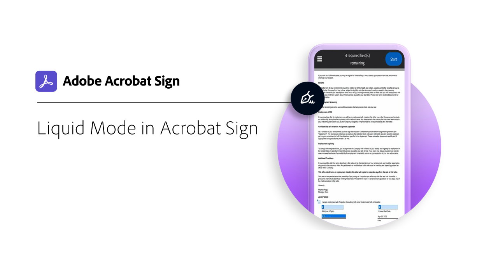

# 行動裝置概觀

傳送檔以索取簽名、追蹤電子簽名進度，以及取得即時更新，這些全都可在您的行動裝置上完成。

<table style="table-layout:fixed">
<tr>
  <td>
    
    

    <a href="liquidmode.md"><strong>Acrobat Sign 中的 Liquid Mode</strong></a>
    

    <em>瞭解 Liquid Mode 如何改善行動簽署體驗</em>
     
  </td>
  <td>
    
    

    <a href="https://itunes.apple.com/us/app/adobe-sign/id481082197?mt=8" target="_blank"><strong>下載 Acrobat iOS 版 Sign 行動應用程式</strong></a>
     
  </td>
  <td>
    
    

    <a href="https://play.google.com/store/apps/details?id=com.adobe.echosign&amp;hl=en" target="_blank"><strong>下載 Acrobat Sign Android 版行動應用程式</strong></a>
     
  </td>
</tr>
</table>
