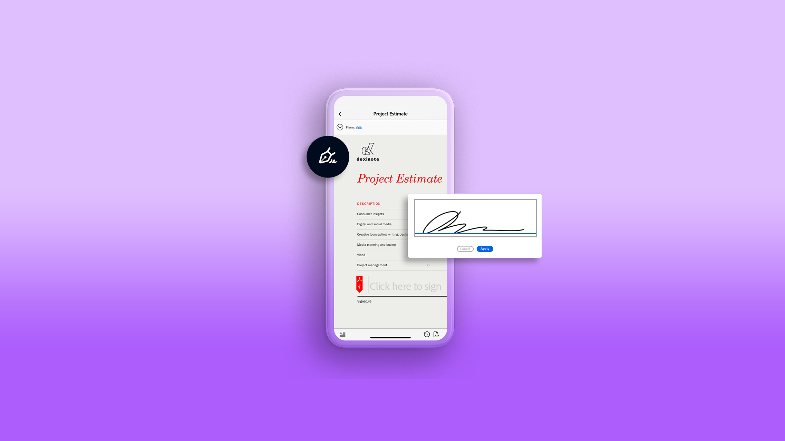

# Acrobat Sign 教學課程

Acrobat Sign 是Adobe Document Cloud解決方案，透過整合、API、進階驗證、其他管理員功能等滿足您組織的需求。 在這裡，您可以找到各式各樣的學習體驗，其設計目的是讓初學者和管理員都能在 Acrobat Sign 上快速上手。

## 學習路徑

<table style="table-layout:fixed">
<tr>
  <td>
    
    

      <a href="sign-beginner-tutorials/beginner-users-overview.md"><strong>快速入門</strong></a>
      

      快速瞭解如何傳送、簽署和追蹤檔       
  </td>
  <td>
    
    

      <a href="sign-advanced-users/advanced-users-overview.md"><strong>進階工作</strong></a>
      

      超越特定任務和自動化的基本知識       
  </td>  
  <td>
    
    

      <a href="admin/intro-admin-overview.md"><strong>管理</strong></a>
      

      組織進階設定秘訣的基本資訊       
  </td>
  <td>
    
     

      <a href="digitalid/digitalid-overview.md"><strong>數位ID</strong></a>
      

      瞭解如何在 Acrobat Sign 中使用數位 ID       
  </td>
</tr>
<tr>
  <td>
    
    

      <a href="integrations/integrations-overview.md"><strong>集成</strong></a>
      

      新增Acrobat直接在貴組織已在使用的其他應用程式中簽署       
  </td>
  <td>
    
    

      <a href="sign-usecase/expand-inspire-overview.md"><strong>產業和部門</strong></a>
      

      探索真實世界的產業和部門使用案例       
  </td>
  <td>
    
    

      <a href="develop/develop-overview.md"><strong>發展</strong></a>
      

      取得 Acrobat Sign I/O 上的開發資源       
  </td>
   <td>
    
    

      <a href="deploy-overview.md"><strong>部署</strong></a>
      

      在組織中部署 Acrobat Sign 的見解和最佳實用性       
  </td>
</tr>
<tr>
  <td>
    
    

      <a href="mobile/mobile-overview.md"><strong>行動裝置</strong></a>
      

      在行動裝置上傳送、簽署和取得實時更新       
  </td>  
</tr>
</table>
