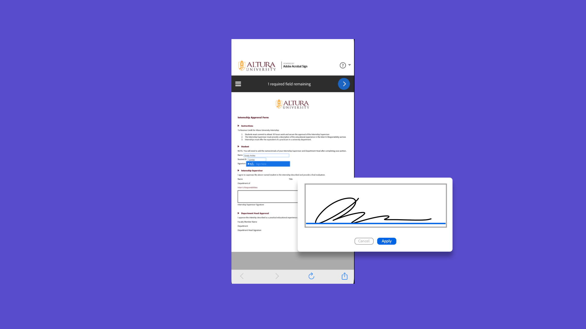

# Acrobat Sign教學課程

Acrobat Sign為Adobe Document Cloud解決方案，可透過整合、API、進階驗證、其他管理功能等擴展以滿足您組織的需求。 您可以在這裡找到廣泛的學習體驗，這些體驗的設計目的是讓初學者和管理員都能快速掌握Acrobat Sign。

## 學習路徑

<table style="table-layout:fixed">
<tr>
  <td>
    
    

    <a href="sign-beginner-tutorials/beginner-users-overview.md"><strong>快速入門</strong></a>
    

    快速掌握如何傳送、簽署及追蹤檔案
     
  </td>
  <td>
    
    

    <a href="sign-advanced-users/advanced-users-overview.md"><strong>進階工作</strong></a>
    

    超越基本知識，完成特定工作與自動化
     
  </td>
   <td>
    
    

    <a href="admin/intro-admin-overview.md"><strong>管理員</strong></a>
    

    貴組織適用的基本到進階設定提示
     
  </td>
   <td>
    
    

    <a href="digitalid/digitalid-overview.md"><strong>數位識別碼</strong></a>
    

    瞭解如何在Acrobat Sign中使用全球的數位ID
     
  </td>
</tr>
<tr>
    <td>
    
    

    <a href="integrations/integrations-overview.md"><strong>整合</strong></a>
    

    直接在另一個應用程式中新增Acrobat Sign
     
    </td>
  <td>
    
    

    <a href="sign-usecase/expand-inspire-overview.md"><strong>產業與部門</strong></a>
    

    探索真實世界的產業和部門使用案例
     
  </td>
  <td>
    
    

    <a href="develop/develop-overview.md"><strong>開發</strong></a>
    

    在Acrobat Sign I/O上取得開發資源
     
  </td>
  <td>
    
    

    <a href="deploy-overview.md"><strong>部署</strong></a>
    

    insight以及在組織內部署Acrobat Sign的最佳作法
     
  </td>
</tr>
<tr>
  <td>
    
    

    <a href="mobile/mobile-overview.md"><strong>行動裝置</strong></a>
    

    傳送、簽署及取得行動裝置上的即時更新
     
  </td>
</tr>
</table>