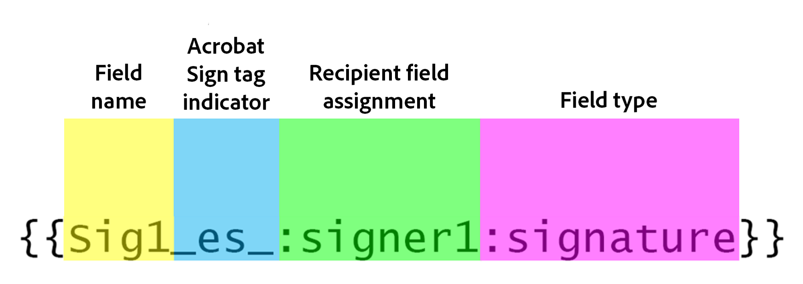

# Acrobat Sign文字標籤

瞭解如何使用文字標籤建立Acrobat Sign表單欄位。 在Acrobat中，文字標籤可以直接新增至編寫工具，例如Microsoft Word、Adobe InDesign，或者如果您有PDF。 它們可大幅減少準備Acrobat Sign中所使用檔案所需的工作量。 在Acrobat Sign中上傳已標籤的檔案後，可將其設定為範本，無需任何人新增欄位至其檔案。

## 開始使用

文字標籤是放在檔案中任何位置的唯一格式化文字片段，上傳至Acrobat Sign時會自動辨識為欄位。

您可以直接將文字標籤新增至撰寫工具，例如Microsoft Word、Adobe InDesign，或如果您有PDF — Acrobat。 文字標籤可大幅減少準備Acrobat Sign中所使用檔案所需的工作量。

### 在Microsoft Word中新增標籤

若要將文字標籤新增至Microsoft Word檔案，請觀看此[教學課程影片](text-tagging-word.md)。

### 在Acrobat中新增標籤

Adobe Acrobat擁有強大的拖放式表單製作環境。 在Acrobat中套用文字標籤，可讓您運用Acrobat Sign提供的其他功能。

1. 在Acrobat中開啟您的表單。

1. 從&#x200B;**[!UICONTROL 所有工具]**&#x200B;面板中選取&#x200B;**[!UICONTROL 準備表單]**。

1. 選取&#x200B;**[!UICONTROL 建立表單]**。

1. 從&#x200B;**[!UICONTROL 選項]**&#x200B;面板下拉式清單中選取&#x200B;**[!UICONTROL 準備表單以進行電子簽署]**。

   

1. 選取&#x200B;**[!UICONTROL 下一步]**&#x200B;確認。

   

1. 按兩下欄位以顯示&#x200B;**[!UICONTROL 內容]**&#x200B;對話方塊。

   使用[Acrobat Sign文字標籤指南](https://helpx.adobe.com/tw/sign/using/text-tag.html)中詳述的語法來變更表單欄位名稱。

1. 例如，您可以在欄位名稱中輸入&#x200B;*OInt_es_:signer1:optinitials*，讓初始欄位成為選用欄位。

   

   文字標籤會新增至表單欄位名稱，而且和您在Microsoft Word （或其他編寫工具）中使用的語法不同，不會包含大括弧。

   只要重新命名表單欄位，即可在「欄位」面板中新增文字標籤。

   

1. 儲存並關閉檔案。

1. 如下一節所述，在Acrobat Sign中上傳檔案並建立可重複使用的範本。

### 建立可重複使用的範本

建立已標籤的檔案後，將其設定為可重複使用的範本 — 消除了任何人將欄位新增到其檔案的需要。

若要建立可重複使用的範本，請檢視此[教學課程影片](../sign-advanced-users/create-a-template.md)。
