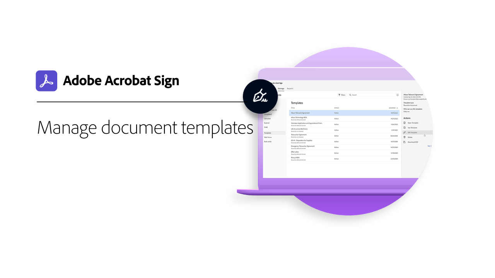

# 進階工作概觀

瞭解如何一次傳送檔給 100 位收件者以索取簽名、為網站設定可簽名的檔、管理簽名交易，以及建立和管理檔範本。 這些教學課程適合任何已經熟悉傳送和索取簽名基本知識的人，並想要瞭解更多 Sign 可使用Acrobat方式。

## 正在傳送

<table style="table-layout:fixed">
<tr>
  <td>
    
    

    <a href="setting-up-routing.md"><strong>設定簽署順序</strong></a>
    

    <em>為多位簽署者設定簽署順序</em>
     
  </td>
  <td>
      
    

    <a href="delegate-signature.md"><strong>使用委派者角色</strong></a>
    

    <em>使用委派者角色傳送檔給仲介人，該仲介接著就可以傳送檔以索取簽名</em>
     
  </td>
  <td>
    
    

    <a href="add-an-approver.md"><strong>使用核准者角色</strong></a>
    

    <em>在合約核准程式中新增核准者角色</em>
     
  </td>
</tr>
<tr>
  <td>
    
    

    <a href="megasign.md"><strong>「傳送」並大量收集簽名</strong></a>
    

    <em>只需幾個簡短步驟，即可針對任何檔一次收集數百個簽名</em>
     
  </td>
  <td>
    
    

    <a href="webform.md"><strong>設定網頁表單</strong></a>
    

    <em>建立可直接在您的網站上進行電子簽署的檔</em>
     
  </td> 
  <td>
    
    

    <a href="adobe-sign-text-tagging.md"><strong>Acrobat簽署文字標記</strong></a>
    

    <em>使用Adobe Acrobat標記文字來建立Acrobat簽署表單欄位</em>
     
  </td> 
</table>

## 管理

<table style="table-layout:fixed">
<tr>
  <td>
    
    

    <a href="edit-a-template.md"><strong>管理檔範本</strong></a>
    

    <em>編輯或刪除資料庫中的範本</em>
     
  </td>  
  <td>
    
    

     
  </td>
  <td>
    
    

     
  </td>
</tr>
</table>
