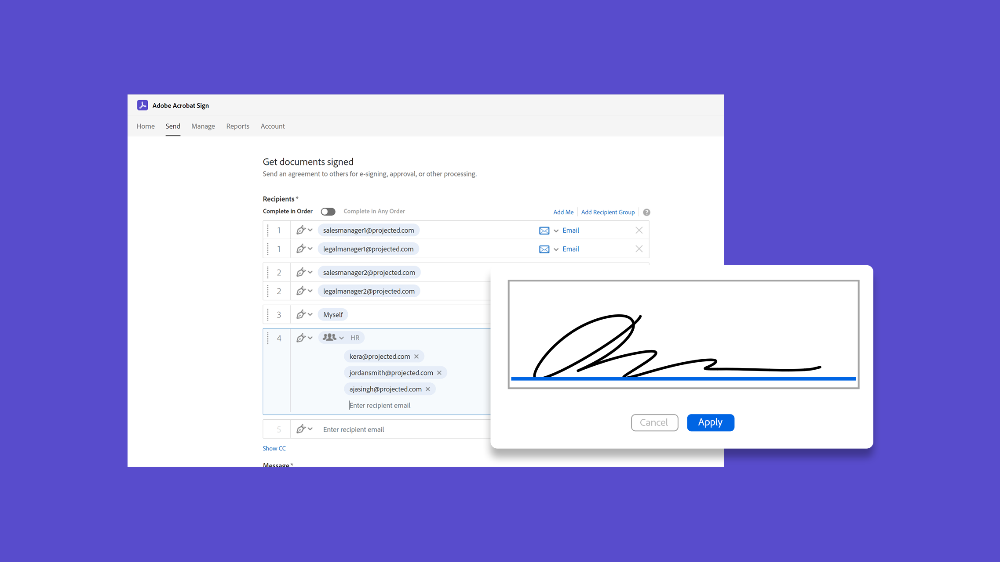
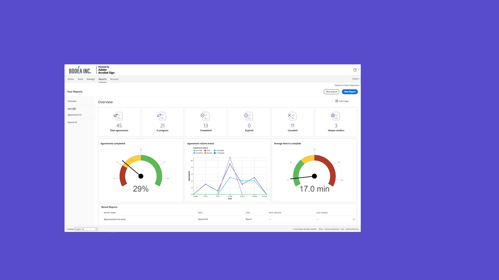
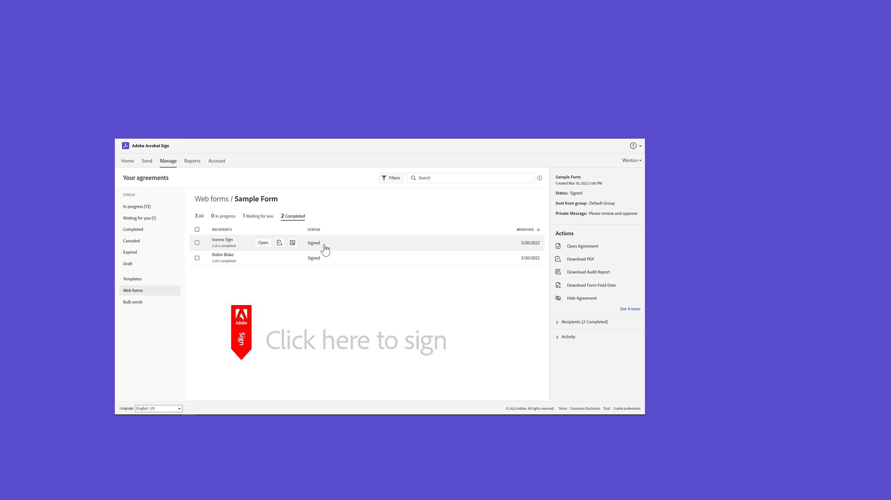

# 進階任務總覽

瞭解如何一次傳送檔案以索取簽名給100多位收件者、為您的網站設定可索取簽名的檔案、管理簽名交易以及建立和管理檔案範本。 這些教學課程適用於已熟悉傳送和請求簽名基本知識，並想要瞭解Acrobat Sign可為他們提供的更多方式的人。

## 新增功能

>[!BEGINTABS]

>[!TAB 建置自訂工作流程]

瞭解如何建立並使用[自訂工作流程](../admin/building-a-custom-workflow.md)，以加速建立和傳送合約的程式。

>[!TAB 大量傳送]

瞭解如何在短短幾個步驟中，一次為任何檔案[收集數千個](megasign.md)簽名。

>[!TAB Acrobat Sign中的 驗證方法]

瞭解Acrobat Sign中可用的方法範圍，以[驗證](authentication-methods.md)簽署檔案的某人的身分。

>[!ENDTABS]

## 傳送

<table style="table-layout:fixed">
<tr>
  <td>
    
    

    <a href="setting-up-routing.md"><strong>正在設定簽署順序</strong></a>
    

    <em>為多位簽署者設定簽署順序</em>
     
  </td>
  <td>
      
    

    <a href="delegate-signature.md"><strong>使用委派者角色</strong></a>
    

    <em>使用委派者角色將檔案傳送給中介者，中介者可傳送檔案以索取簽名</em>
     
  </td>
  <td>
    
    

    <a href="add-an-approver.md"><strong>使用核准者角色</strong></a>
    

    <em>新增核准者角色至您的合約核准程式</em>
     
  </td>
  <td>
      
      

      <a href="megasign.md"><strong>大量傳送</strong></a>
      

      <em>只要幾個短步驟，即可一次收集任何檔案的數百個簽章</em>
       
  </td>
</tr>
<tr>
  <td>
      
      

      <a href="webform.md"><strong>正在建立網路表單</strong></a>
      

      <em>瞭解如何建立可直接在您的網站上以電子方式簽署的檔案</em>
       
  </td>
  <td>
      
      

      <a href="../admin/building-a-custom-workflow.md"><strong>建置自訂工作流程</strong></a>
      

      <em>瞭解如何建立和使用自訂工作流程，以加速建立和傳送合約的程式</em>
       
  </td>
  <td>
      
      

      <a href="set-up-online-payments.md"><strong>設定線上付款</strong></a>
      

      <em>瞭解如何設定並接受檔案中的線上付款</em>
       
  </td>
  <td>
      
      

      Acrobat Sign中的<a href="authentication-methods.md"><strong>驗證方法</strong></a>
      

      <em>瞭解Acrobat Sign中可用的身分驗證方法範圍</em>
       
  </td>
</tr>
<tr>
  <td>
      
      

      <a href="adobe-sign-text-tagging.md"><strong>Acrobat Sign文字標籤</strong></a>
      

      <em>使用Adobe Acrobat以文字標籤建置Acrobat Sign表單欄位</em>
       
    </td>
  <td>
    
    

    <a href="text-tagging-word.md"><strong>在[!DNL Microsoft Word]</strong></a>中使用文字標籤
    

    <em>瞭解如何在[!DNL Microsoft Word]</em>中新增Acrobat Sign文字標籤，以建立可重複使用的檔案範本
     
  </td>
  <td>
    
    

     
  </td>
  <td>
    
    

     
  </td>
</tr>
</table>

## 管理

<table style="table-layout:fixed">
<tr>
<td>
    
    

    <a href="creating-a-report.md"><strong>報告和交易使用量</strong></a>
    

    <em>瞭解如何產生報告及追蹤交易使用情況</em>
     
  </td>
  <td>
    
    

    <a href="edit-a-template.md"><strong>管理檔案範本</strong></a>
    

    <em>編輯或刪除程式庫中的範本</em>
     
  </td>
  <td>
    
    

    <a href="modify-webform.md"><strong>修改現有的Web表單</strong></a>
    

    <em>瞭解如何停用、編輯和重新啟用現有的Web表單</em>
     
  </td>  
  <td>
    
    

    <a href="manage-webform-data.md"><strong>管理網頁表單資料</strong></a>
    

    <em>瞭解如何追蹤、管理及匯出網頁表單中的資料</em>
     
  </td>  
</tr>
<tr>
  <td>
      
      

      <a href="manage-form-data.md"><strong>管理表單資料</strong></a>
      

      <em>瞭解如何合併檔案中的表單資料</em>
       
    </td>
    <td>
    
    

     
  </td>
  <td>
    
    

     
  </td>
  <td>
    
    

     
  </td>
</tr>
</table>