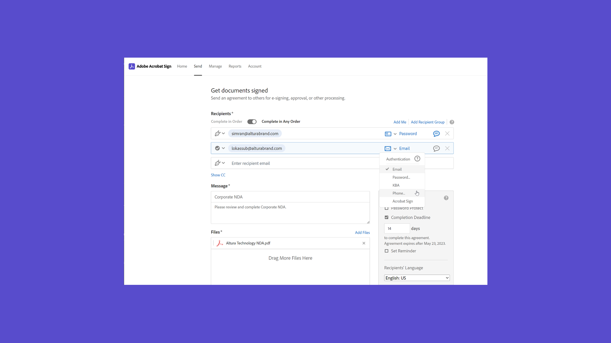
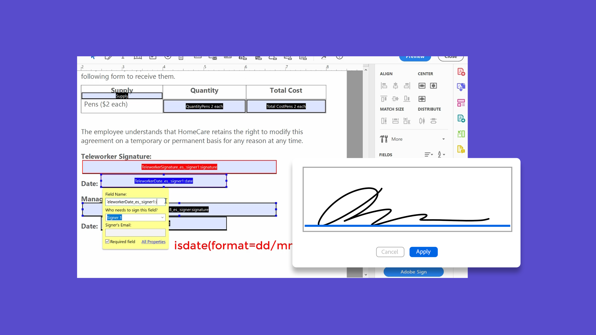

# 高級任務概述

瞭解如何立即向100多個收件人發送文檔以進行簽名，為網站設定可進行簽名的文檔，管理簽名事務，以及建立和管理文檔模板。 這些教程面向已熟悉發送和請求籤名的基本知識並希望瞭解Acrobat Sign可以為他們提供更多方法的人。

## 新增功能

>[!BEGINTABS]

>[!TAB 生成自定義工作流]

瞭解如何建立和使用[自定義工作流](../admin/building-a-custom-workflow.md)以加快建立和發送協定的過程。

>[!TAB 批量發送]

只需幾個短步驟，即可瞭解如何[立即收集任何文檔的數千個簽名](megasign.md)。

>[!TAB Acrobat Sign中的身份驗證方法]

瞭解Acrobat Sign中可用的方法範圍，以[驗證](authentication-methods.md)簽名文檔的人的身份。

>[!ENDTABS]

## 傳送

<table style="table-layout:fixed">
<tr>
  <td>
    
    

    <a href="setting-up-routing.md"><strong>設定註冊順序</strong></a>
    

    <em>為多個簽名者設定簽名順序</em>
     
  </td>
  <td>
      
    

    <a href="delegate-signature.md"><strong>使用委託者角色</strong></a>
    

    <em>使用委託者角色向中間人發送文檔，中間人隨後可以將文檔路由以進行簽名</em>
     
  </td>
  <td>
    
    

    <a href="add-an-approver.md"><strong>使用批准者角色</strong></a>
    

    <em>將批准者角色添加到合同批准流程</em>
     
  </td>
  <td>
      
      

      <a href="megasign.md"><strong>批量發送</strong></a>
      

      <em>只需幾個簡短步驟即可收集任何文檔的數百個簽名</em>
       
  </td>
</tr>
<tr>
  <td>
      
      

      <a href="webform.md"><strong>建立Web表單</strong></a>
      

      <em>瞭解如何建立可直接在您的網站上以電子方式簽名的文檔</em>
       
  </td>
  <td>
      
      

      <a href="../admin/building-a-custom-workflow.md"><strong>生成自定義工作流</strong></a>
      

      <em>瞭解如何建立和使用自定義工作流以加快建立和發送協定的過程</em>
       
  </td>
  <td>
      
      

      <a href="set-up-online-payments.md"><strong>設定線上付款</strong></a>
      

      <em>瞭解如何在文檔中設定和接受線上付款</em>
       
  </td>
  <td>
      
      

      <a href="authentication-methods.md"><strong>Acrobat Sign中的身份驗證方法</strong></a>
      

      <em>瞭解Acrobat Sign提供的身份驗證方法範圍</em>
       
  </td>
</tr>
<tr>
  <td>
      
      

      <a href="adobe-sign-text-tagging.md"><strong>Acrobat Sign文本標籤</strong></a>
      

      <em>使用Adobe Acrobat通過文本標籤生成Acrobat Sign表單域</em>
       
    </td>
  <td>
    
    

    <a href="text-tagging-word.md"><strong>在[!DNL Microsoft Word]</strong></a>中使用文本標籤
    

    <em>通過在[!DNL Microsoft Word]</em>中添加Acrobat Sign文本標籤，瞭解如何建立可重用的文檔模板
     
  </td>
  <td>
    
    

     
  </td>
  <td>
    
    

     
  </td>
</tr>
</table>

## 管理

<table style="table-layout:fixed">
<tr>
<td>
    
    

    <a href="creating-a-report.md"><strong>報告和事務使用率</strong></a>
    

    <em>瞭解如何生成報告和跟蹤事務使用情況</em>
     
  </td>
  <td>
    
    

    <a href="edit-a-template.md"><strong>管理文檔模板</strong></a>
    

    <em>編輯或刪除庫中的模板</em>
     
  </td>
  <td>
    
    

    <a href="modify-webform.md"><strong>修改現有Web表單</strong></a>
    

    <em>瞭解如何禁用、編輯和重新啟用現有Web表單</em>
     
  </td>  
  <td>
    
    

    <a href="manage-webform-data.md"><strong>管理Web表單資料</strong></a>
    

    <em>瞭解如何跟蹤、管理和導出Web表單中的資料</em>
     
  </td>  
</tr>
<tr>
  <td>
      
      

      <a href="manage-form-data.md"><strong>管理表單資料</strong></a>
      

      <em>瞭解如何從文檔合併表單資料</em>
       
    </td>
    <td>
    
    

     
  </td>
  <td>
    
    

     
  </td>
  <td>
    
    

     
  </td>
</tr>
</table>