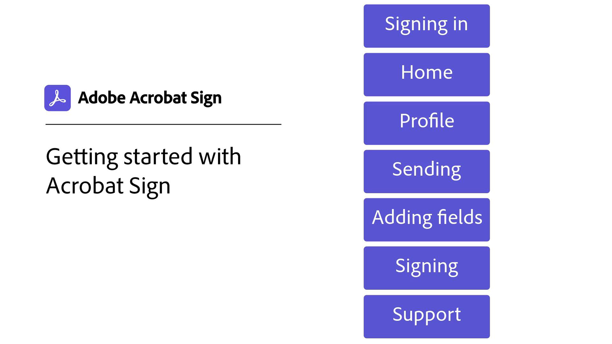
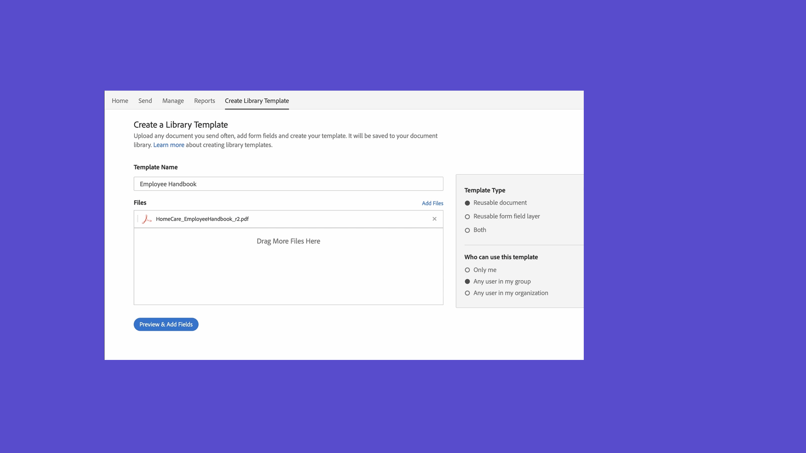

# 入門概述

通過這些簡短的逐步教程瞭解如何發送、簽名和跟蹤文檔。 快速瀏覽Acrobat Sign，然後快速將文檔發送給一個或多個人。 此內容旨在簡化您進入電子簽名工作流的過程。

## 新增功能

>[!BEGINTABS]

>[!TAB 配置發送選項]

瞭解如何[在將文檔發送出去進行簽名時配置各種選項](sending-options.md)。

>[!TAB 發送到多個簽名者]

瞭解如何按您想要的順序將電子簽名文檔發送給[多個人](send-to-multiple-recipients.md)。

>[!TAB 向單個簽名者發送文檔]

請跳入並瞭解[發送文檔以進行簽名](send-to-single-recipient.md)是多麼容易。

>[!TAB 開始使用Acrobat Sign]

你是新來的Acrobat Sign嗎？ 此[教程](new-sender.md)是一個很好的開始。

>[!ENDTABS]

## 傳送

<table style="table-layout:fixed">
<tr>
  <td>
    
    

    <a href="new-sender.md"><strong>開始使用Acrobat Sign</strong></a>
    

    本教程是新用戶在Acrobat Sign的絕佳開端
     
  </td>
 <td>
    
    

    <a href="quick-tour.md"><strong>工作區基礎知識</strong></a>
    

    快速瀏覽Acrobat Sign工作區以啟動並運行
     
  </td>
  <td>
    
    

    <a href="send-to-single-recipient.md"><strong>向單個簽名者發送文檔</strong></a>
    

    跳入並瞭解將文檔發送出去進行簽名是多麼容易
     
  </td>
  <td>
    
    

    <a href="send-to-multiple-recipients.md"><strong>發送到多個簽名者</strong></a>
    

    以您想要的準確順序將電子簽名文檔發送給多個人
     
  </td>
</tr>
<tr>
  <td>
    
    

    <a href="sending-options.md"><strong>配置發送選項</strong></a>
    

    瞭解如何在將文檔發送出去進行簽名時配置各種選項
     
  </td>
  <td>
    
    

    <a href="adding-fields.md"><strong>將欄位添加到文檔</strong></a>
    

    瞭解如何向文檔添加不同類型的欄位
     
  </td>
  <td>
    
    

    <a href="modify-in-flight.md"><strong>在發送後修改文檔</strong></a>
    

    修改已在進行中的文檔
     
  </td>
  <td>
    
    

    <a href="replace-signer.md"><strong>替換簽名者</strong></a>
    

    瞭解如何更改已在進行中的文檔的簽名者
      
  </td>
</tr>
<tr>
  <td>
      
      

      <a href="set-deadlines-reminders.md"><strong>設定截止時間和提醒</strong></a>
      

      瞭解如何定期發送電子郵件提醒和截止時間，以幫助您快速簽署文檔
       
    </td> 
  <td>
    
    

    <a href="../sign-advanced-users/create-a-template.md"><strong>建立可重用模板</strong></a>
    

    建立可重用的文檔模板，為組織提供快速和一致性
     
  </td>
    <td>
      
      

       
    </td>
    <td>
      
      

       
    </td>
</tr>
</table>

## 簽署

<table style="table-layout:fixed">
<tr>
  <td>
    
    

    <a href="electronically-sign-a-document.md"><strong>以電子方式簽名文檔</strong></a>
    

    瞭解與Acrobat Sign一起簽署發送給您的文檔是多麼容易
     
  </td>
  <td>
    
    

    <a href="fill-and-sign.md"><strong>填寫和簽名文檔</strong></a>
    

    填寫表單，並將電子簽名添加到文檔
     
  </td>
  <td>
    
    

    <a href="sign-in-person.md"><strong>正在當面獲取簽名</strong></a>
    

    使用Acrobat Sign移動應用親自獲取其他人的簽名
     
  </td>
  <td>
    
    

    <a href="delegate-signing.md"><strong>將簽名委託給其他人</strong></a>
    

    瞭解如何將文檔簽名委託給其他人
     
  </td>
</tr>
<tr>
  <td>
    
    

    <a href="sign-with-a-digital-signature.md"><strong>什麼是數字簽名</strong></a>
    

    瞭解基於證書的數字簽名
     
  </td>
  <td>
    
    

    <a href="sign-with-a-stamp.md"><strong>使用戳簽名</strong></a>
    

    使用郵票來標籤已批准或已完成的單據
      
  </td> 
 <td>
    
    

     
  </td>
  <td>
    
    

     
  </td>
</tr>  
</table>

## 管理

<table style="table-layout:fixed">
<tr>
  <td>
    
    

    <a href="manage-and-track.md"><strong>管理和跟蹤您的協定</strong></a>
    

    瞭解如何管理和跟蹤發送供簽名的協定
     
  </td>
  <td>
    
    

     
  </td>
  <td>
    
    

     
  </td>
  <td>
    
    

     
  </td>
</tr>
</table>
