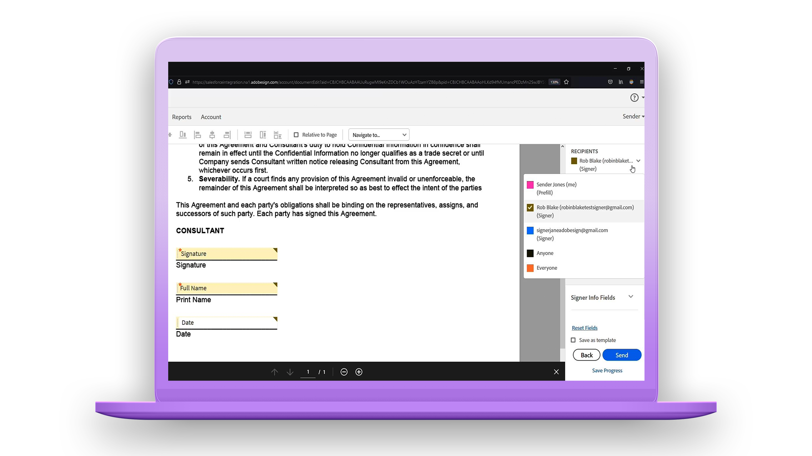

# 快速入門總覽

透過這些簡短的逐步教學課程，快速瞭解如何傳送、簽署和追蹤檔。 快速導覽 Acrobat Sign，然後跳入傳送檔給一或多個人員。 本內容旨在協助您輕鬆進入電子簽名工作流程。

## 新增功能

>[!BEGINTABS]

>[!TAB 開始使用 Acrobat Sign]

您第一次使用 Acrobat Sign 嗎？ 這個 [教學課程](new-sender.md) 是一個不錯的開始。

>[!TAB 設定截止日期和提醒]

瞭解如何定期傳送電子郵件 [提醒和截止日期](set-deadlines-reminders.md) ，以協助快速簽署檔。

>[!ENDTABS]

## 傳送

<table style="table-layout:fixed">
<tr>
 <td>
    
    

    <a href="quick-tour.md"><strong>Workspace基本知識</strong></a>
    

    快速流覽 Acrobat Sign 工作區，以開始使用     
  </td>
  <td>
    
    

    <a href="new-sender.md"><strong>開始使用 Acrobat Sign</strong></a>
    

    這個完整的教學課程是Acrobat Sign 新傳送者絕佳入門的地方     
  </td>
  <td>
    
    

    <a href="send-to-single-recipient.md"><strong>傳送給單一收件者</strong></a>
    

    跳入並了解傳送檔以索取簽名有多麼簡單     
  </td>
  <td>
    
    

    <a href="send-to-multiple-recipients.md"><strong>傳送給多位收件者</strong></a>
    

    依照您想要的順序，傳送檔給多個人員以索取電子簽名     
  </td>
</tr>
<tr>
  <td>
    
    

    <a href="sending-options.md"><strong>設定傳送選項</strong></a>
    

    瞭解如何在傳送檔以供簽署時設定各種選項     
  </td>
  <td>
    
    

    <a href="adding-fields.md"><strong>將欄位新增至檔</strong></a>
    

    瞭解如何在檔中新增不同類型的欄位     
  </td>
  <td>
    
    

    <a href="modify-in-flight.md"><strong>傳送後修改檔</strong></a>
    

    修改進行中的檔     
  </td>
  <td>
    
    

    <a href="replace-signer.md"><strong>取代簽署者</strong></a>
    

    瞭解如何變更進行中文件的簽署者      
  </td>
</tr>
<tr>
  <td>
      
      

      <a href="set-deadlines-reminders.md"><strong>設定截止日期和提醒</strong></a>
      

      瞭解如何定期傳送電子郵件提醒和截止日期，以協助快速簽署檔       
    </td> 
  <td>
      
      

       
    </td>
    <td>
      
      

       
    </td>
    <td>
      
      

       
    </td>
</tr>
</table>

## 簽署

<table style="table-layout:fixed">
<tr>
  <td>
    
    

    <a href="electronically-sign-a-document.md"><strong>以電子方式簽署檔</strong></a>
    

    瞭解使用 Acrobat Sign 傳送給您的文件簽署有多麼簡單     
  </td>
  <td>
    
    

    <a href="fill-and-sign.md"><strong>填寫和簽署檔</strong></a>
    

    填寫表格並將電子簽名新增至檔     
  </td>
  <td>
    
    

    <a href="sign-in-person.md"><strong>取得親筆簽名</strong></a>
    

    使用 Acrobat Sign 行動應用程式取得其他人的親筆簽名     
  </td>
  <td>
    
    

    <a href="delegate-signing.md"><strong>委派簽署給其他人</strong></a>
    

    瞭解如何將文件簽署作業委派給其他人     
  </td>
</tr>
<tr>
  <td>
    
    

    <a href="sign-with-a-digital-signature.md"><strong>什麼是數字簽名</strong></a>
    

    了解憑證式數字簽名     
  </td>
  <td>
    
    

    <a href="sign-with-a-stamp.md"><strong>使用印章簽署</strong></a>
    

    使用印章標示已核准或完成的檔      
  </td> 
 <td>
    
    

     
  </td>
  <td>
    
    

     
  </td>
</tr>  
</table>

## 管理

<table style="table-layout:fixed">
<tr>
  <td>
    
    

    <a href="manage-and-track.md"><strong>管理與追蹤您的合約</strong></a>
    

    瞭解如何管理和追蹤傳送以供簽署的合約     
  </td>
  <td>
    
    

    <a href="../sign-advanced-users/create-a-template.md"><strong>建立文件範本</strong></a>
    

    建立可重複使用的文件範本，為您的組織提供速度和一致性     
  </td>
  <td>
    
    

     
  </td>
  <td>
    
    

     
  </td>
</tr>
</table>
