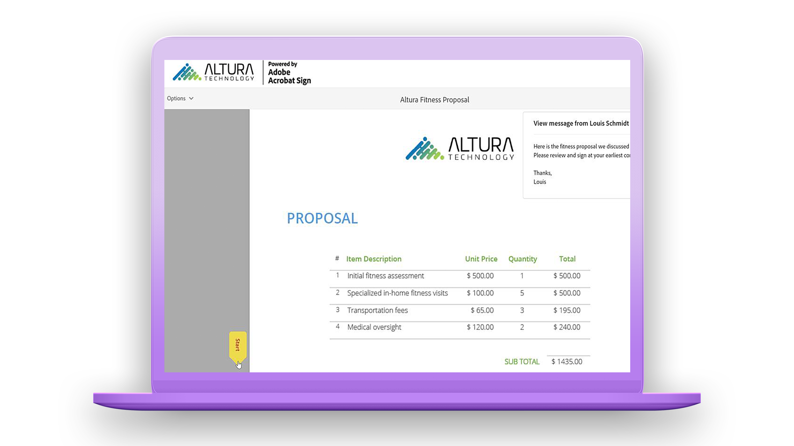

# 快速入門總覽

透過這些簡短的逐步教學課程，快速瞭解如何傳送、簽署和追蹤檔。 快速導覽Adobe Sign，然後跳入傳送檔給一或多個人員。 本內容旨在協助您輕鬆進入電子簽名工作流程。

## 正在傳送

<table style="table-layout:fixed">
<tr>
 <td>
    
    

    <a href="quick-tour.md"><strong>快速導覽Adobe Sign</strong></a>
    

    <em>快速導覽Adobe Sign介面，以開始使用</em>
     
  </td>
  <td>
    
    

    <a href="send-to-single-recipient.md"><strong>傳送給單一收件者</strong></a>
    

    <em>跳入並瞭解傳送檔以索取簽名有多麼簡單</em>
     
  </td>
  <td>
    
    

    <a href="send-to-multiple-recipients.md"><strong>傳送給多位收件者</strong></a>
    

    <em>依照您想要的順序，傳送檔給多個人員以索取電子簽名</em>
     
  </td>
</tr>
<tr>
  <td>
    
    

    <a href="new-sender.md"><strong>開始為新寄件者Adobe Sign</strong></a>
    

    <em>這個一應俱全的教學課程是Adobe Sign新寄件者絕佳入門Adobe Sign</em>
     
  </td>
  <td>
    
    

     
  </td>
  <td>
    
    

     
  </td>
</tr>
</table>

## Signing

<table style="table-layout:fixed">
<tr>
  <td>
    
    

    <a href="electronically-sign-a-document.md"><strong>以電子方式簽署檔</strong></a>
    

    <em>瞭解使用 Adobe Sign 簽署傳送給您的檔有多麼簡單Adobe Sign</em>
     
  </td>
  <td>
    
    

    <a href="fill-and-sign.md"><strong>填寫和簽署檔</strong></a>
    

    <em>填寫表格並將電子簽名新增至檔</em>
     
  </td>
  <td>
    
    

    <a href="sign-in-person.md"><strong>取得親筆簽名</strong></a>
    

    <em>使用 Adobe Sign 行動應用程式取得其他人的親筆簽名</em>
     
  </td>
</tr>
<tr>
  <td>
    
    

    <a href="sign-with-a-digital-signature.md"><strong>什麼是數位簽章</strong></a>
    

    <em>瞭解憑證式數位簽章</em>
     
  </td>
  <td>
    
    

    <a href="sign-with-a-stamp.md"><strong>使用印章簽署</strong></a>
    

    <em>使用印章標示已核准或完成的檔</em>
      
  </td> 
  <td>
    
    

     
  </td>
</tr>  
</table>

## 管理

<table style="table-layout:fixed">
<tr>
  <td>
    
    

    <a href="manage-and-track.md"><strong>管理與追蹤您的合約</strong></a>
    

    <em>瞭解如何管理和追蹤傳送以供簽署的合約</em>
     
  </td>
  <td>
    
    

    <a href="../sign-advanced-users/create-a-template.md"><strong>建立檔範本</strong></a>
    

    <em>建立可重複使用的檔範本，為您的組織提供速度和一致性</em>
     
  </td>
  <td>
    
    

    <a href="modify-in-flight.md"><strong>修改已傳送以供簽署的檔</strong></a>
    

     
    <em>修改進行中檔的工作流程</em>
  </td>
</tr>
</table>
