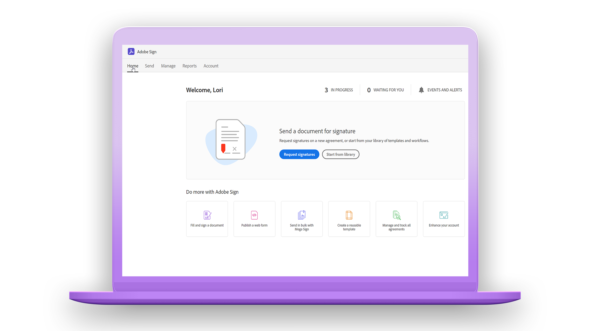
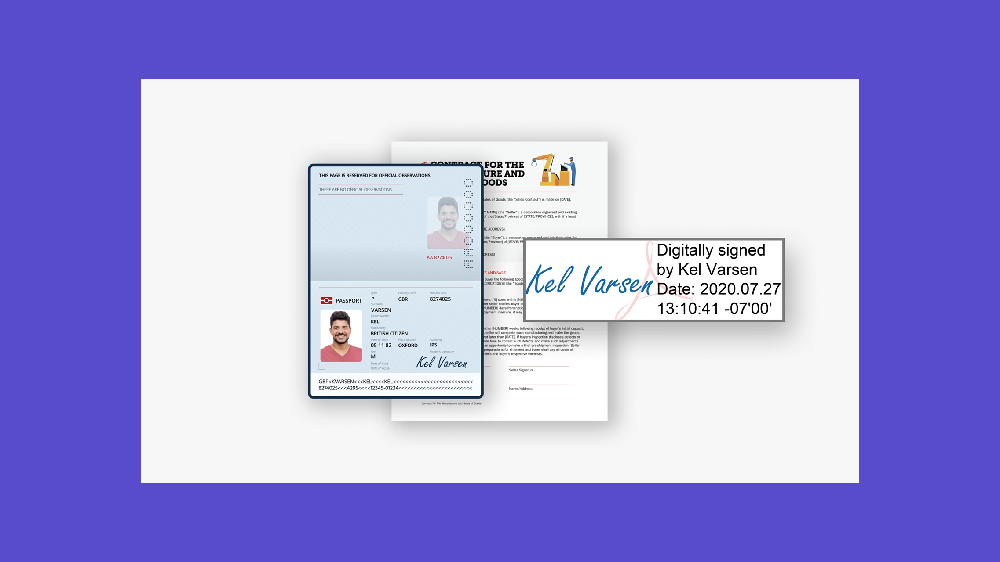

# 快速入門概述

透過這些簡短的逐步教學課程，快速瞭解如何傳送、簽署及追蹤檔案。 快速導覽Acrobat Sign，然後跳到傳送檔案給一或多人。 本內容的設計目的是讓您輕鬆進行電子簽章工作流程。

## 新增功能

>[!BEGINTABS]

>[!TAB 何時使用建立復本]

瞭解如何使用[建立復本](../sign-beginner-tutorials/create-a-copy.md)以複製任何現有的合約。 您可以調整需要變更的內容，並在數秒後重新傳送。 不從頭重建。

>[!TAB 在傳送檔案後修改檔案]

瞭解如何[修改已送出供簽名的檔案](../sign-beginner-tutorials/manage-and-track.md)。

>[!TAB 管理和追蹤合約]

瞭解如何[管理及追蹤傳送以供簽名的合約](../sign-beginner-tutorials/manage-and-track.md)。

>[!TAB 以電子方式簽署檔案]

瞭解使用Acrobat Sign[簽署](../sign-beginner-tutorials/electronically-sign-a-document.md)傳送給您的檔案有多容易。

>[!ENDTABS]

## 傳送

<table style="table-layout:fixed">
<tr>
  <td>
    
    

    <a href="new-sender.md"><strong>開始使用Acrobat Sign</strong></a>
    

    本教學課程是最適合 Acrobat Sign 新使用者著手開始之處
     
  </td>
 <td>
    
    

    <a href="quick-tour.md"><strong>Workspace基本知識</strong></a>
    

    快速導覽Acrobat Sign工作區以啟動並執行
     
  </td>
  <td>
    
    

    <a href="send-to-single-recipient.md"><strong>傳送檔案給單一簽署者</strong></a>
    

    深入瞭解傳送文件以進行簽署有多麼簡單
     
  </td>
  <td>
    
    

    <a href="send-to-multiple-recipients.md"><strong>傳送給多位簽署者</strong></a>
    

    傳送文件以供多人進行電子簽名，並以您想要的確切順序進行
     
  </td>
</tr>
<tr>
  <td>
    
    

    <a href="sending-options.md"><strong>設定傳送選項</strong></a>
    

    了解如何在傳送文件以進行簽署時設定不同選項
     
  </td>
  <td>
    
    

    <a href="adding-fields.md"><strong>正在新增欄位至您的檔案</strong></a>
    

    瞭解如何在檔案中新增不同型別的欄位
     
  </td>
  <td>
    
    

    <a href="modify-in-flight.md"><strong>在傳送檔案後修改檔案</strong></a>
    

    瞭解如何修改已進行中的檔案
     
  </td>
  <td>
    
    

    <a href="replace-signer.md"><strong>取代簽署者</strong></a>
    

    瞭解如何變更已進行中檔案的簽署者
      
  </td>
</tr>
<tr>
  <td>
      
      

      <a href="set-deadlines-reminders.md"><strong>設定截止日期和提醒</strong></a>
      

      瞭解如何定期傳送電子郵件提醒和截止日期，以協助您的檔案快速完成簽署
       
    </td> 
  <td>
    
    

    <a href="../sign-advanced-users/create-a-template.md"><strong>建立可重複使用的範本</strong></a>
    

    建立可重複使用的文件範本，為您的組織提供速度與一致性
     
  </td>
  <td>
     
    

    <a href="checkbox-groups.md"><strong>使用核取方塊群組引導必要的選取專案</strong></a>
    

    瞭解如何使用核取方塊群組來控制簽署者可以在表單上選取多少選項
     
    </td>
  <td>
     
    

    <a href="create-a-copy.md"><strong>何時使用建立復本</strong></a>
    

    瞭解如何使用「建立副本」來複製任何現有的協定
     
    </td>
</tr>
</table>

## 簽署

<table style="table-layout:fixed">
<tr>
  <td>
    
    

    <a href="electronically-sign-a-document.md"><strong>以電子方式簽署檔案</strong></a>
    

    了解多輕鬆即可使用 Acrobat Sign，為傳送給您的文件進行簽署
     
  </td>
  <td>
    
    

    <a href="fill-and-sign.md"><strong>正在填寫和簽署檔案</strong></a>
    

    填寫表格，並將您的電子簽章新增至檔案
     
  </td>
  <td>
    
    

    <a href="sign-in-person.md"><strong>取得簽章（親屬）</strong></a>
    

    使用Acrobat Sign行動應用程式取得別人的親筆簽名
     
  </td>
  <td>
    
    

    <a href="delegate-signing.md"><strong>將簽署委派給其他人</strong></a>
    

    瞭解如何將檔案的簽署委派給其他人
     
  </td>
</tr>
<tr>
  <td>
    
    

    <a href="sign-with-a-digital-signature.md"><strong>什麼是數位簽名</strong></a>
    

    瞭解憑證式數位簽名
     
  </td>
  <td>
    
    

    <a href="sign-with-a-stamp.md"><strong>使用印章簽名</strong></a>
    

    使用印章來標籤檔案已核准或已完成
      
  </td> 
 <td>
    
    

     
  </td>
  <td>
    
    

     
  </td>
</tr>  
</table>

## 管理

<table style="table-layout:fixed">
<tr>
  <td>
    
    

    <a href="manage-and-track.md"><strong>管理和追蹤您的合約</strong></a>
    

    了解如何管理和追蹤傳送以供簽署的合約
     
  </td>
  <td>
    
    

     
  </td>
  <td>
    
    

     
  </td>
  <td>
    
    

     
  </td>
</tr>
</table>
