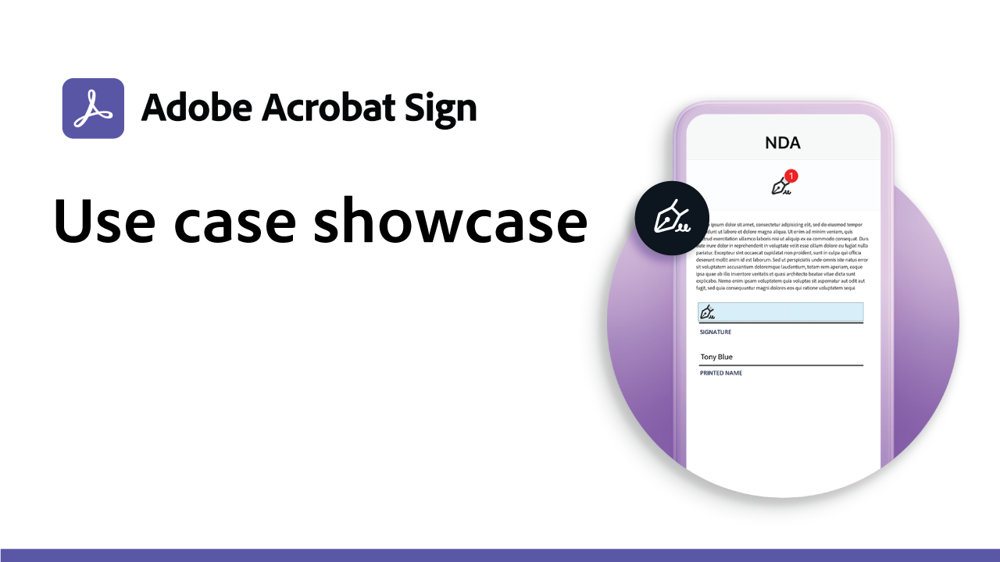

# 產業和部門概觀

瞭解如何透過探索這些真實的產業和部門使用案例、配方和網路研討會來變革組織的電子簽名體驗。

<table style="table-layout:fixed">
<tr>
  <td>
    
    

    <a href="innovation-series.md"><strong>Skill Builder</strong></a>
    

    <em>加入我們 30 分鐘的 Skill Builder，瞭解如何使電子簽名能夠正常運作，而無需額外完成任何工作。</em>
     
  </td>
  <td>
    
    

    <a href="recipes.md"><strong>使用案例配方</strong></a>
    

    <em>下載所需的資源，以自行快速部署各種電子簽名部門工作流程</em>
     
  </td>
  <td>
    
    

    <a href="use-case-showcase.md"><strong>使用案例展示</strong></a>
    

    <em>觀看現場或錄製的會議，向您介紹新的 Acrobat Sign 使用案例和趨勢</em>
     
  </td>
  <td>
    
    

     
  </td>
</tr>
</table>
