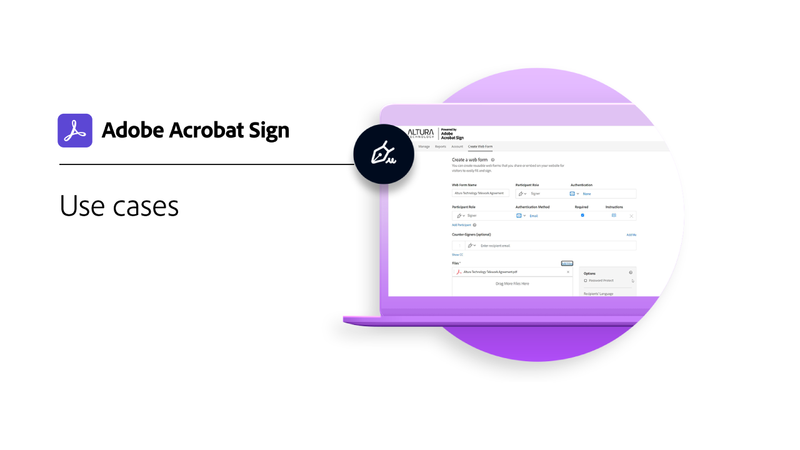

# 產業與部門概觀

瞭解如何透過探索這些真實的產業和部門使用案例、配方和網路研討會，轉變您組織的電子簽章體驗。

<table style="table-layout:fixed">
<tr>
  <td>
    
    

    <a href="innovation-series.md"><strong>技能培養</strong></a>
    

    <em>加入我們，進行30分鐘的技能培養，瞭解如何讓您的電子簽章發揮作用，而不會增加您的日常工作</em>
     
  </td>
  <td>
    
    

    <a href="recipes.md"><strong>使用案例</strong></a>
    

    <em>探索各種組織如何透過這些真實的使用案例來使用Acrobat Sign</em>
     
  </td>
 </td>
  <td>
    
    

     
  </td>
  <td>
    
    

     
  </td>
</tr>
</table>
