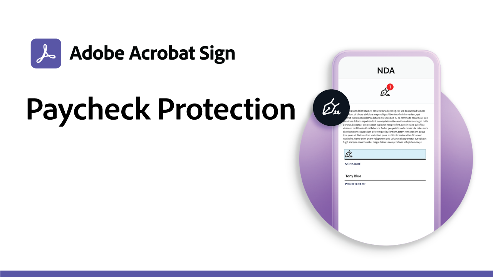

# 使用案例配方

使用這些政府與商業電子簽名範例，加快您組織的數位工作流程。 按一下以檢視 PDF，其中包含如何設定這些特定電子簽名使用案例的資源和詳細資訊。

## 政府使用案例

<table style="table-layout:fixed">
<tr>
  <td>
    
    

    <a href="usecasegovgrants.md"><strong>企業助學金和貸款</strong></a>
    

    <em>透過提供授予、貸款和稅務延期申請表單的自助存取權，為企業提供快速的協助</em>
     
  </td> 
  <td>
    
    

    <a href="usecasegovtelework.md"><strong>遠端工作協定</strong></a>
    

    <em>有效率地收集所有員工針對遠端辦公合約、政策更新等的簽名</em>
     
  </td>
  <td>
    
    

    <a href="usecasegovcontracts.md"><strong>合約和征約表單</strong></a>
    

    <em>使用合規的數位工作流程（包含稽核報告）快速取代紙本處理</em>
     
  </td>
</tr>
<tr>
  <td>
    
    

    <a href="usecasegovreemployment.md"><strong>重新部署協助</strong></a>
    

    <em>協助民眾獲得所需的協助，而無需配合可在數天內上線的全面數位化應用程式表單</em>
     
  </td>
  <td>
    
    

    <a href="usecasegovpaycheck.md"><strong>薪資保護</strong></a>
    

    <em>瞭解如何使用 Acrobat Sign 將付款保護計劃表格轉換為線上互動表格</em>
     
  </td>
  <td>
    
    

    <a href="usecasegovremote.md"><strong>遠端擔保要求</strong></a>
    

    <em>搭配使用電子簽名和網路會議，縮短向判斷者索取及保護授權所需的時間</em>
     
  </td>
</tr>
</table>

## 商業使用案例

<table style="table-layout:fixed">
<tr>
  <td>
    
    

    <a href="usecasecomcontracts.md"><strong>合約和征約表單</strong></a>
    

    <em>使用合規的數位工作流程（包含稽核報告）快速取代紙本處理</em>
     
  </td> 
  <td>
    
    

    <a href="usecasecompolicy.md"><strong>政策協定</strong></a>
    

    <em>有效率地收集所有員工的簽名，以取得保單合約和更新</em>
     
  </td>
  <td>
    
    

    <a href="usecasecomtelework.md"><strong>遠端工作協定</strong></a>
    

    <em>有效率地收集所有員工的遠端辦公合約簽名</em>
     
  </td>
</tr>
</table>
