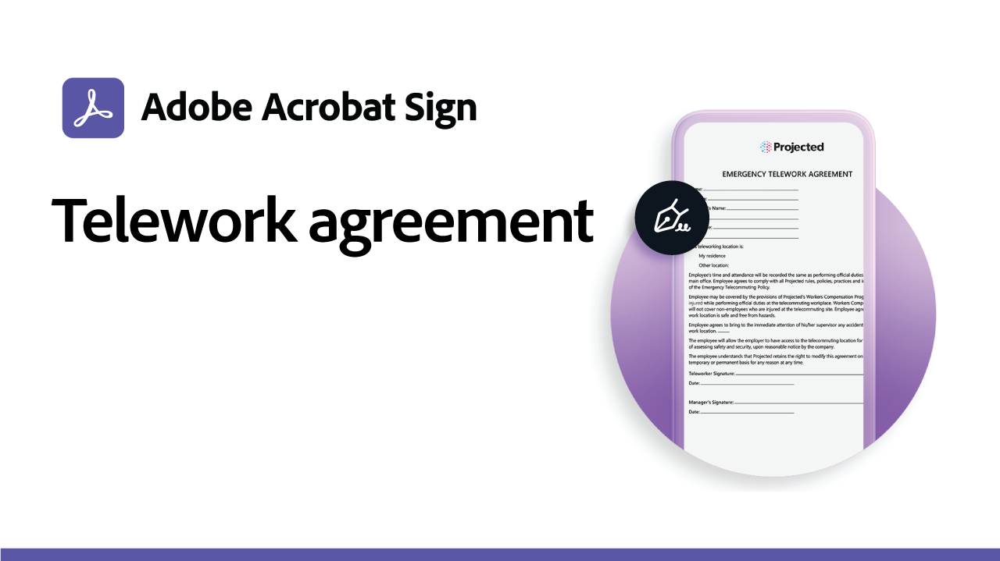
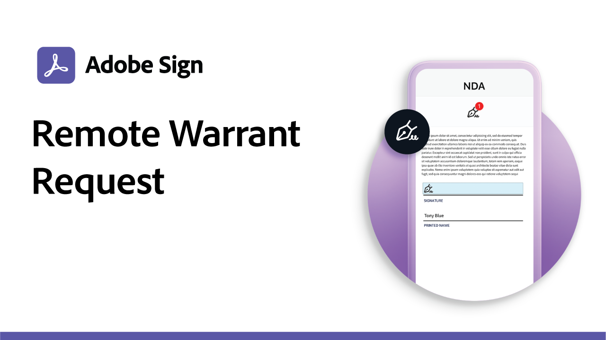
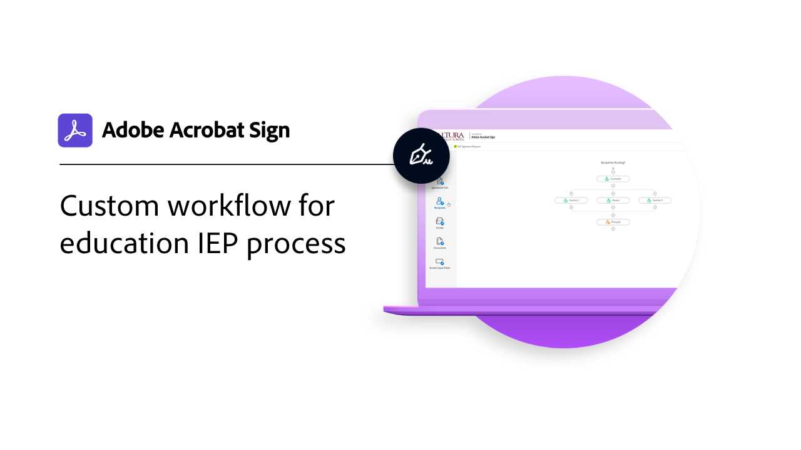

# 使用案例

探索各種組織如何透過這些真實世界使用案例使用Acrobat Sign來轉換其組織的數位工作流程。

## 新增功能

>[!BEGINTABS]

>[!TAB 教育IEP程式的自訂工作流程]

瞭解如何使用[自訂工作流程Designer](usecase-edu-iep.md)將個人化教育計畫(IEP)程式數位化。

>[!TAB 教育網路表單實習應用程式]

瞭解如何使用[網路表單](usecase-edu-intern.md)來改善學生對所需表單的存取權。

>[!TAB 建立教育網路表單實習應用程式]

瞭解如何建立實習[網路表單](usecase-edu-intern-create.md)。

>[!TAB 具有多個未知簽署者的政府貸款申請]

瞭解[網路表單](webform-multiple-signers.md)如何用於涉及多個未知參與者的複雜政府貸款申請工作流程。

>[!ENDTABS]

## 政府使用案例

<table style="table-layout:fixed">
<tr>
  <td>
    
    

    <a href="webform-multiple-signers.md"><strong>具有多個未知簽署者的政府貸款申請</strong></a>
    

    <em>瞭解網路表單如何用於涉及多個未知參與者的複雜政府貸款申請工作流程</em>
     
  </td> 
  <td>
    
    

    <a href="usecasegovgrants.md"><strong>商業授權與貸款</strong></a>
    

    <em>透過自助存取授權、貸款和稅務遞延申請表，為企業提供快速協助</em>
     
  </td> 
  <td>
    
    

    <a href="usecasegovtelework.md"><strong>遠端工作協定</strong></a>
    

    <em>有效率地收集您所有員工對電話工作協定、原則更新等的簽章</em>
     
  </td>
  <td>
    
    

    <a href="usecasegovcontracts.md"><strong>合約與請購單表單</strong></a>
    

    <em>以符合規範的數位工作流程快速取代紙張處理，以稽核報告完成</em>
     
  </td>
</tr>
<tr>
 <td>
    
    

    <a href="usecasegovreemployment.md"><strong>重新僱用協助</strong></a>
    

    <em>協助市民取得他們需要的協助，無需排隊等候數位應用程式表格，這些表格可在數天內上線</em>
     
  </td>
  <td>
    
    

    <a href="usecasegovpaycheck.md"><strong>薪資保護</strong></a>
    

    <em>瞭解如何使用Acrobat Sign將付款保護方案表單轉換為線上互動式表單</em>
     
  </td>
  <td>
    
    

    <a href="usecasegovremote.md"><strong>遠端擔保請求</strong></a>
    

    <em>將電子簽章與網路會議結合使用，以縮短向法官請求並取得授權所需的時間</em>
     
  </td>
  <td>
    
    

     
  </td>
</tr>
</table>

## 商業使用案例

<table style="table-layout:fixed">
<tr>
  <td>
    
    

    <a href="usecasecomcontracts.md"><strong>合約與請購單表單</strong></a>
    

    <em>以符合規範的數位工作流程快速取代紙張處理，以稽核報告完成</em>
     
  </td> 
  <td>
    
    

    <a href="usecasecompolicy.md"><strong>原則協定</strong></a>
    

    <em>有效率地收集您所有員工的原則合約和更新簽章</em>
     
  </td>
  <td>
    
    

    <a href="usecasecomtelework.md"><strong>遠端工作協定</strong></a>
    

    <em>有效率地收集您所有員工在遠端工作合約上的簽章</em>
     
  </td>
  <td>
    
    

     
  </td>
</tr>
</table>

## 教育使用案例

<table style="table-layout:fixed">
<tr>
  <td>
    
    

    <a href="usecase-edu-intern.md"><strong>教育網路表單實習應用程式</strong></a>
    

    <em>瞭解如何使用網路表單來改善學生對所需表單的存取權</em>
     
  </td> 
  <td>
    
    

    <a href="usecase-edu-intern-create.md"><strong>建立教育網路表單實習應用程式</strong></a>
    

    <em>瞭解如何建立實習網路表單</em>
     
  </td> 
  <td>
    
    

    <a href="usecase-edu-iep.md"><strong>教育IEP程式的自訂工作流程</strong></a>
    

    <em>瞭解如何使用自訂工作流程Designer將個人化教育計畫(IEP)程式數位化</em>
     
  </td>
  <td>
    
    

     
  </td>
</tr>
</table>

