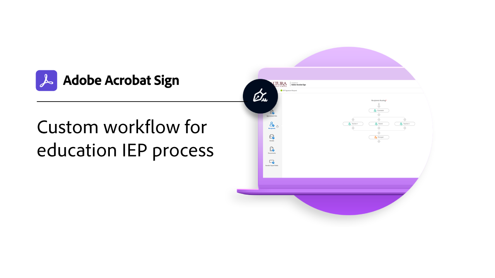

# 使用案例

探索各組織如何使用 Acrobat Sign 來利用這些現實世界的使用案例來改變組織的數位工作流程。

## 新增功能

>[!BEGINTABS]

>[!TAB 教育版 IEP 程式的自定義工作流程]

瞭解「自定義工作流程Designer](usecase-edu-iep.md)如何[用於數位化個人化教育計劃 （IEP） 程式。

>[!TAB 教育版網頁窗體實習申請]

瞭解如何 [使用網頁窗體](usecase-edu-intern.md) 來改善學生對所需表單的存取。

>[!TAB 建立教育版網頁窗體實習申請]

瞭解如何建立實習 [網頁窗體](usecase-edu-intern-create.md)。

>[!TAB 政府貸款申請與多名不明簽署者]

瞭解網頁窗體](webform-multiple-signers.md)如何[用於涉及多名不明參與者的複雜政府貸款申請工作流程。

>[!ENDTABS]

## 政府使用案例

<table style="table-layout:fixed">
<tr>
  <td>
    
    

    <a href="webform-multiple-signers.md"><strong>政府貸款申請與多名不明簽署者</strong></a>
    

    <em>瞭解網頁窗體如何用於涉及多名不明參與者的複雜政府貸款申請工作流程</em>
     
  </td> 
  <td>
    
    

    <a href="usecasegovgrants.md"><strong>企業助學金和貸款</strong></a>
    

    <em>透過提供授予、貸款和稅務延期申請窗體的自助存取權，為企業提供快速的協助</em>
     
  </td> 
  <td>
    
    

    <a href="usecasegovtelework.md"><strong>遠端工作協定</strong></a>
    

    <em>有效率地收集所有員工針對遠端辦公合約、政策更新等的簽名</em>
     
  </td>
  <td>
    
    

    <a href="usecasegovcontracts.md"><strong>合約和征約表單</strong></a>
    

    <em>使用合規的數位工作流程（包含稽核報告）快速取代紙本處理</em>
     
  </td>
</tr>
<tr>
 <td>
    
    

    <a href="usecasegovreemployment.md"><strong>重新部署協助</strong></a>
    

    <em>協助民眾獲得所需的協助，而無需配合可在數天內上線的全面數位化應用程式表單</em>
     
  </td>
  <td>
    
    

    <a href="usecasegovpaycheck.md"><strong>薪資保護</strong></a>
    

    <em>瞭解如何使用 Acrobat Sign 將付款保護計劃表格轉換為在線互動表格</em>
     
  </td>
  <td>
    
    

    <a href="usecasegovremote.md"><strong>遠端擔保要求</strong></a>
    

    <em>搭配使用電子簽名和網路會議，縮短向判斷者索取及保護授權所需的時間</em>
     
  </td>
  <td>
    
    

     
  </td>
</tr>
</table>

## 商業使用案例

<table style="table-layout:fixed">
<tr>
  <td>
    
    

    <a href="usecasecomcontracts.md"><strong>合約和征約表單</strong></a>
    

    <em>使用合規的數位工作流程（包含稽核報告）快速取代紙本處理</em>
     
  </td> 
  <td>
    
    

    <a href="usecasecompolicy.md"><strong>政策協定</strong></a>
    

    <em>有效率地收集所有員工的簽名，以取得保單合約和更新</em>
     
  </td>
  <td>
    
    

    <a href="usecasecomtelework.md"><strong>遠端工作協定</strong></a>
    

    <em>有效率地收集所有員工的遠端辦公合約簽名</em>
     
  </td>
  <td>
    
    

     
  </td>
</tr>
</table>

## 教育機構使用案例

<table style="table-layout:fixed">
<tr>
  <td>
    
    

    <a href="usecase-edu-intern.md"><strong>教育版網頁窗體實習申請</strong></a>
    

    <em>瞭解如何使用網頁窗體來改善學生對所需表單的存取權</em>
     
  </td> 
  <td>
    
    

    <a href="usecase-edu-intern-create.md"><strong>建立教育版網頁窗體實習申請</strong></a>
    

    <em>瞭解如何建立實習網頁窗體</em>
     
  </td> 
  <td>
    
    

    <a href="usecase-edu-iep.md"><strong>教育版 IEP 程式的自定義工作流程</strong></a>
    

    <em>瞭解「自定義工作流程Designer如何用於數位化個人化教育計劃 （IEP） 程式</em>
     
  </td>
  <td>
    
    

     
  </td>
</tr>
</table>

